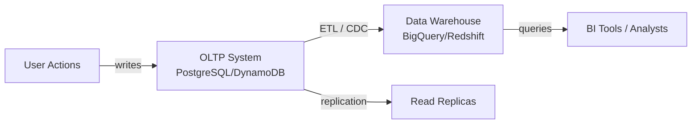
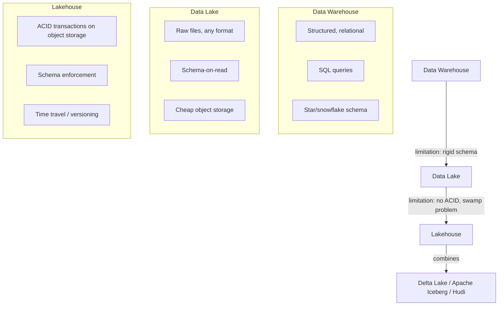
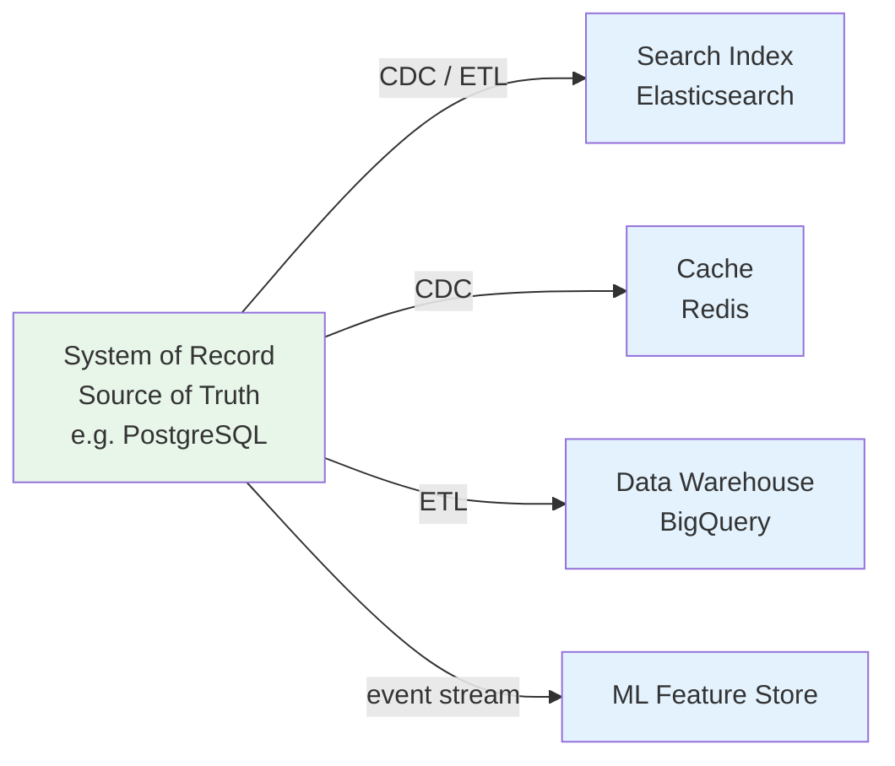
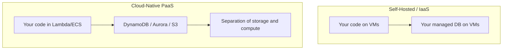
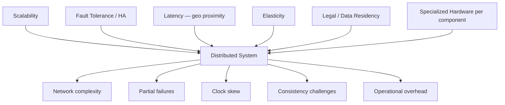
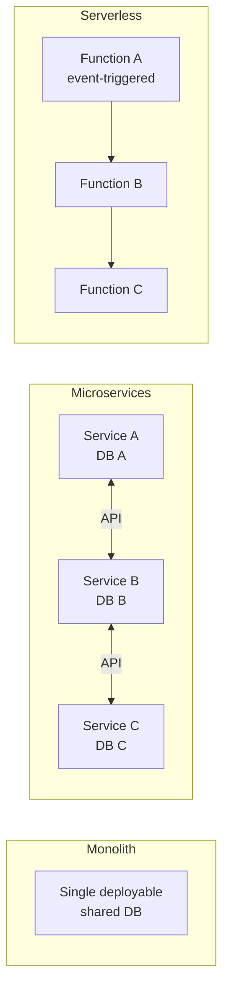

# Chapter 1: Trade-Offs in Data Systems Architecture

## Core Thesis
There are no universal solutions in data systems — only trade-offs. Every architectural decision
sacrifices something to gain something else. The goal is to understand the space of options
clearly enough to make informed choices for a specific context.

---

## OLTP vs OLAP — The Fundamental Split

| Property | OLTP (Operational) | OLAP (Analytical) |
|----------|-------------------|-------------------|
| Primary pattern | Read/write individual records | Aggregate over large record sets |
| Write pattern | Low-latency inserts/updates | Bulk load (ETL) or event streams |
| Dataset size | GB–TB | TB–PB |
| Users | End users, microservices | Internal analysts, BI tools |
| Query type | Fixed, predefined | Ad-hoc, exploratory |
| Example | E-commerce checkout | Monthly revenue by region |
| Example systems | PostgreSQL, MySQL, DynamoDB | Redshift, BigQuery, Snowflake |



**HTAP (Hybrid Transaction/Analytical Processing)**: Some systems (SingleStore, TiDB) attempt
to handle both. In practice, workload isolation often still wins — OLTP and OLAP have
fundamentally different access patterns and storage optimizations.

---

## Data Warehouse → Data Lake → Beyond



**Key insight**: Data lakes solve the rigidity problem of warehouses but introduce governance
problems ("data swamp"). Lakehouses (Delta Lake, Iceberg) add ACID semantics back on top of
cheap object storage.

---

## Systems of Record vs Derived Data



- **System of record**: Authoritative source. Written exactly once. If disagreement exists,
  the system of record wins.
- **Derived data**: Created by processing source data. Can be reconstructed from source.
  Examples: search indexes, caches, materialized views, ML model outputs.

**Design rule**: Clearly designate which system is the source of truth for each entity.
Ambiguity here causes consistency bugs that are very hard to debug.

---

## Cloud vs Self-Hosting Trade-offs

| Dimension | Cloud Service | Self-Hosted |
|-----------|--------------|-------------|
| Ops burden | Managed (patching, backups, HA) | Full ownership |
| Control | Limited — vendor decides internals | Full |
| Cost model | Opex (pay per use) | Capex + Opex |
| Vendor lock-in | High | Low |
| Performance tuning | Limited visibility | Full access |
| Compliance | Depends on vendor certifications | You own it |

**Cloud-native architecture distinction**:



**Separation of storage and compute** is the defining feature of cloud-native systems.
Compute scales independently from storage. Examples: Snowflake, BigQuery, Aurora Serverless.

---

## Distributed vs Single-Node Systems

**Reasons to distribute** (each has a cost):



**Don't distribute if you don't need to.** A well-optimized single-node PostgreSQL can handle
millions of rows and thousands of concurrent users. Distribute only when there's a clear reason.

---

## Microservices and Serverless



**Microservices trade-off**:
- ✅ Independent deployability, team autonomy, fault isolation, polyglot persistence
- ❌ Network latency, distributed transactions, operational complexity, service discovery

**Serverless trade-off**:
- ✅ No server management, automatic scaling, pay-per-invocation
- ❌ Cold starts, limited execution time, stateless (state must be externalized), vendor lock-in

---

## Cloud Computing Versus Supercomputing

Two contrasting philosophies for large-scale computation:

| Dimension | Cloud Computing | Supercomputing / HPC |
|-----------|----------------|---------------------|
| **Failure model** | Expect nodes to fail; design around it | Assume hardware is reliable; abort on any failure |
| **Network** | Commodity Ethernet, variable latency | High-speed RDMA fabric (InfiniBand), low latency |
| **Job model** | Always-on services, partial updates | Batch jobs, checkpoint-restart |
| **Storage** | Object storage (S3), distributed FS | Parallel filesystem (Lustre, GPFS) |
| **Scale-out** | Horizontal: add commodity nodes | Vertical + tightly coupled: specialized hardware |
| **Typical use** | Web services, data pipelines | Physics simulations, weather forecasting, ML training |

**Why cloud dominates general workloads**: Commodity hardware + fault tolerance in software
is cheaper and more flexible than specialized fault-free hardware.

**Where HPC still wins**: Workloads that require tight coupling between nodes (MPI-style
all-reduce for distributed ML training) where network latency is the bottleneck.

---

## Data Systems, Law, and Society

Data systems are not politically or legally neutral. Several legal and ethical frameworks
govern what can be built and how data can be used:

```mermaid
graph TD
    LEGAL[Legal Framework]
    LEGAL --> GDPR[GDPR / CCPA / Privacy Laws<br/>Right to erasure, data minimization<br/>Lawful basis for processing<br/>Data residency requirements]
    LEGAL --> ANTI[Antitrust / Competition Law<br/>Data as a competitive moat<br/>Market power through data accumulation]
    LEGAL --> SECTOR[Sector-specific<br/>HIPAA (healthcare), PCI-DSS (payments),<br/>SOX (financial reporting), FERPA (education)]
    LEGAL --> IP[Intellectual Property<br/>Training data copyright<br/>AI-generated content ownership]
```

**Data residency**: Many jurisdictions require data about their citizens to remain within
their borders (EU, China, Russia, India). This forces multi-region architecture decisions
and limits data sharing between regions.

**Right to erasure (GDPR Art. 17)**: Users can request deletion of their personal data.
Technically complex: data may be in the primary DB, data warehouse, backups, event logs,
ML training sets, derived data, and third-party systems. See Ch.14 for cryptographic erasure.

**Data as liability (not just asset)**: The legal framework has shifted. Collecting data
you don't need creates liability (breach costs, compliance costs, GDPR fines up to 4% of
global revenue). Engineers should advocate for minimal data collection.

---

## Key Terms

| Term | Definition |
|------|-----------|
| OLTP | Online Transaction Processing — low-latency reads/writes of individual records |
| OLAP | Online Analytical Processing — aggregations over large datasets |
| HTAP | Hybrid — handles both OLTP and OLAP |
| ETL | Extract, Transform, Load — moves data from OLTP to warehouse |
| CDC | Change Data Capture — streams DB changes as events |
| Data Lake | Raw data storage in object store, schema-on-read |
| Lakehouse | Data lake + ACID semantics (Delta, Iceberg, Hudi) |
| IaaS | Infrastructure as a Service — VMs in cloud |
| PaaS | Platform as a Service — managed runtime |
| SRE | Site Reliability Engineering — ops + software approach |
