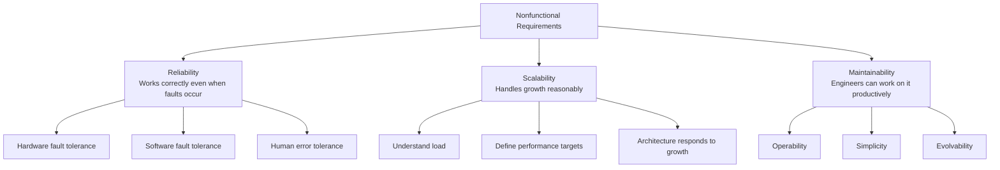
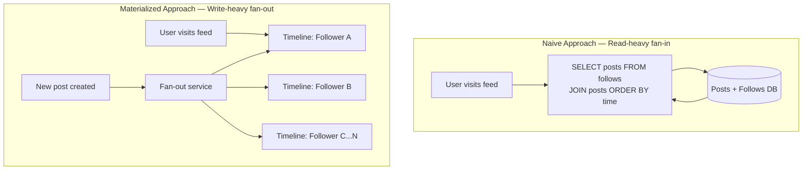
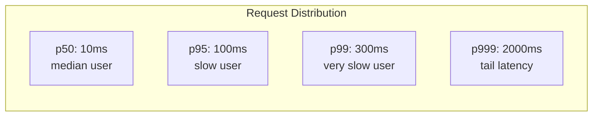
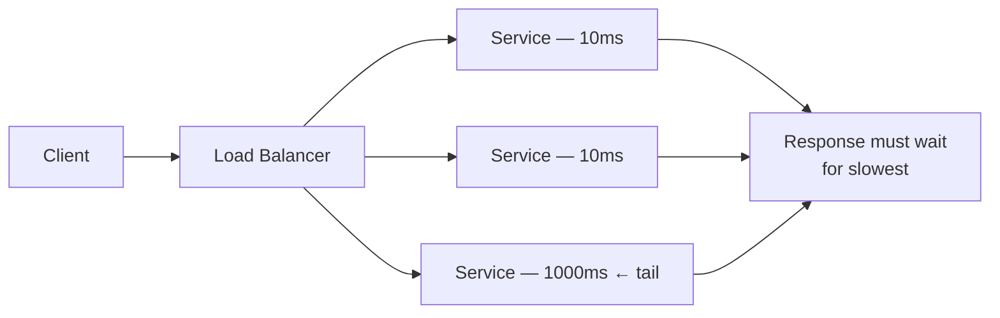
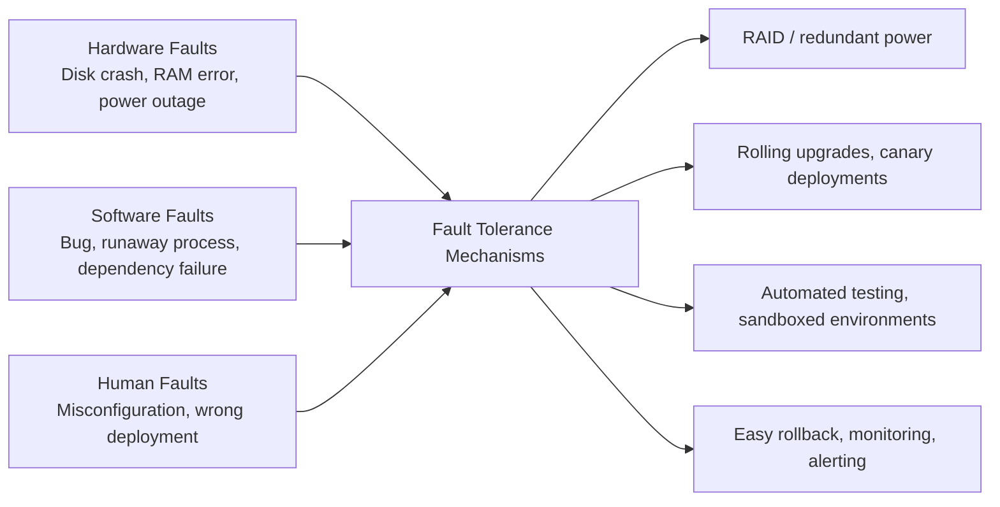
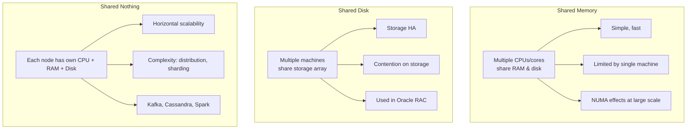
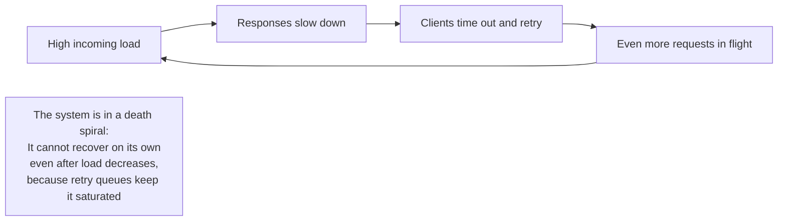

# Chapter 2: Defining Nonfunctional Requirements

## Core Thesis
Before designing a system, you must define what "good" means quantitatively. Reliability,
scalability, and maintainability are the three pillars — but each must be specified with
concrete metrics, not vague adjectives.

---

## The Three Pillars



---

## Case Study: Social Network Home Timelines

This running example shows how requirements drive architecture decisions.



**Trade-off**:
- Fan-in (read-time join): Simple writes, expensive reads. Bad at scale if users have many
  followers.
- Fan-out (write-time materialization): Expensive writes, cheap reads. Bad for users with
  millions of followers (celebrities).

**Hybrid**: Most real systems use fan-out for normal users + fan-in merge for high-follower
accounts (Twitter/X solution).

---

## Describing Performance: Latency & Throughput

**Two primary metrics**:
- **Response time**: Time from request to response (experienced by the client)
- **Throughput**: Requests/second or data volume/second the system handles

### Percentiles — the only honest way to measure latency



| Metric | What it hides | When to use |
|--------|--------------|-------------|
| Average | Skewed by outliers | Never for latency |
| p50 | Slow 50% of users | Baseline health check |
| p95 | Only shows 5% bad | SLA definition |
| p99 | Only shows 1% bad | Premium SLA |
| p999 | Only shows 0.1% | High-value transactions |

**Tail latency amplification**: In a service that makes N parallel backend calls, overall
response time = slowest call. With 100 backends at p99=1%, 63% of requests hit at least one
slow backend.



### Retry storms and backoff

When services are slow, naive retries amplify load. Solution:
- Exponential backoff with jitter
- Circuit breakers
- Hedged requests (send second request if no response within p95 time)

---

## Reliability and Fault Tolerance

**Fault ≠ Failure**:
- **Fault**: One component deviates from spec
- **Failure**: System as a whole stops providing service



**Key insight**: Prefer tolerating faults over preventing all faults. Netflix Chaos Monkey
(intentionally kills production instances) builds real fault tolerance.

**Human error is the leading cause of outages** — design systems where humans are unlikely
to make mistakes, not systems that assume humans won't make mistakes.

---

## Scalability

### Understanding Load

Define load with **load parameters** specific to your system:
- Web server: requests/second
- DB: ratio of reads to writes
- Cache: hit rate
- Social network: number of followers per user (fan-out factor)

### Shared-Memory vs Shared-Disk vs Shared-Nothing



### Scalability Principles

1. **Stateless services scale horizontally** — add more nodes, use a load balancer
2. **Stateful services are harder** — need data partitioning (sharding) or replication
3. **There is no one-size-fits-all scalable architecture** — the right approach depends on
   your load parameters
4. **Premature optimization is the root of scaling problems** — design for current load,
   with seams to re-architect when needed

---

## Maintainability

### Operability
Make life easy for operations:
- Monitoring and observability (metrics, tracing, logs)
- Predictable behavior, avoiding surprises
- Good documentation and runbooks
- Easy rollback and deployment
- Support for automation

### Simplicity
Manage complexity:
- Good abstractions hide implementation complexity
- Accidental complexity (from bad design) vs essential complexity (from the problem domain)
- Every abstraction is a trade-off: it hides complexity but also hides what's happening

### Evolvability
Make change easy:
- Design for change, not just for current requirements
- Backward and forward compatibility (see Chapter 5)
- Test coverage that enables confident refactoring
- Decouple components that change at different rates

---

## When an Overloaded System Won't Recover

A system can enter a pathological state where high load causes slow responses, which
causes retries, which creates even higher load — a death spiral:



**Solutions**:
- **Load shedding**: Intentionally drop some requests under overload (return 503 quickly)
  rather than trying to serve everything slowly
- **Back-pressure**: Tell clients to slow down (reactive streams pattern)
- **Exponential backoff + jitter**: Prevents all retries arriving simultaneously
- **Circuit breaker**: After N failures, stop sending to the service entirely; allow recovery

**How Important Is Reliability?**: Even "non-critical" systems have reliability requirements.
Unreliability is not just annoying — it erodes trust. Reliability must be weighed against
development cost, but "good enough" is almost always more reliable than most systems are
in practice.

---

## Computing Percentiles Efficiently

Sorting all response times to compute p99 is expensive at scale. Two production-grade approaches:

### t-digest Algorithm
A probabilistic data structure that approximates quantiles with bounded relative error:
- Maintains a compressed representation of the distribution (not all values)
- More accurate near the extremes (p99, p999) where accuracy matters most
- O(log n) space, mergeable (add results from multiple nodes)

```mermaid
graph LR
    N1[Node 1 t-digest] -->|merge| AGG[Aggregated t-digest]
    N2[Node 2 t-digest] -->|merge| AGG
    N3[Node 3 t-digest] -->|merge| AGG
    AGG -->|query| P99["p99 = 234ms (approximate)"]
    note1[Each node sends a small sketch<br/>not all raw values — O(100 bytes)<br/>not O(N requests)]
```

### HDR Histogram (High Dynamic Range)
- Pre-allocates fixed buckets covering a range (e.g., 1μs to 3600s)
- O(1) recording, O(buckets) space, exact within bucket precision
- Widely used for latency measurement (Java: HdrHistogram, Prometheus histograms)

**Production rule**: Never compute percentiles by sorting all values in the request path.
Use a pre-aggregated histogram or sketch. **Prometheus** uses HDR histograms; **DataDog**
and **Wavefront** use t-digest.

---

## Key Formulas and Rules of Thumb

| Concept | Rule |
|---------|------|
| SLA latency target | Use p99, not average |
| Retry policy | Exponential backoff + jitter, max 3-5 retries |
| Headroom | Design for 10× current load |
| MTTR target | < 1 hour for P1 incidents |
| Change failure rate | < 15% of deployments cause issues (DORA metric) |
