# Chapter 3: Data Models and Query Languages

## Core Thesis
The data model is the single most important decision in building a data system. It determines
what queries are easy, what's hard, and what's impossible. Different models optimize for
different access patterns — and you must match the model to the workload, not the other way.

---

## The Three Major Data Models

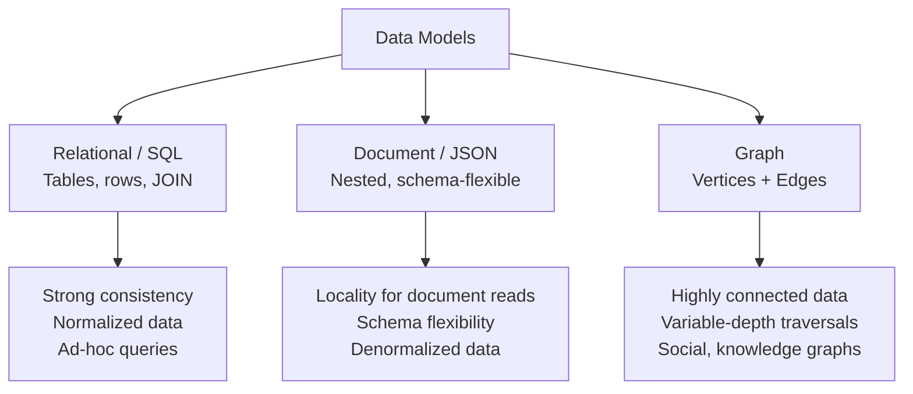

---

## Relational vs Document — The Core Debate

### Object-Relational Mismatch (Impedance Mismatch)

Application code works with objects/graphs; relational DB works with tables. The gap between
them is the "impedance mismatch" — ORMs reduce boilerplate but don't eliminate the conceptual
difference.

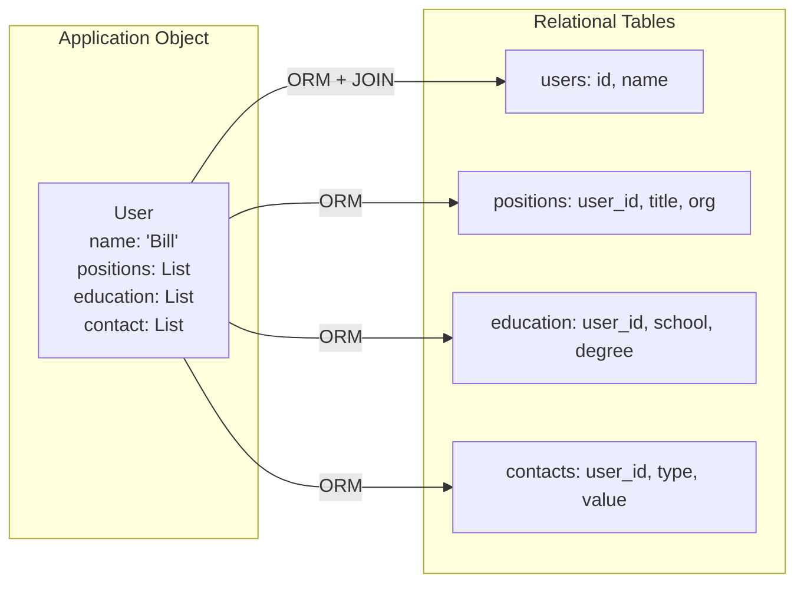

**Document DB advantage for one-to-many**: Store user + all positions in a single JSON document.
One read retrieves the whole object. No JOINs needed.

**Document DB disadvantage**: Many-to-many relationships require application-side joins or
denormalization. Updates to referenced data (e.g., city name) require updating everywhere it's
stored.

---

## Normalization vs Denormalization

### When to Normalize (OLTP default)

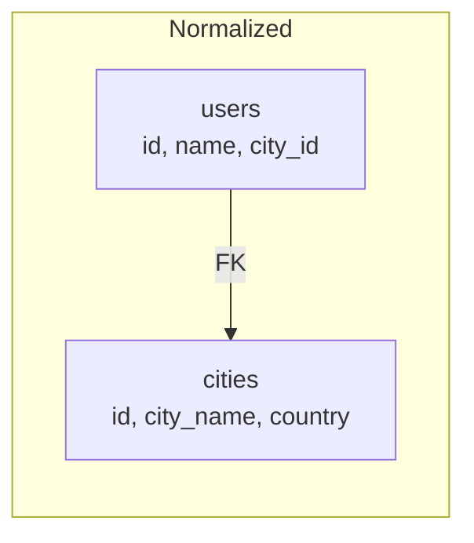
✅ Single source of truth for city name  
✅ Storage efficient  
✅ Updates are easy  
❌ Reads require JOIN — more CPU  

### When to Denormalize (OLAP or read-heavy)

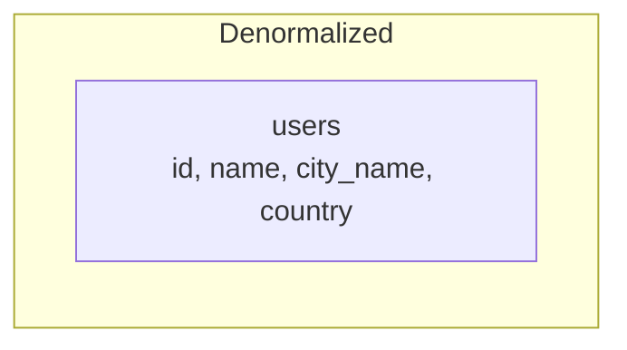
✅ Fast reads — no JOIN  
✅ Simple queries  
❌ Duplicated data  
❌ Updates must touch all copies  

**Rule**: Normalize for write-heavy OLTP. Denormalize for read-heavy analytics (star/snowflake schema).

---

## Star Schema (Data Warehouse)

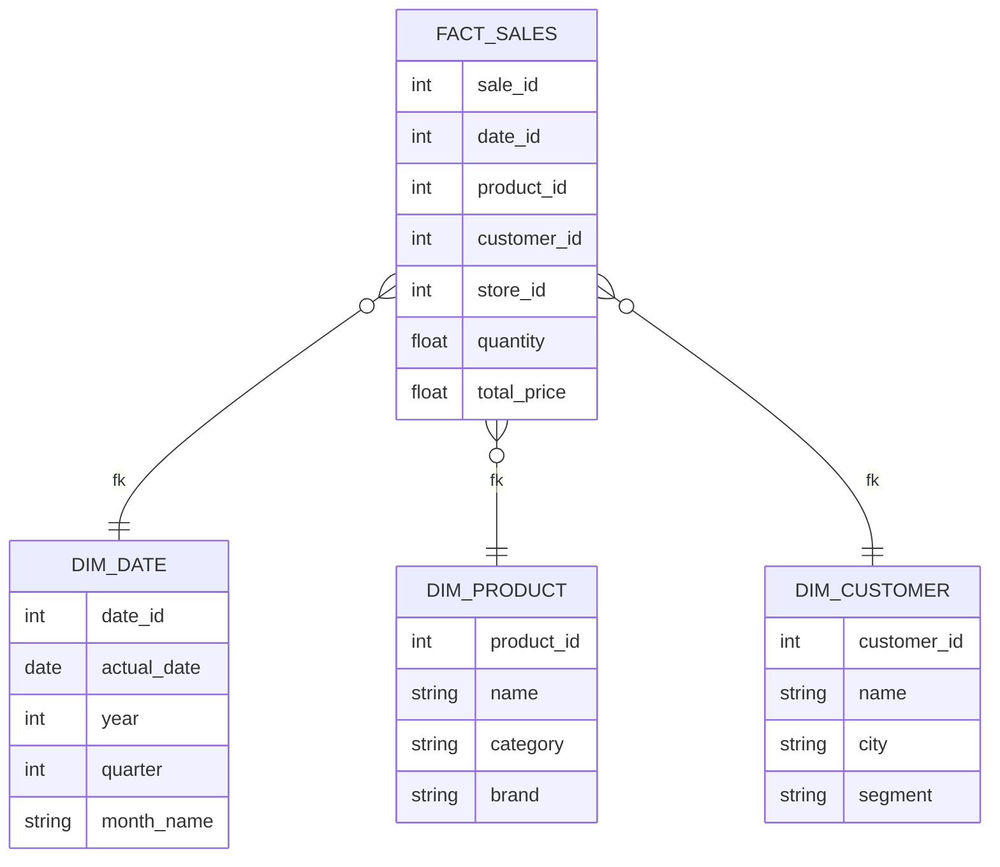

- **Fact table**: Events/transactions. Each row is one event. Very wide, many FK columns.
- **Dimension tables**: Who/what/where/when context. Smaller, richer text.
- **Snowflake schema**: Dimension tables further normalized (e.g., separate brand table).

---

## Document Model — When to Use It

**Good fit**:
- Data has a natural document structure (1:many from root to nested)
- Application typically loads the whole document at once
- Schema varies across records (flexible/schemaless)
- No need for many-to-many relationships

**Bad fit**:
- Data is highly interconnected (many-to-many)
- You need cross-document joins
- You need strong referential integrity

```mermaid
graph TD
    subgraph "Good Document Model Fit"
        ORD[Order<br/>id: 12345<br/>customer: ...<br/>items: [{...}, {...}]<br/>shipping: {...}]
    end

    subgraph "Bad Document Model Fit"
        U[User] --> P[Post]
        P --> C[Comment]
        C --> U
        P --> T[Tag]
        T --> P2[Post2]
    end
```

**Schema-on-read vs Schema-on-write**:
- Document DBs: Schema enforced by application at read time (flexible but risky)
- Relational DBs: Schema enforced by DB at write time (strict but safe)

---

## Graph Data Model

For **highly connected data** with **variable-depth traversals**:

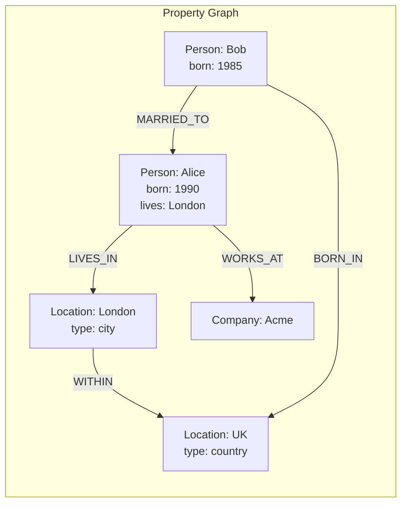

**Graph model strengths**:
- Variable-depth traversals: "Find all colleagues of Alice's ex-colleagues within 3 hops"
- Heterogeneous data in the same graph (people, locations, companies, events)
- Natural for social graphs, knowledge graphs, fraud detection, recommendation engines

**Cypher (Neo4j) query example**:
```
MATCH (person:Person)-[:LIVES_IN]->(city:City)-[:IN]->(country:Country {name: 'UK'})
RETURN person.name
```

**When to choose graph over relational**: When you're frequently asking questions that
involve following relationships of unknown depth. Relational can model graphs but is
inefficient for deep traversals.

---

## Query Language Paradigms

| Paradigm | Example | Philosophy |
|----------|---------|-----------|
| Declarative SQL | `SELECT name FROM users WHERE age > 30` | *What* you want |
| Imperative | Python loop over rows | *How* to get it |
| MapReduce | map() + reduce() | Functional, parallelizable |
| Cypher | `MATCH (a)-[:KNOWS]->(b)` | Pattern matching on graph |
| Datalog | Recursive rules | Logic programming |

**Declarative wins for most cases**: The DB optimizer can choose execution plan, parallelize,
use indexes. Imperative code locks you into one execution path.

---

## Triple Stores and SPARQL

An alternative to property graphs, grounded in the semantic web vision:

**Triple store**: Each fact is stored as a three-part statement: `(subject, predicate, object)`.

```
(Jim,      born_in,    Idaho)
(Idaho,    type,       Location)
(Idaho,    name,       "Idaho")
(Idaho,    within,     USA)
(Lucy,     age,        33)
(Lucy,     married_to, Jim)
```

Every triple maps to a directed edge in a graph: subject → predicate → object.

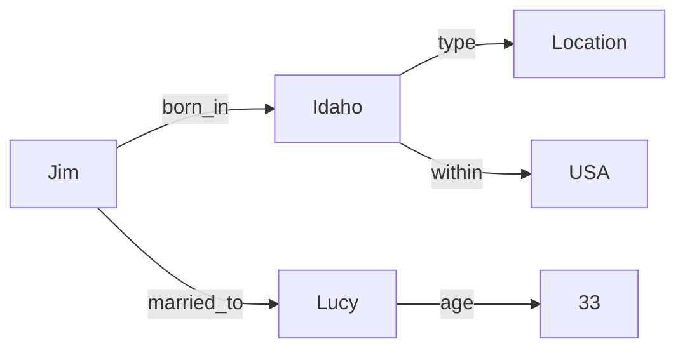

### SPARQL (SPARQL Protocol and RDF Query Language)

```sparql
PREFIX : <urn:example:>

SELECT ?personName WHERE {
  ?person :born_in ?place .
  ?place :within :USA .
  ?person :name ?personName .
}
```

Reads: "Find all people born in a place that is within USA, return their names."

**Compared to Cypher**:
- Both express graph pattern matching
- SPARQL: W3C standard, designed for linked open data, RDF format
- Cypher: proprietary to Neo4j, more readable for typical property graph queries

### The Semantic Web

The original vision behind triple stores: a web of linked data where any piece of information
can reference any other, machine-readable, using URIs as universal identifiers.

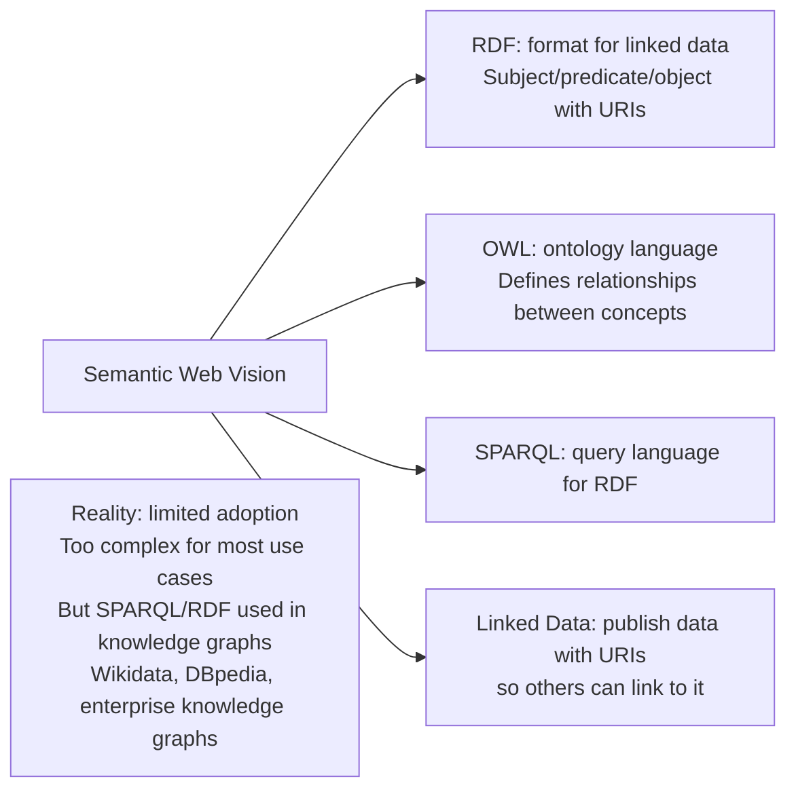

**When to use triple stores / knowledge graphs**:
- Data that naturally has many types of entities and relationships
- Need to infer new facts from existing ones (OWL reasoning)
- Integrating heterogeneous data from many sources
- Enterprise knowledge management (Google Knowledge Graph, Amazon Product Graph)

---

## Datalog: Recursive Relational Queries

Datalog (1980s academic origin) is a subset of Prolog used in databases like Datomic, CozoDB, and LinkedIn's LIquid. It expresses queries as recursive rules, making it uniquely powerful for graph traversals.

```prolog
% Data as facts
within(idaho, usa).
within(usa, north_america).
born_in(lucy, idaho).

% Rules — recursive
within_recursive(X, Y) :- within(X, Y).
within_recursive(X, Z) :- within(X, Y), within_recursive(Y, Z).

% Query: find people born in a place within north_america
migrated(Person, BornIn) :- born_in(Person, BornPlace),
                             within_recursive(BornPlace, BornIn).
us_to_europe(P) :- migrated(P, north_america).
```

Rules derive new virtual tables from facts. Rules can be recursive (unlike SQL without CTEs). The engine figures out evaluation order — you specify *what*, not *how*. Niche, but the most expressive query language for deeply recursive graph queries.

---

## GraphQL

Not a graph database query language — it's an API query language for client-server data fetching. Clients declare exactly the shape of JSON response they need:

```graphql
query {
  channels {
    name
    recentMessages(latest: 50) {
      timestamp
      content
      sender { fullName imageUrl }
      replyTo { content sender { fullName } }
    }
  }
}
```

**Key properties**:
- ✅ Client specifies exact fields → no over-fetching or under-fetching
- ✅ Schema-driven → strong typing, introspection
- ✅ Client evolves queries without server changes
- ❌ No recursive queries (by design — untrusted clients can't cause expensive traversals)
- ❌ No arbitrary search conditions (unless server exposes them)
- ❌ Requires tooling to translate queries to internal services (REST/gRPC)

**When to use**: Public/partner APIs where client data needs vary widely. Internal APIs with stable, narrow contracts → REST or gRPC are simpler.

---

## Event Sourcing and CQRS (2nd Edition Addition)

**Event Sourcing**: Store every state change as an immutable event in an append-only log. Never update or delete — only append. Current state is derived by replaying events.

**CQRS (Command Query Responsibility Segregation)**: Separate the write path (commands → events → event log) from the read path (event log → materialized views optimized for queries).

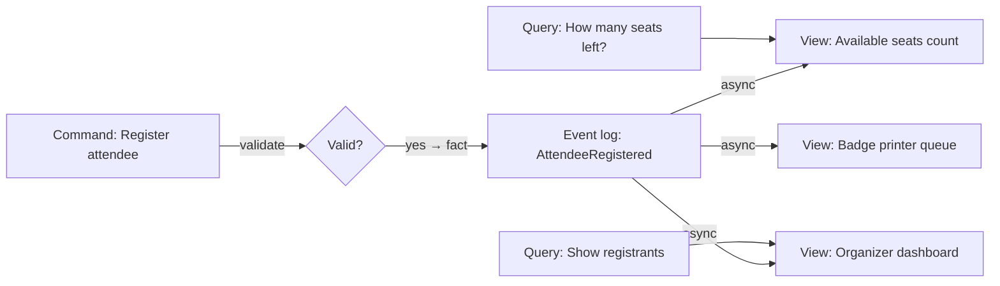

**Advantages**:
- Audit trail: complete history of what happened and why
- Replayability: delete any view and recompute from scratch with fixed code
- Multiple views: one event log → N read-optimized representations
- High write throughput: sequential log writes are fast
- Debuggability: reproduce exact state at any point in time

**Downsides**:
- External dependencies in event processing must be deterministic (include exchange rate in event, not fetched at replay time)
- GDPR right to erasure requires crypto-shredding (encrypt personal data, delete encryption key)
- Externally visible side effects (emails) must not re-trigger on view recomputation
- Eventually consistent: queries read from derived views, not the event log directly

**Implementation**: EventStoreDB, MartenDB (PostgreSQL), Axon Framework, or Kafka + stream processor.

**Event sourcing ≠ event-driven messaging**: In event sourcing, events are the source of truth for one bounded context. Event-driven messaging is about inter-service communication.

---

## DataFrames, Matrices, and Arrays (2nd Edition Addition)

A data model for analytical and ML workloads — not OLTP:

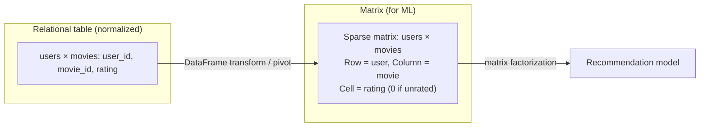

**DataFrame** (Pandas, Spark, Polars, Dask): table-like, but imperative manipulation API. Data scientists incrementally wrangle data toward the target shape.

**Key differences from relational**:
- Imperative (chain of operations) vs declarative SQL
- Supports wide tables (millions of columns — impossible in RDBMS)
- First-class support for sparse data, missing values, time-series
- Bridges to matrix/tensor representation for ML algorithms
- `join` → `merge`, `GROUP BY` → `groupby().agg()`

**When relational beats DataFrame**: Multi-user concurrent OLTP, referential integrity, ad-hoc queries, complex joins on normalized data. When DataFrame beats relational: ML feature engineering, exploratory analysis, scientific computing, sparse high-dimensional data.

**Array databases** (TileDB): specialized for multidimensional arrays — geospatial rasters, medical imaging, astronomical data.

---

## Decision Framework: Which Data Model?

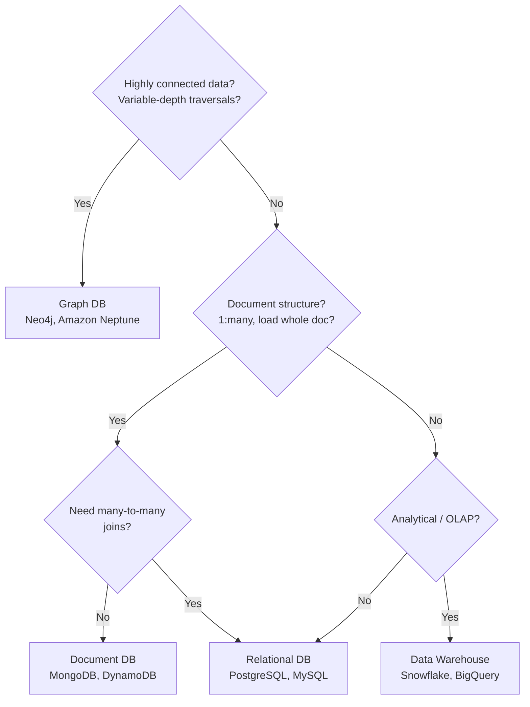
