# Chapter 4: Storage and Retrieval

## Core Thesis
The internals of storage engines directly determine performance characteristics. You cannot
reason about DB performance, capacity planning, or choosing between systems without
understanding the fundamental data structures underneath: B-trees and LSM-trees. Each is
optimized for different workloads, and neither is universally better.

---

## The Simplest Possible Storage Engine

```bash
# Append-only log — the foundation of almost everything
echo "$1,$2" >> database  # set(key, value)
grep "^$1," database | tail -1 | cut -d',' -f2  # get(key)
```

This illustrates the core insight: **appending to a log is the fastest possible write**.
The cost is paid on reads. Every real storage engine is a variation on how to make reads
faster without making writes too slow.

---

## Log-Structured Storage (LSM-Trees)

### MemTable + SSTable Architecture

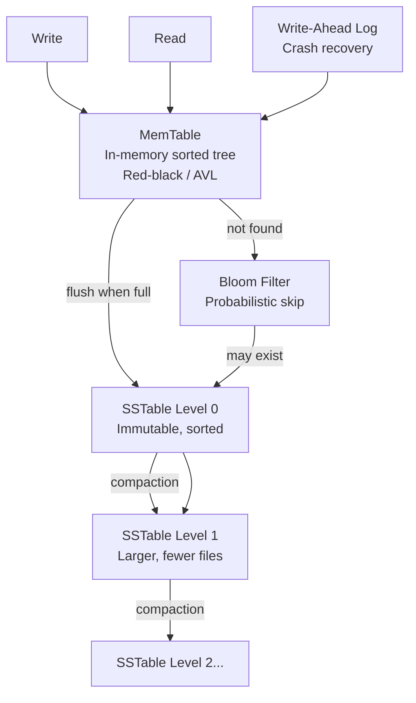

**SSTable (Sorted String Table)**:
- Keys sorted within file
- Each file is immutable once written
- Compaction merges and purges deleted/old keys

**Bloom Filter**: Probabilistic data structure — answers "definitely not in this file" or
"probably in this file" with zero false negatives. Crucial for read performance in LSM-trees.

### Compaction Strategies

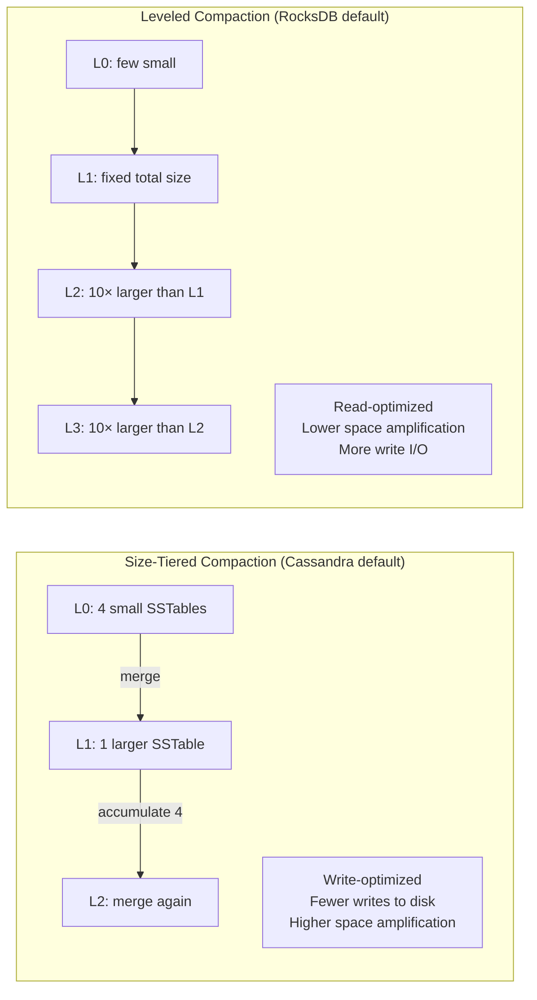

---

## B-Tree Storage

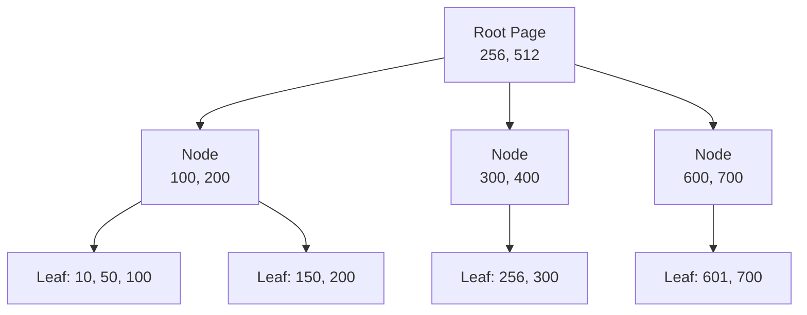

**B-tree properties**:
- Fixed-size pages (typically 4KB–16KB)
- `branching factor` (number of child pointers per page) = typically 500
- A 4-level tree with branching factor 500 can store 500⁴ = 62.5 billion keys
- **In-place updates**: overwrites existing pages on disk

**Write-Ahead Log (WAL)** for crash safety:
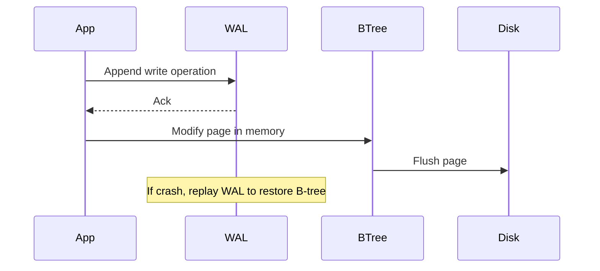

---

## LSM-Tree vs B-Tree — The Critical Decision

| Dimension | LSM-Tree | B-Tree |
|-----------|----------|--------|
| **Write throughput** | ✅ Higher (sequential appends) | ❌ Lower (random in-place writes) |
| **Read latency** | ❌ Higher (check multiple levels) | ✅ Lower (predictable page traversal) |
| **Write amplification** | Medium (compaction rewrites data) | Lower (only write data once… mostly) |
| **Space amplification** | Medium (old versions until compaction) | Low (in-place, predictable) |
| **Compression** | ✅ Better (contiguous data) | ❌ Worse (fragmentation) |
| **Compaction impact** | ⚠️ Can throttle writes during heavy compaction | N/A |
| **Range queries** | ✅ Efficient (sorted SSTables) | ✅ Efficient (sorted pages) |
| **Best for** | Write-heavy workloads, time-series | Read-heavy, latency-sensitive |
| **Examples** | RocksDB, Cassandra, DynamoDB, LevelDB | PostgreSQL, MySQL InnoDB, SQLite |

**Write amplification**: One logical write causes multiple physical writes (compaction,
WAL, actual data). For SSDs with limited write endurance, this matters.

---

## Indexes

### Primary vs Secondary Index

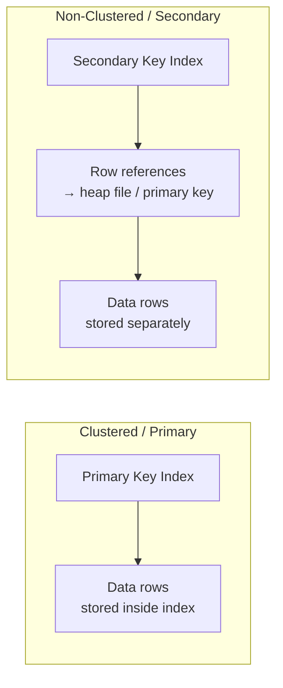

- **Clustered index** (InnoDB, DynamoDB): Data stored sorted by PK. Fast PK lookups.
  Secondary indexes hold PK value as row reference.
- **Heap file**: Data stored separately from index. More flexible, avoids duplication.

### Multi-Column / Composite Indexes

```sql
-- Index on (latitude, longitude) for geo queries
-- Efficient for: WHERE lat BETWEEN x1 AND x2 AND lon BETWEEN y1 AND y2
CREATE INDEX idx_location ON restaurants(latitude, longitude);
```

A 2D index maps to a 1D space via space-filling curves (R-trees, geohash). PostGIS uses this.

### Full-Text Search Indexes (Inverted Index)

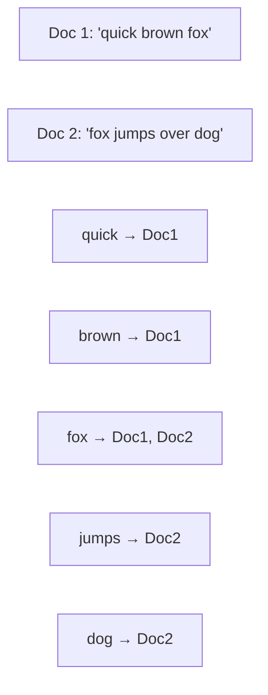

---

## In-Memory Databases

**Why in-memory can be faster** is often misunderstood:
- NOT because avoiding disk reads (OS page cache does that anyway)
- IS because avoiding the overhead of encoding data in a disk-compatible format
- AND because data structures that don't need to be disk-safe (e.g., priority queues, sets)

**Durability options**:
1. Snapshot to disk periodically (Redis default)
2. Append-only log of operations (Redis AOF)
3. Replication to other nodes
4. NVM (non-volatile memory) — emerging

**Examples**: Redis (cache + limited durability), VoltDB (full ACID in-memory), RAMCloud.

---

## Column-Oriented Storage (for Analytics)

### Row vs Column Layout

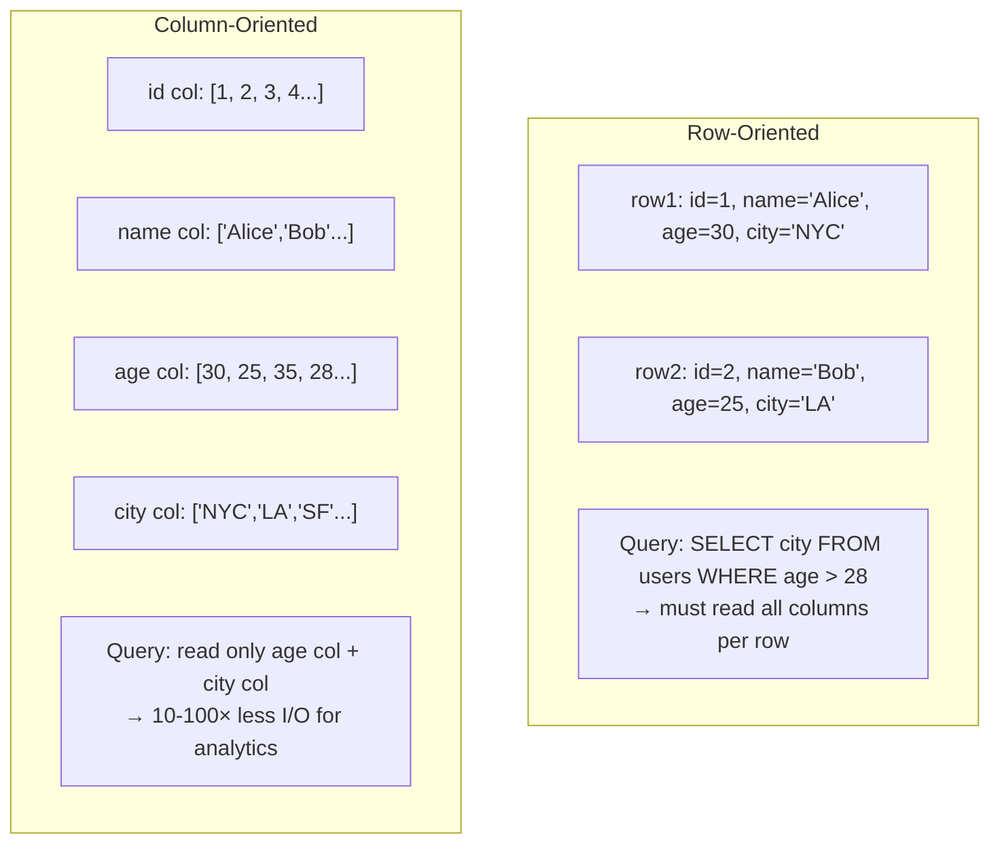

### Column Compression

Columns store the same type of data repeatedly → excellent compression:

| Technique | How | When |
|-----------|-----|------|
| Bitmap encoding | One bit per row per value | Low-cardinality columns (status, country) |
| Run-length encoding | "value × count" | Sorted, repetitive data |
| Delta encoding | Store diffs, not values | Time-series, monotonic IDs |
| Dictionary encoding | Map values to integers | String columns |

**Vectorized processing**: SIMD CPU instructions can process compressed column data in bulk —
query engines like DuckDB, ClickHouse exploit this heavily.

### Sort Order in Column Storage

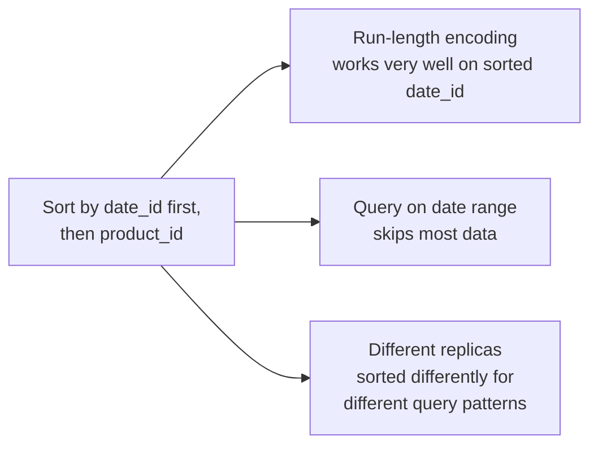

**Materialized views / Cubes**: Pre-aggregate common queries (SUM by product by date).
Fast at query time, stale on writes. Trade-off: write overhead vs query speed.

---

## Query Execution: Compilation and Vectorization

Two approaches to fast analytical query execution on columnar data:

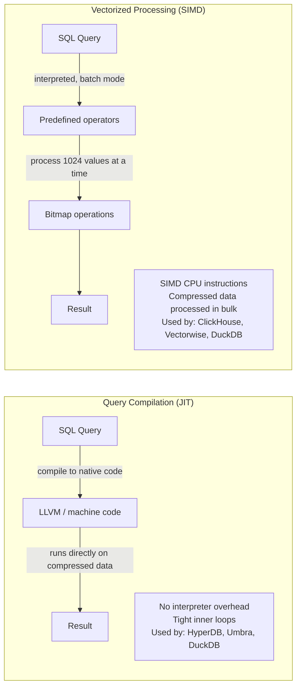

**Both approaches leverage**:
- Sequential memory access (CPU cache-friendly)
- SIMD (Single Instruction, Multiple Data) parallelism
- Operating on compressed column data directly without decompression overhead

---

## Materialized Views and Data Cubes

**Materialized view**: Actual copy of query results stored on disk (not a virtual/logical view).
Updated when source data changes.

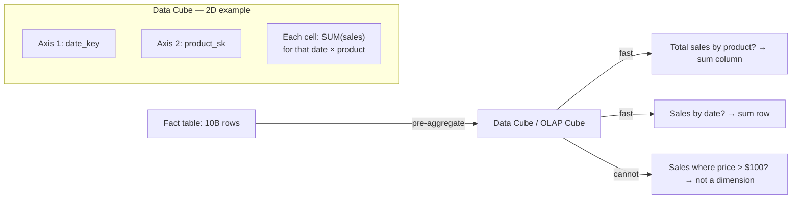

**Trade-off**:
- ✅ Pre-computed aggregates are very fast to query
- ❌ Data cube only supports queries on its defined dimensions
- ❌ Write overhead: materialized view must be updated on every source change
- Best practice: keep as much raw data as possible; use cubes only as performance boost for known common queries

---

## Multidimensional Indexes

B-trees and LSM-trees support single-dimension range queries efficiently. For multiple simultaneous dimensions, specialized indexes are needed:

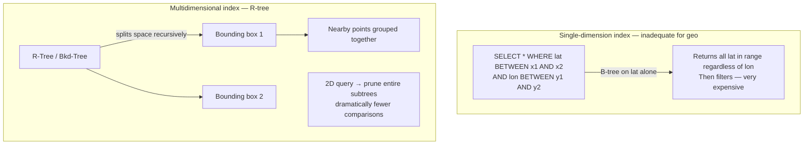

**R-tree** (PostGIS): Recursively partitions space into bounding rectangles.
**Space-filling curve** (geohash): Maps 2D to 1D by interleaving bits of lat/lon.
**Applications**: geo search, color range queries (R/G/B dimensions), time+temperature sensors.

---

## Full-Text Search (Inverted Index)

```mermaid
graph LR
    subgraph "Inverted Index"
        D1[Doc 1: 'quick brown fox']
        D2[Doc 2: 'fox jumps high']

        T1[quick → [Doc1]]
        T2[brown → [Doc1]]
        T3[fox → [Doc1, Doc2]]
        T4[jumps → [Doc2]]
    end

    Q["Search: 'brown fox'"] --> T2
    Q --> T3
    T2 & T3 -->|AND → bitwise AND of bitmaps| R[Doc1]
```

**Implementation (Lucene/Elasticsearch)**:
- Postings list stored in SSTable-like sorted files
- Merged in background (same log-structured approach as LSM-trees)
- Supports fuzzy matching via Levenshtein automaton (edit distance = 1 typo tolerance)
- Trigram indexing for substring/regex search

**PostgreSQL GIN index**: Native inverted index supporting full-text search and JSON document indexing.

---

## Vector Embeddings and Semantic Search (2nd Edition Addition)

Traditional search: keyword matching (exact or fuzzy).
Semantic search: find documents with similar *meaning*, not identical words.

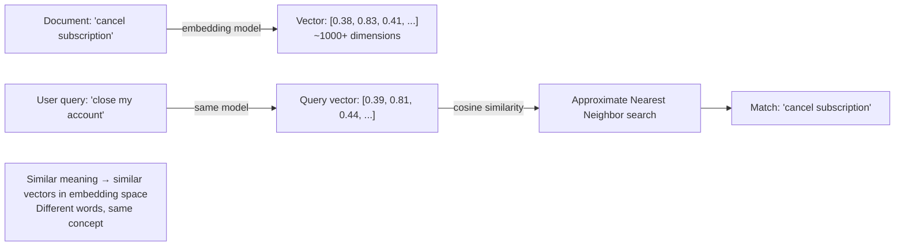

**Vector Index Types**:

| Type | How | Speed | Accuracy |
|------|-----|-------|----------|
| Flat | Compare query against every vector | Slowest | Exact |
| IVF (Inverted File) | Cluster vectors into centroids; search nearest clusters | Fast | Approximate |
| HNSW (Hierarchical Navigable Small World) | Graph of proximity layers; greedy search | Very fast | Approximate |

**Key term clarification**:
- "Vectorized processing" (column DB) = batch CPU operations on compressed data
- "Vector embedding" (semantic search) = floating-point array representing meaning in high-dimensional space
These are unrelated despite the naming collision.

**Products**: pgvector (PostgreSQL), Pinecone, Weaviate, Chroma, Qdrant. Facebook's Faiss library implements IVF and HNSW.

---

## Storage Engine Selection Guide

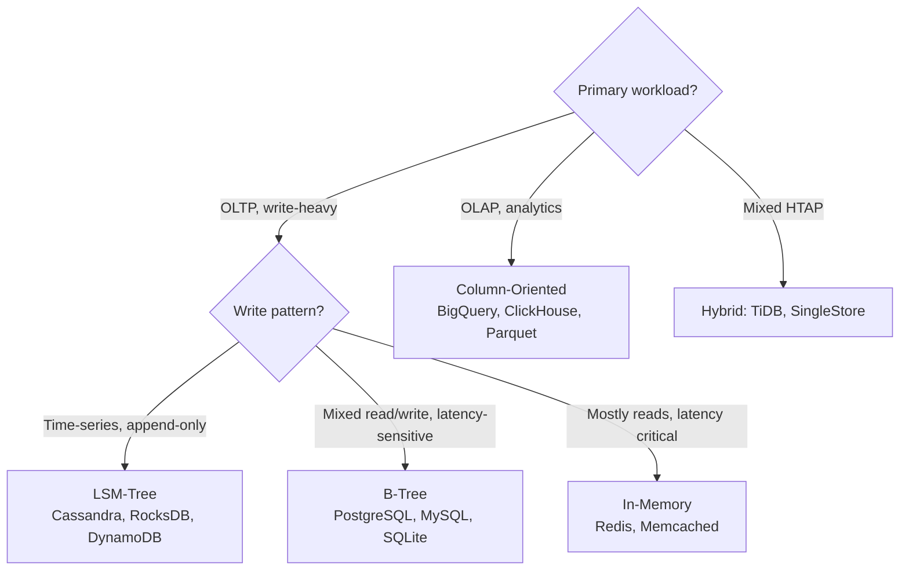
