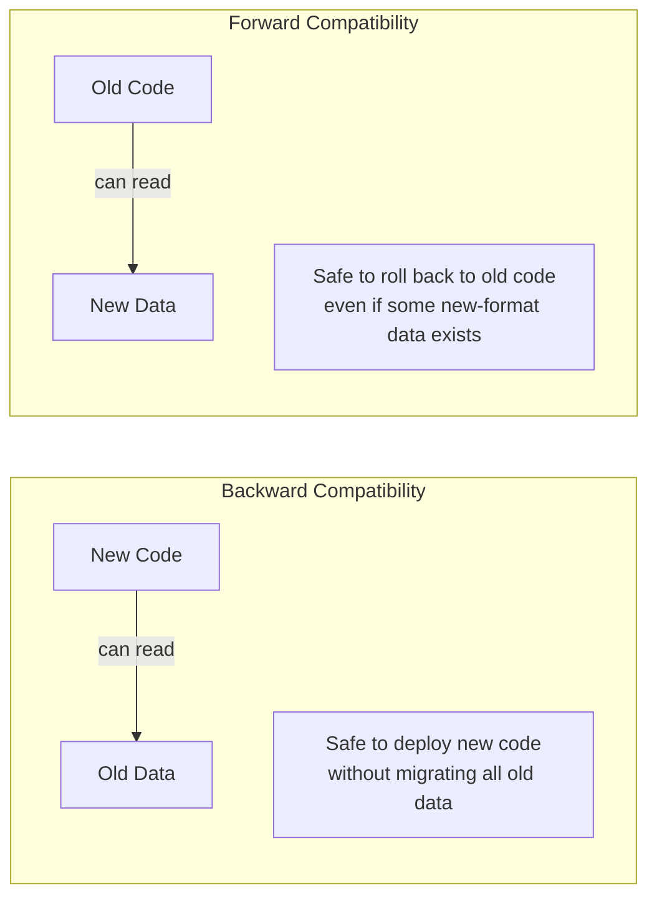
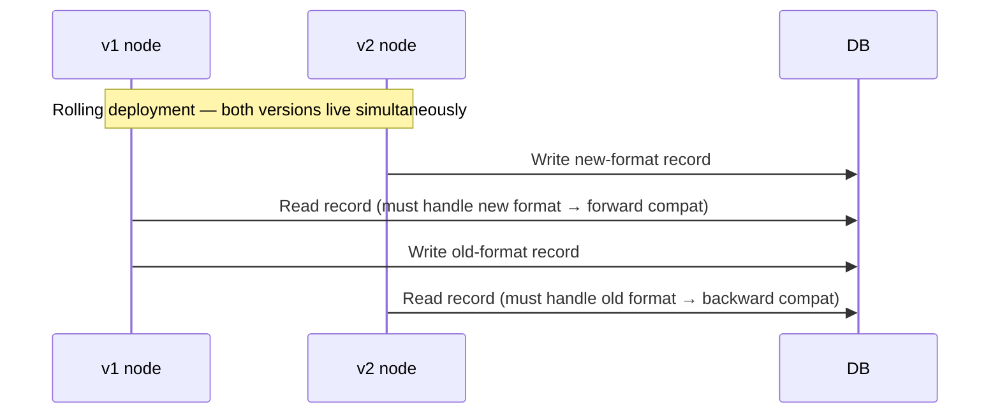
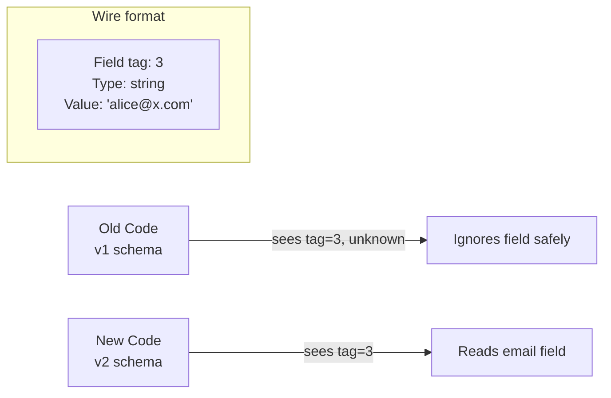
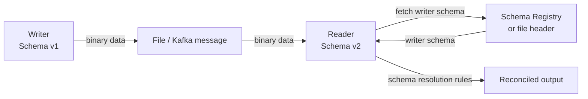
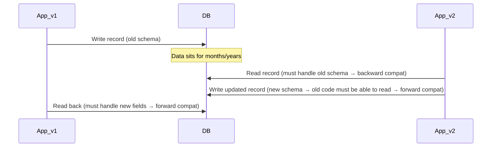
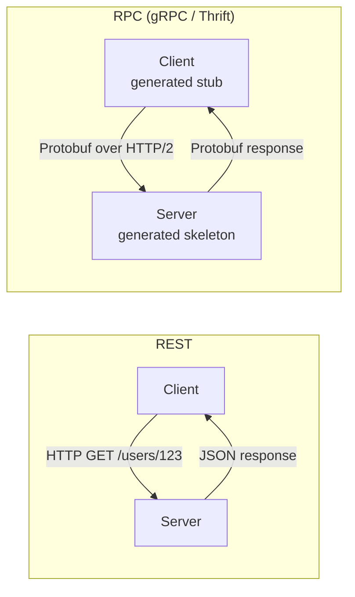
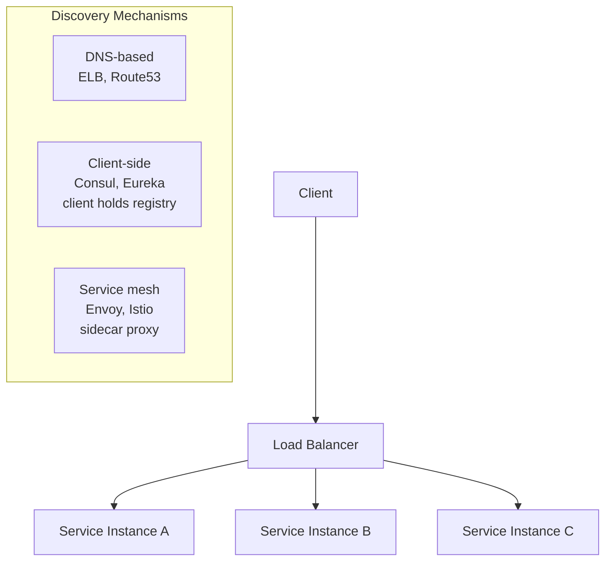
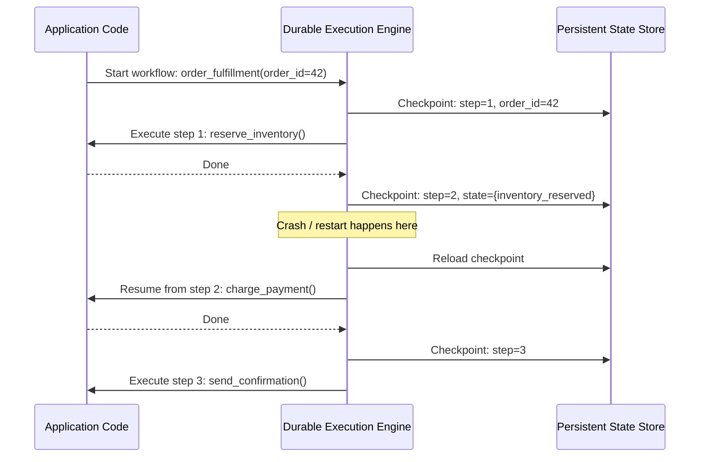
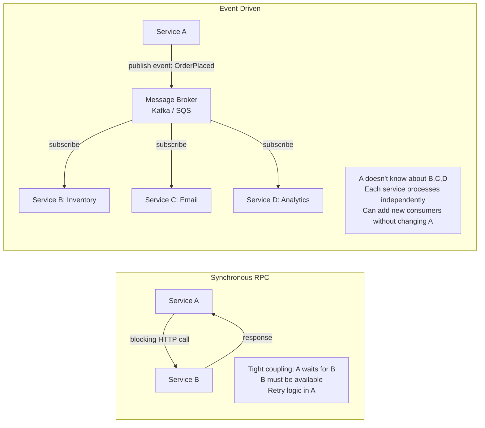
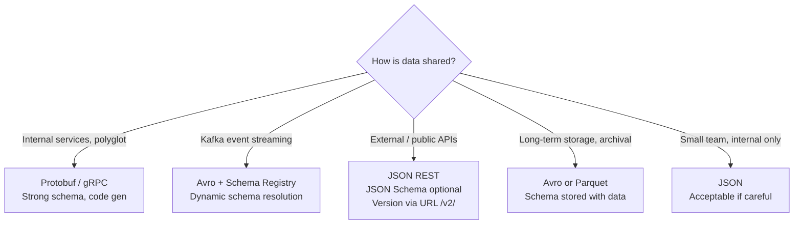

# Chapter 5: Encoding and Evolution

## Core Thesis
Systems evolve. Code changes, but data written with old schemas outlives old code. Schema
evolution is not optional — it's a first-class engineering concern. The choice of encoding
format determines how safely and easily you can evolve your data model over time.

---

## Backward and Forward Compatibility



**Why both matter in rolling deployments**:



---

## Encoding Formats Compared

| Format | Schema? | Human-readable? | Binary? | Schema evolution | Size |
|--------|---------|----------------|---------|-----------------|------|
| JSON | Optional (JSON Schema) | ✅ Yes | ❌ | Weak | Large |
| XML | Optional (XSD) | ✅ Yes | ❌ | Weak | Very large |
| CSV | No | ✅ Yes | ❌ | Very weak | Medium |
| MessagePack | No | ❌ | ✅ | Weak | Small |
| Thrift / Protobuf | Required | ❌ | ✅ | Strong | Very small |
| Avro | Required (in/out of band) | ❌ | ✅ | Strong | Very small |

---

## Protocol Buffers (Protobuf) / Thrift

**Schema evolution via field tags**:

```protobuf
// v1 schema
message Person {
  required string user_name = 1;
  optional int64 favorite_number = 2;
}

// v2 schema — adding a field safely
message Person {
  required string user_name = 1;
  optional int64 favorite_number = 2;
  repeated string email = 3;    // new field — old code ignores unknown tags
}
```



**Rules for safe Protobuf evolution**:
- ✅ Add optional/repeated fields with new tag numbers
- ✅ Remove optional/repeated fields (old writers send nothing, new readers get default)
- ❌ Change a field's data type (may break encoding)
- ❌ Change a field's tag number (existing data becomes unreadable)
- ❌ Add required fields (old writers don't send them → validation failure)

---

## Avro

Avro's key innovation: **writer's schema and reader's schema can differ** and are
reconciled at read time using explicit schema resolution rules.



**Avro schema evolution rules**:
- Adding field with default: backward + forward compatible
- Removing field with default: backward + forward compatible  
- Changing type: only compatible if schemas define a union type

**Where to store the writer schema**:
1. Large file (Avro container): schema in file header
2. Database with many small records: schema version ID in each record → look up in registry
3. Kafka messages: Confluent Schema Registry — schema ID embedded in message

---

## Modes of Dataflow

### 1. Dataflow Through Databases



**Data outlives code**. A field added years ago may still be read by code that knows nothing
about it. Always write code that gracefully ignores unknown fields.

### 2. Dataflow Through Services: REST and RPC



**REST advantages**: Widely understood, human-readable, easy to debug, cacheable (HTTP caching),
no code generation required.

**RPC advantages**: Type safety, IDL-driven contract, smaller payload (binary), streaming
support (gRPC bidirectional streaming).

**The fundamental problem with RPC**: Network calls are not like local calls:
- Can fail in ways local calls cannot (timeout, packet loss, partial failure)
- Latency is variable and unpredictable
- Return values may not arrive even if the call succeeded (→ idempotency requirement)
- Cannot pass large objects by reference

**RPC evolution**: Must maintain backward-compatible request format (old clients, new server)
and forward-compatible response format (new server fields ignored by old clients).

### 3. Dataflow Through Message Queues

```mermaid
sequenceDiagram
    participant Producer
    participant Broker[Message Broker<br/>Kafka / SQS / RabbitMQ]
    participant Consumer_v1
    participant Consumer_v2

    Producer->>Broker: Message (schema v2)
    Broker->>Consumer_v1: Deliver (v1 consumer must handle v2 data → forward compat)
    Broker->>Consumer_v2: Deliver (v2 consumer handles v2 data)
    note over Producer,Consumer_v2: Different consumers may be at different versions simultaneously
```

---

## Service Discovery and Load Balancing



---

## Durable Execution and Workflows (2nd Edition Addition)

Traditional RPC/REST: if the caller crashes mid-workflow, the state is lost. Durable execution
solves this by persisting workflow state so it can resume after any failure.



**Key semantics**: Code appears to execute linearly, but the engine transparently saves state
after each step and can replay from any checkpoint after a crash.

**Examples**:
- **Temporal**: Open-source durable execution platform (used by DoorDash, Netflix, Stripe)
- **AWS Step Functions**: Managed state machine with Lambda steps
- **Azure Durable Functions**: Durable orchestration for Azure Functions
- **Conductor** (Netflix): Workflow orchestration platform

**How it relates to encoding**: Workflow state must be serialized to persistent storage at each checkpoint — schema evolution of workflow state is as important as database schema evolution.

---

## Event-Driven Architectures (Dataflow Through Events)

A third mode of dataflow (alongside databases and services): systems communicate by
publishing and subscribing to events asynchronously.



**Event-driven vs message-passing RPC**:
- Both use a message broker
- Event-driven: publisher doesn't care who processes the event (fire-and-forget, fanout)
- Message queue RPC: publisher sends to specific service, expects a response (request/reply pattern)

**Schema evolution for events**: Events in a broker are long-lived — consumers may be on older
versions. This makes Avro (with schema registry) the preferred encoding for Kafka events:
schema evolution is explicit and controlled. JSON works but provides no compile-time safety.

**Encoding/evolution rules apply to all dataflow modes**:

| Mode | Schema evolution concern |
|------|--------------------------|
| DB | Data outlives code — old records read by new code |
| RPC/REST | Rolling deploy — old client talks to new server |
| Message broker | Long message retention — old consumer reads new-format event |
| Durable workflow | State checkpointed and replayed — workflow schema must be backward-compatible |

---

## Schema Evolution Decision Framework



**The Merits of Schemas** (vs schema-less/JSON):
- Self-documentation: schema is the contract
- Compact encoding: no field names in payload
- Schema registry: audit trail of evolution
- Code generation: compile-time type safety
- Schema compatibility checks: catch breaking changes before deploy
