# Chapter 6: Replication

## Core Thesis
Replication keeps copies of data on multiple nodes. The hard part is handling changes to
replicated data. Every replication strategy makes a trade-off between consistency,
availability, and performance — and understanding these trade-offs is essential before
choosing a replication topology.

---

## Why Replicate?

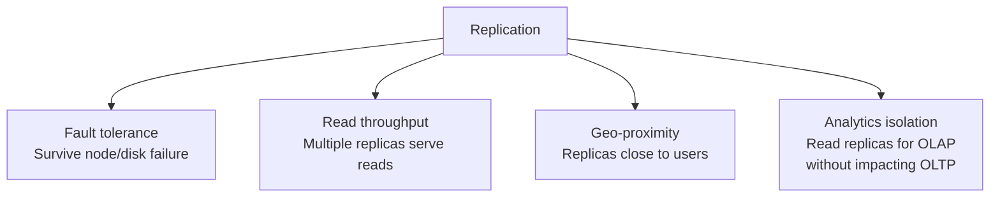

**Replication ≠ Backup**: Backups are point-in-time snapshots, not live copies. Replication
does not protect against accidentally deleting data — the deletion will be replicated.

---

## Single-Leader (Leader-Follower) Replication

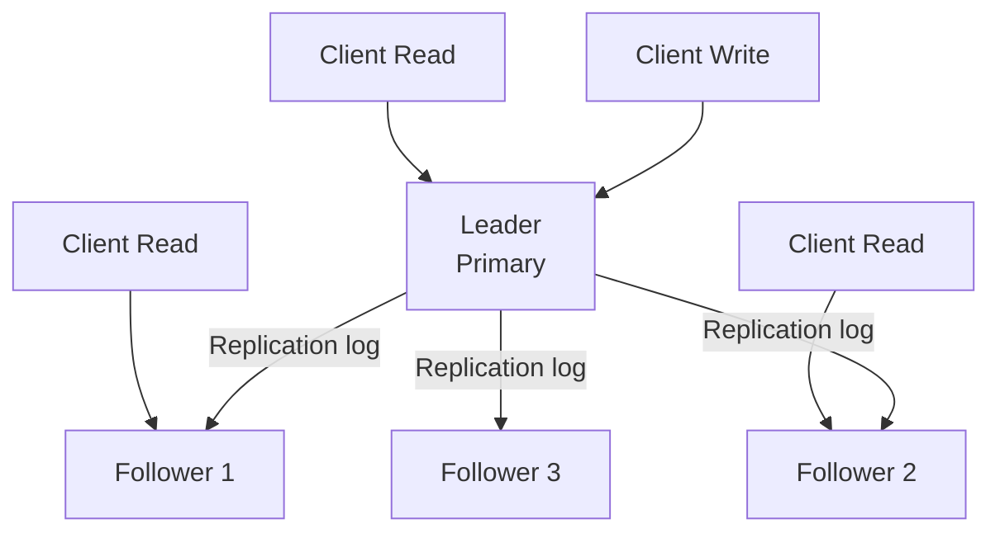

**Properties**:
- All writes → leader only
- Reads → any replica (with consistency caveats)
- Replicas apply leader's log in same order

### Synchronous vs Asynchronous Replication

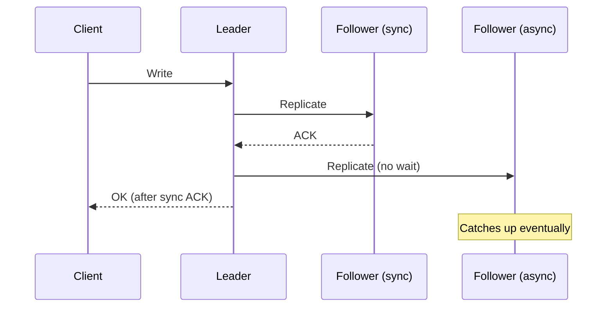

| Mode | Durability | Write latency | Availability |
|------|-----------|--------------|-------------|
| Fully synchronous | Highest — no data loss | Highest — waits all followers | Lowest — one follower down = blocked |
| Semi-synchronous | High — 1 sync follower | Medium | Good — only 1 sync |
| Fully asynchronous | Lowest — leader crash = data loss | Lowest | Highest — writes always ack fast |

**Semi-synchronous** is the most common production setting: one follower is synchronous, the
rest are asynchronous. Ensures at least 2 copies (leader + 1 sync follower).

---

## Follower Setup and Failover

### Adding a New Follower

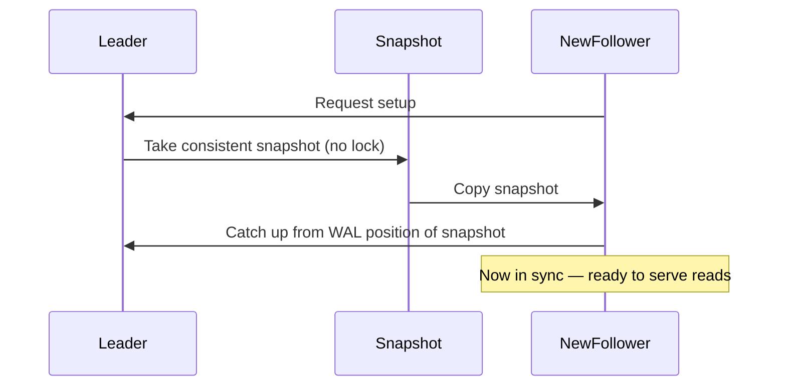

### Leader Failover

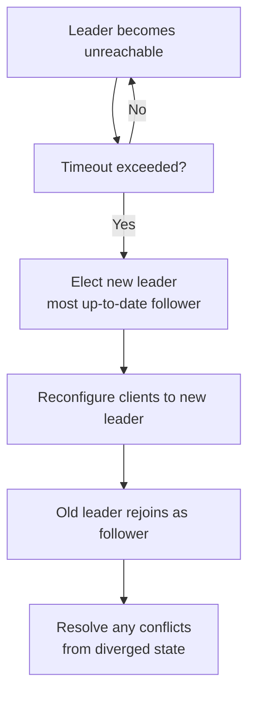

**Failover hazards**:
1. **Data loss**: Async follower promoted → unreplicated writes lost
2. **Split-brain**: Two nodes think they're leader → write conflicts (use fencing tokens)
3. **Wrong timeout**: Too short → spurious failover under load. Too long → long recovery time.
4. **Primary key collisions**: If lost writes used auto-increment IDs, new leader's IDs may
   overlap with writes elsewhere (GitHub incident with MySQL → stale counter)

---

## Replication Lag Anomalies

These anomalies occur when reading from async followers:

### 1. Read-After-Write Inconsistency

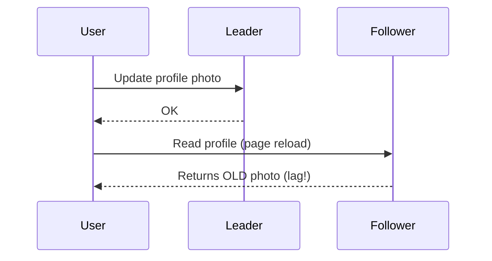

**Solution — Read-your-own-writes consistency**:
- Read from leader for 1 minute after a write
- Track replication position; read from follower only if it's caught up
- Route user to same follower consistently (sticky sessions)

### 2. Monotonic Reads

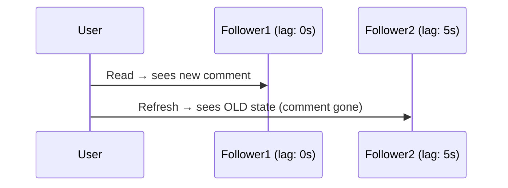

**Solution**: User always reads from same replica (session stickiness by user ID hash).

### 3. Consistent Prefix Reads

Order of causally related writes must be preserved:
```
Q: "How far into the future can you see?"   (write 1 to shard A)
A: "About ten seconds."                     (write 2 to shard B)

Reader sees shard B first → answer appears before question → nonsense
```

**Solution**: Causally related writes to same shard, or track causal dependencies.

---

## Multi-Leader Replication

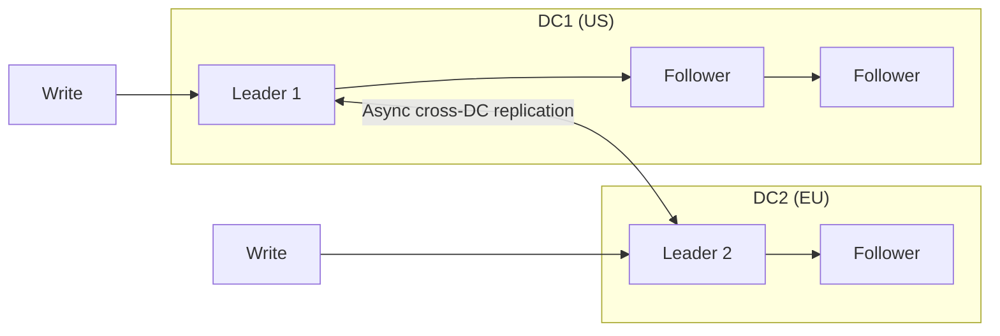

**Use cases**:
- Multi-datacenter operation (writes local, replicate across DCs)
- Offline clients (mobile app as a "leader" when offline, syncs when online)
- Collaborative editing (Google Docs model)

### Write Conflicts

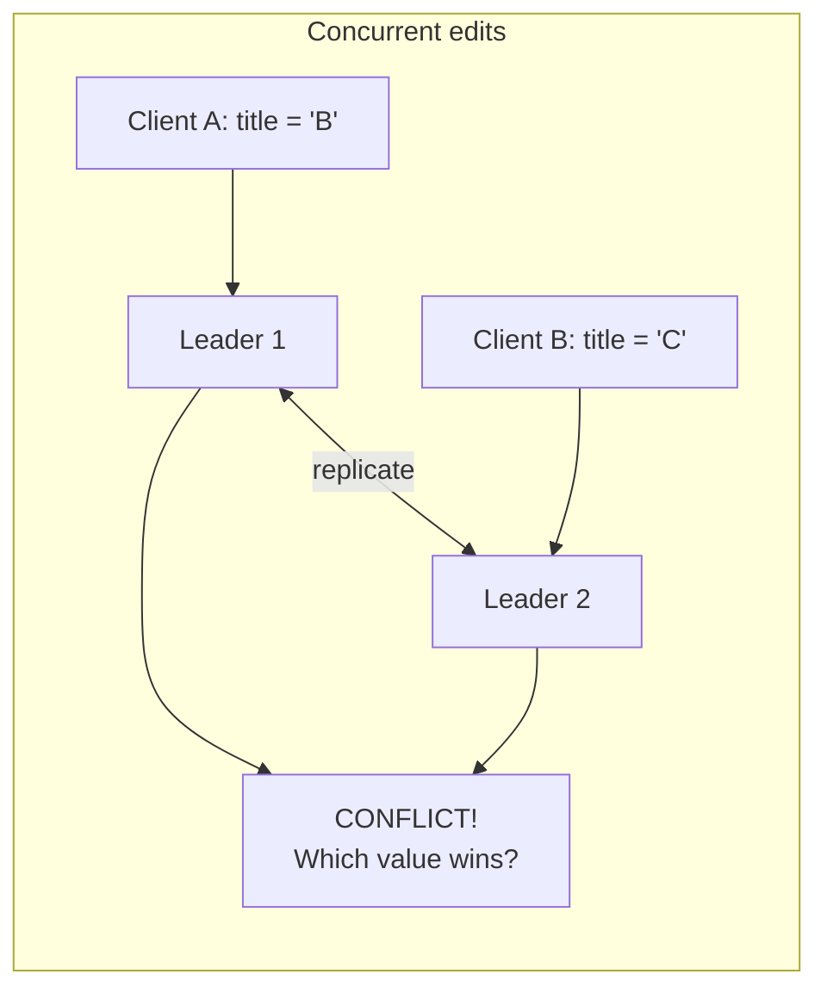

**Conflict resolution strategies**:

| Strategy | Description | Risk |
|----------|-------------|------|
| Last-write-wins (LWW) | Higher timestamp wins | Data loss — concurrent writes may be lost |
| Merge | Application merges values | Complex, domain-specific |
| CRDT | Conflict-free Replicated Data Types | Limited data structures only |
| Custom logic | Application-defined conflict handler | Most flexible |

**LWW is the default in Cassandra and DynamoDB** — it silently discards concurrent writes.
This is acceptable only if losing some writes is acceptable.

---

## Leaderless Replication (Dynamo-Style)

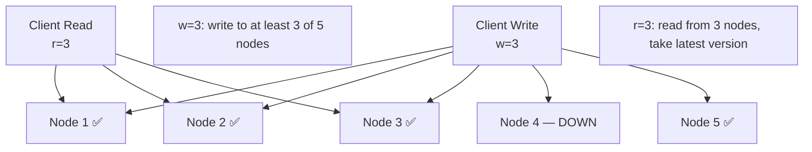

**Quorum condition**: `w + r > n` (where n = total replicas) ensures overlap → always
reads at least one node that has the latest write.

For `n=5, w=3, r=3`: `3+3=6 > 5` ✅

**Read repair**: When reading, if different nodes return different values, the client writes
the newest value back to stale nodes.

**Anti-entropy**: Background process constantly compares replicas and fixes differences.

---

## Databases Backed by Object Storage

A newer architectural pattern: separate the storage engine from the storage medium.
Traditional databases own their storage (local disk or SAN). Cloud-native databases
store data in object storage (S3/GCS) and run compute separately.

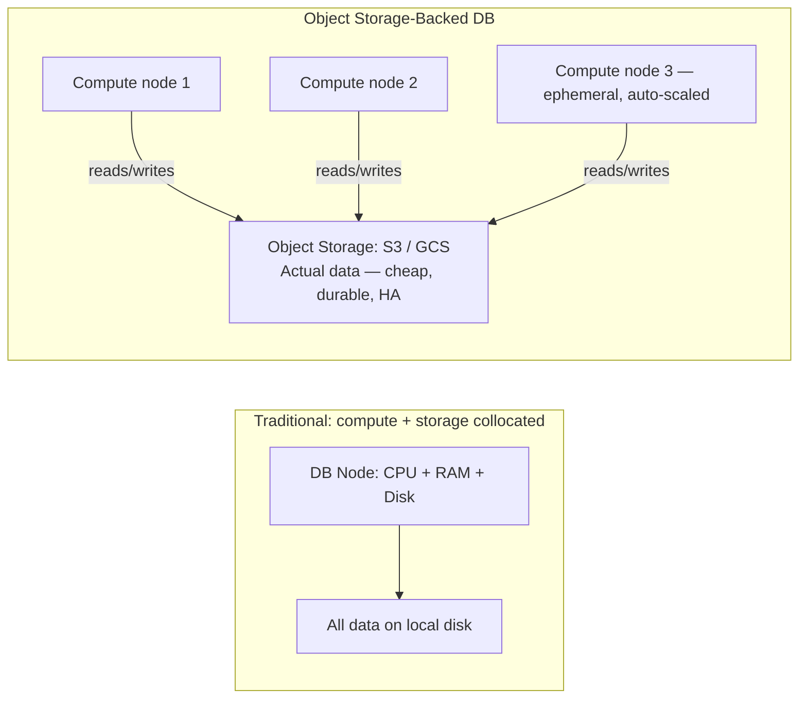

**Examples**: Aurora (log-only over NVMe + S3), Neon (Postgres over S3), AlloyDB.

**Implications for replication**: Instead of shipping a replication log between nodes,
all nodes read from the same shared object storage. "Replication" is handled by the
object store's durability guarantees.

**Implications for follower setup**: No snapshot-and-catch-up needed — new compute nodes
simply start reading from object storage. Scale-out in seconds.

---

## Conflict Resolution in Multi-Leader Systems

When two leaders accept concurrent writes to the same key, a conflict must be resolved.

### Conflict Avoidance
Route all writes for a given record through the same leader:
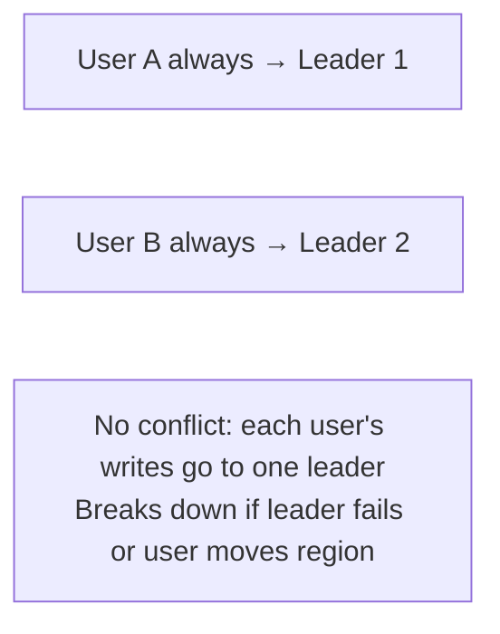
Most reliable: if the application can always route a user's writes to one leader, conflicts don't arise.

### Last-Write-Wins (LWW)
Attach a timestamp to each write; highest timestamp wins.
- ✅ Simple to implement
- ❌ Silent data loss: concurrent writes lose one value
- ❌ Clock skew means "last" is not deterministic

**Used by**: Cassandra (default), DynamoDB (if using LWW mode)

### CRDTs (Conflict-Free Replicated Data Types)
Data structures designed so concurrent updates can always be merged without conflict:

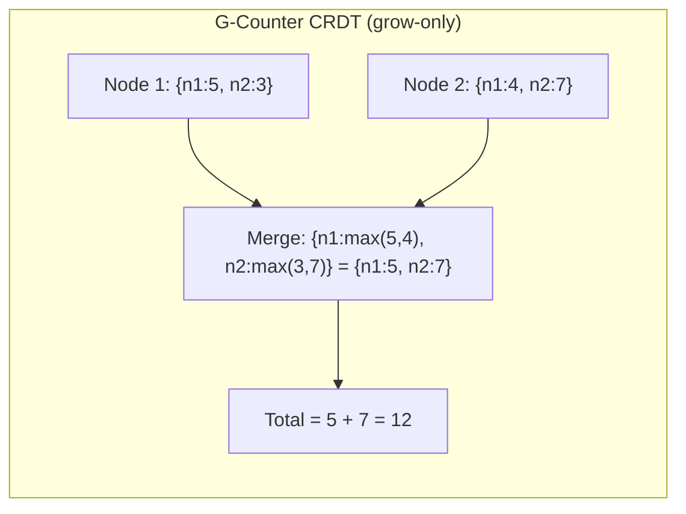

**CRDT types**: G-Counter, PN-Counter, G-Set, OR-Set, LWW-Register, MV-Register.

**Used by**: Riak (CRDT-native), Redis (some data types), Collaborative editors (Yjs, Automerge).

**Limitation**: Only specific data structures fit the CRDT model. Arbitrary application logic
cannot be made conflict-free without redesigning data models.

### Sync Engines and Local-First Software

A newer pattern for collaborative applications (Figma, Linear, Notion):

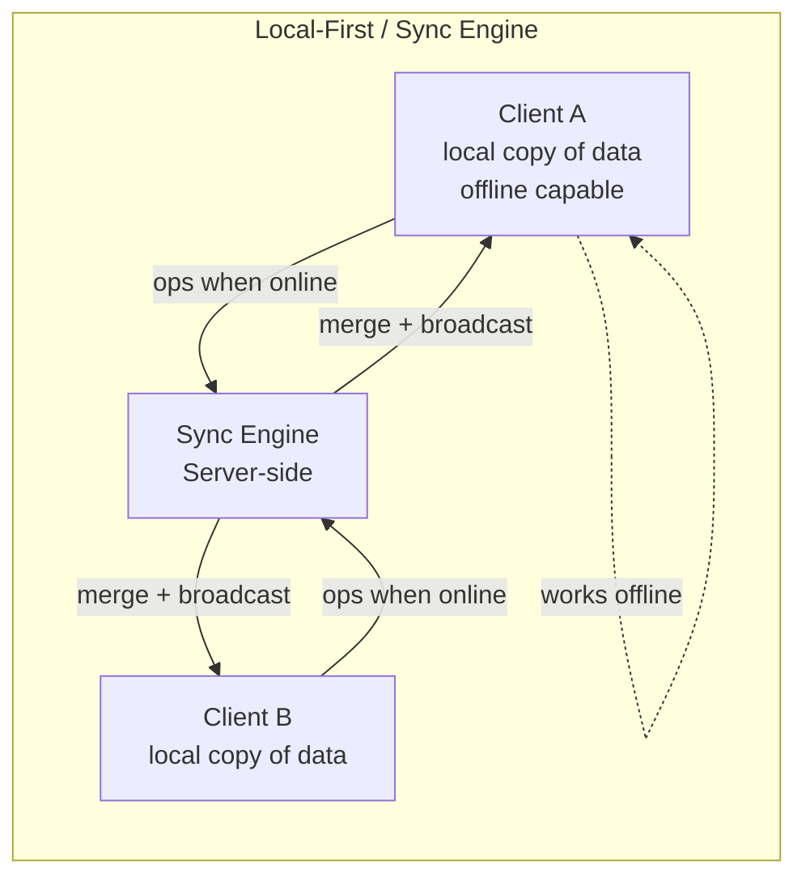

- Each client maintains a full local copy (works offline)
- Operations are appended to a local log and synced when online
- The sync engine merges operations using CRDTs or operational transformation (OT)
- **Conflict resolution** is the core hard problem

**Examples**: Automerge, Yjs (CRDT-based), Google Docs (OT-based), Apple's CloudKit.

---

## Hinted Handoff (Leaderless Replication)

When a node is temporarily unavailable, another node accepts writes on its behalf,
storing them as "hints":

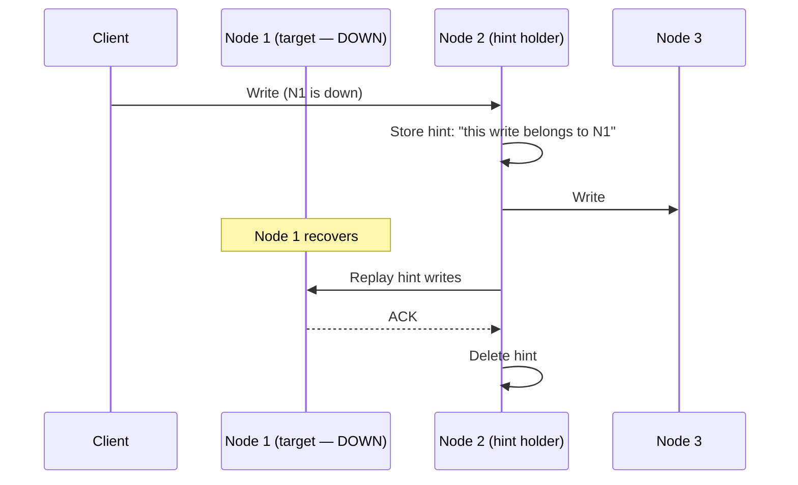

**Sloppy quorum**: Accept writes even when fewer than w nodes from the designated replica
set are available, by using other available nodes as hint holders.

**Risk**: Hinted handoff only improves write availability. Reads may still return stale data
until hints are replayed. Even with `w + r > n`, a sloppy quorum cannot guarantee reading
the most recent value.

---

## Detecting Concurrent Writes and Version Vectors

In leaderless replication, concurrent writes to the same key produce conflicting versions. The system must detect which writes are concurrent vs causally ordered.

### Concurrency, Time, and Relativity

Two operations are **concurrent** if neither knows about the other — not necessarily same wall-clock time. A and B are concurrent if A happened neither before nor after B in causal order.

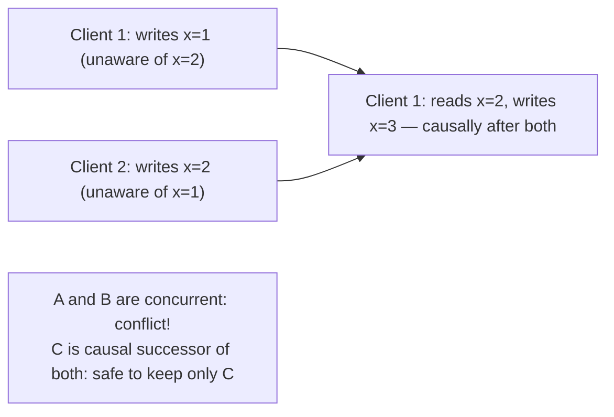

### Version Vectors

Track a counter per replica to determine causal dominance:

```
V1 = {n1:3, n2:1}   V2 = {n1:2, n2:2}

V1 dominates V2 if ALL counters in V1 ≥ V2
Here: n1: 3>2 ✓  but  n2: 1<2 ✗
→ Neither dominates: CONCURRENT — keep both until merged

V3 = {n1:4, n2:2} dominates V1 and V2: n1:4≥3,2 ✓  n2:2≥1,2 ✓
→ V3 supersedes both safely
```

**Used by**: Riak, DynamoDB (internal), Git DAG, CRDTs.

### Monitoring Replication Staleness

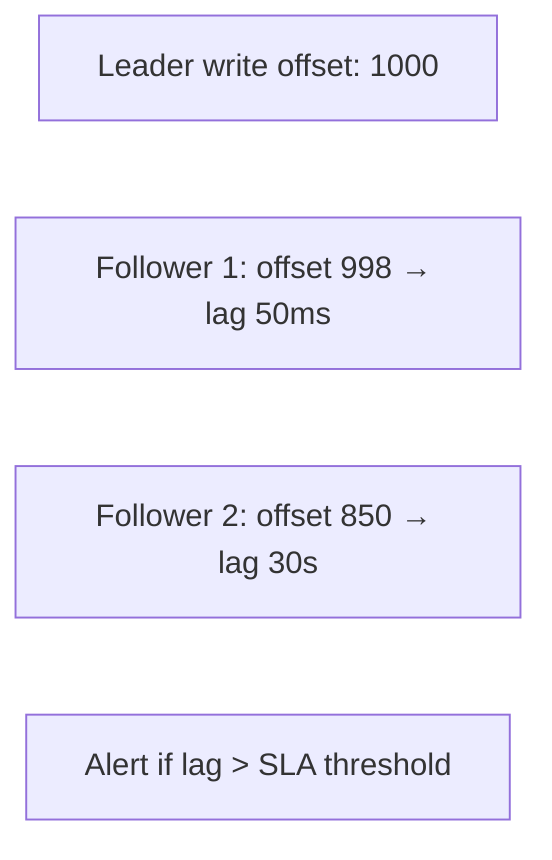

**Operational metrics**: bytes lag (WAL offset delta) + time lag (seconds). Alert on time lag exceeding your read-your-own-writes SLA.

**Single-leader vs leaderless performance**: Single-leader: consistent reads from follower, write bottleneck at leader. Leaderless: writes to any node, tune `w` for throughput vs durability.

**Multi-region operation**: Cross-region replication RTT = 50–200ms. Async = low write latency, risk losing data on region failure. Sync = durability, high latency. Multi-leader per region = lowest latency, conflict resolution required.

---

## Replication Topologies

| Method | How | Trade-offs |
|--------|-----|-----------|
| Statement-based | Replicate SQL statements | ❌ Non-deterministic functions (NOW(), RAND()) |
| WAL shipping | Ship raw storage engine bytes | ❌ Tightly coupled to storage engine version |
| Row-based (logical) | Replicate changed rows | ✅ Storage-engine independent, most common |
| Trigger-based | Application-level triggers | ⚠️ High overhead, flexible but fragile |

**PostgreSQL WAL / MySQL binlog** = logical replication (row-based). This is what CDC tools
(Debezium) consume to create event streams.
