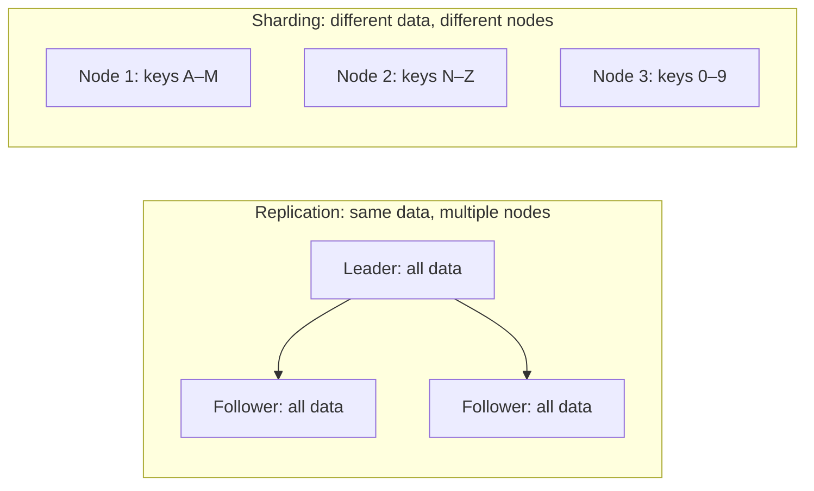
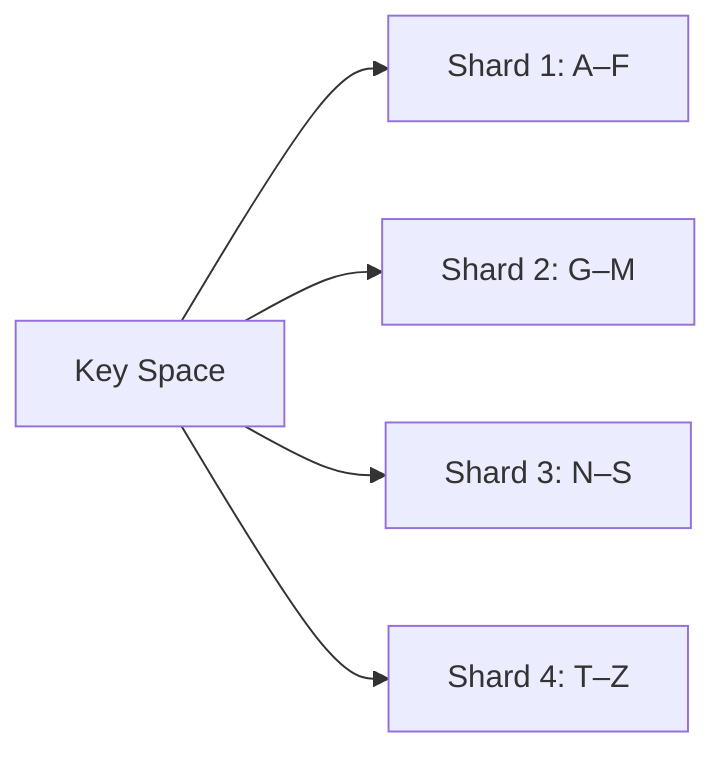
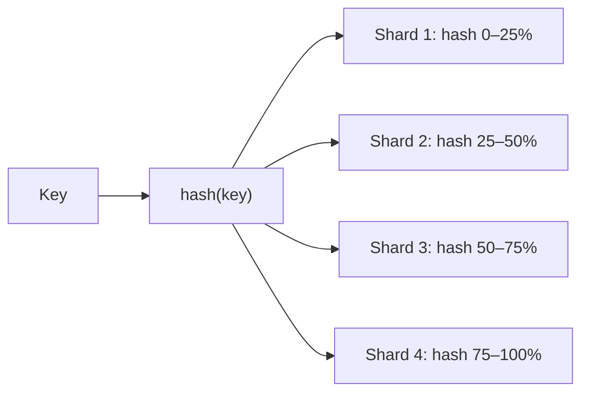
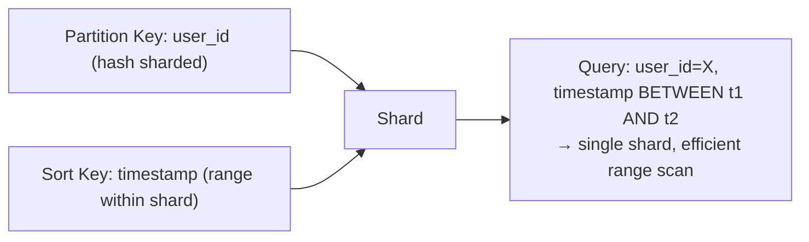
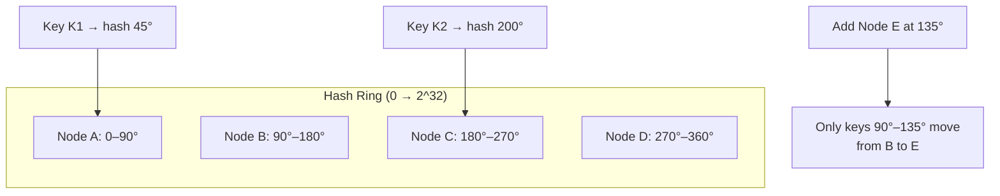
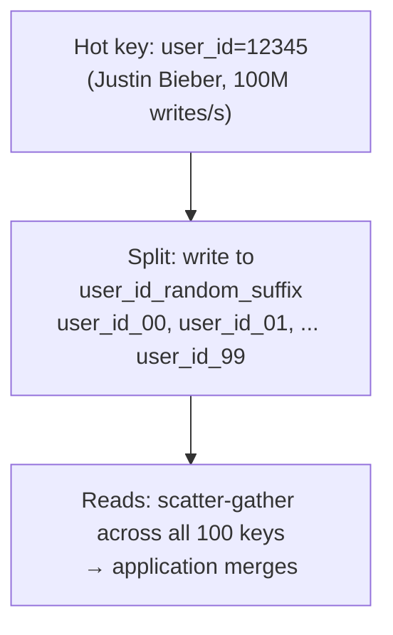
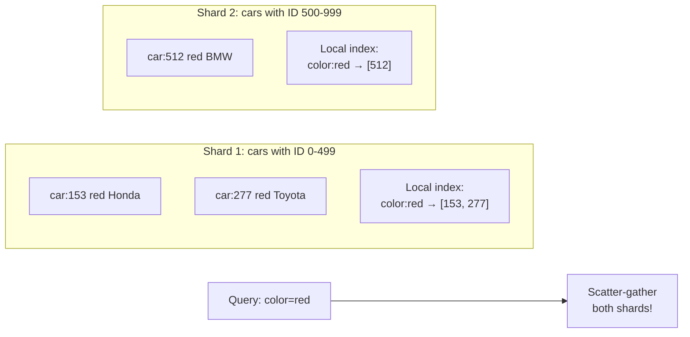
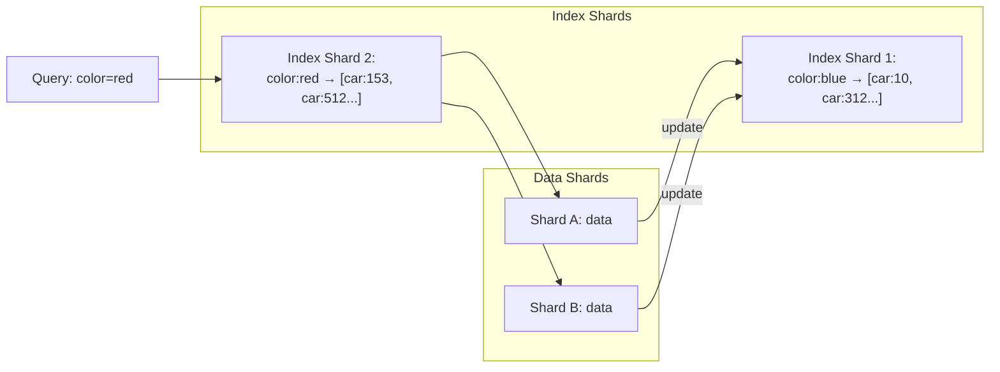
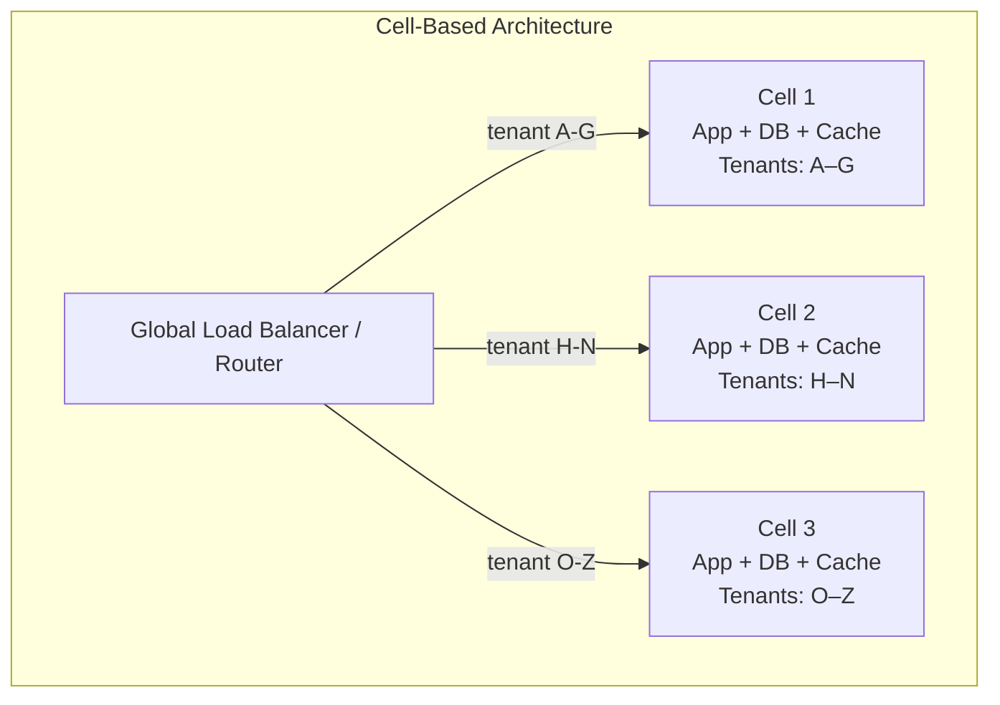
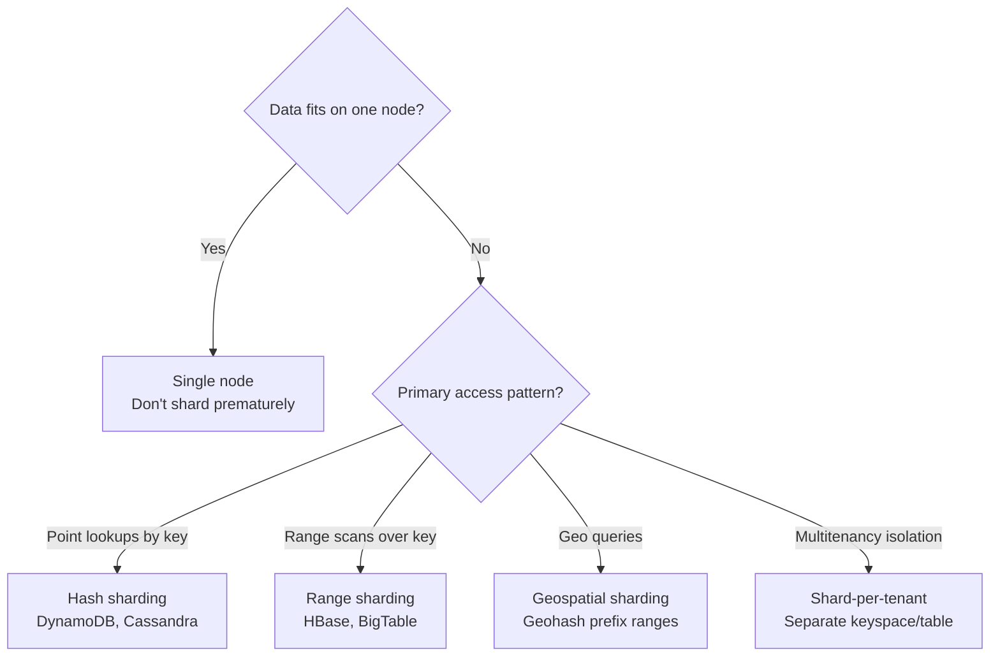

# Chapter 7: Sharding (Partitioning)

## Core Thesis
Sharding splits a dataset across multiple nodes so that each node is responsible for a
subset of the data. It's the primary mechanism for scaling beyond a single machine's
limits. The central challenge: distributing data evenly while supporting the query patterns
your application needs.

---

## Replication vs Sharding — Different Problems



In practice, replication and sharding are combined: each shard is replicated.

---

## Sharding Strategies

### 1. Key-Range Sharding



**Advantages**:
- Efficient range scans: `WHERE key BETWEEN 'G' AND 'K'` hits one shard
- Easy to understand

**Disadvantages**:
- Hot spots: if keys are time-ordered, all writes go to the "current" shard
- Uneven distribution if key distribution is skewed

**Fix for time-series hot spots**: Prefix key with something other than timestamp, or use
`sensor_id + timestamp` where the shard key is `sensor_id`.

### 2. Hash Sharding



**Advantages**:
- Uniform distribution of random keys
- No hot spots from sequential keys

**Disadvantages**:
- ❌ Range queries require scatter-gather (hit all shards)
- Rebalancing: adding/removing nodes requires moving data

### 3. Hash + Range (Compound Sharding)

DynamoDB's model: **partition key** (hash → determines shard) + **sort key** (range within shard).



---

## Consistent Hashing



**Benefit**: Adding/removing a node only moves `1/n` of keys (not all keys).
**Used by**: Amazon DynamoDB, Apache Cassandra, Chord protocol.

---

## Handling Hot Spots (Skewed Workloads)

Even with hash sharding, a celebrity's user_id will create a hot key (millions of reads/writes):



This is a manual application-level fix; databases don't do this automatically (as of DDIA 2e).

---

## Sharding and Secondary Indexes

Secondary indexes on sharded data create a fundamental problem:

### Local Secondary Indexes (Document-Partitioned)



Write: ✅ Only touches one shard  
Read by secondary key: ❌ Must scatter to all shards  

### Global Secondary Indexes (Term-Partitioned)



Read: ✅ Single index shard lookup  
Write: ❌ Must update both data shard AND index shard (distributed write, async or 2PC)  

---

## Rebalancing Shards

When adding/removing nodes, data must move:

| Strategy | How | Trade-off |
|----------|-----|----------|
| Hash mod N | `hash(key) % N` — all keys move when N changes | ❌ Massive data movement |
| Fixed shards | Pre-create 1000 shards, assign multiple to each node | ✅ Only move shards, not keys |
| Dynamic splitting | Shard splits when too large (HBase, RethinkDB) | ✅ Adapts to data distribution |
| Consistent hashing | Move only adjacent key space | ✅ Minimal movement |

**Fixed number of shards** (Elasticsearch, Riak): Create far more shards than nodes at the
start. When adding a node, move some shards to it. Cannot change shard count after creation.

---

## Request Routing — How Does a Client Find the Right Shard?

```mermaid
graph TD
    A{Routing approach} --> R1[Client-side routing<br/>Client knows the shard map]
    A --> R2[Routing tier<br/>Dedicated router (ZooKeeper-aware)]
    A --> R3[Gossip protocol<br/>Client can contact any node,<br/>gets redirected]

    R1 --> Z[ZooKeeper / etcd<br/>Source of truth for shard assignment]
    R2 --> Z
```

**ZooKeeper** is the dominant coordination service for shard assignment metadata.
HBase, SolrCloud, Helix all use ZooKeeper for this.

---

### Cell-Based Architecture (Sharding for Multitenancy)

A cell is a complete, independent instance of the entire stack — including DB, services,
and infrastructure — serving a subset of tenants:



**Advantages over simple sharding**:
- Blast radius isolation: a bug/outage in Cell 1 doesn't affect Cell 2
- Independent deployments: roll out new version to Cell 1, validate, then proceed
- Regulatory compliance: route EU tenants to EU cells for data residency
- Per-cell backup/restore: restore a single tenant's cell without touching others
- Gradual schema migrations: migrate Cell 1 first, then Cell 2

**When to use**: SaaS platforms with many enterprise tenants, especially when tenants have
strict isolation, compliance, or SLA requirements (Shopify, Salesforce, GitHub use this).

**Complexity**: Cell management infrastructure is significant — routing, provisioning,
monitoring, and deploying N identical cells adds operational overhead.

---

## Sharding Decision Framework


