# Chapter 8: Transactions

## Core Thesis
Transactions are an abstraction layer that hides a complex set of concurrency and fault
tolerance problems behind a simple "all-or-nothing" guarantee. Understanding isolation
levels — what guarantees they provide and what anomalies they still allow — is essential
for any engineer working with databases at scale.

---

## ACID — What It Actually Means

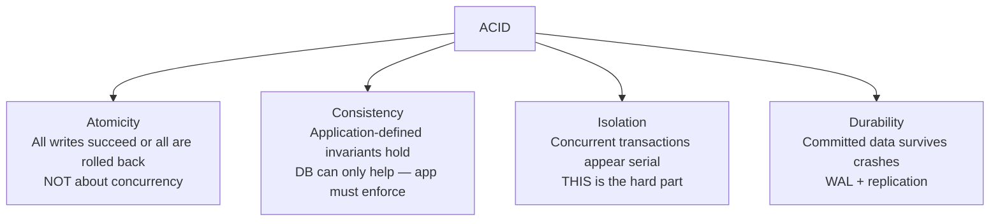

**Common misconception**: The C in ACID is not a database property — it's an application
property. The database provides atomicity and isolation; you define the consistency rules.

**BASE** (Basically Available, Soft state, Eventual consistency) — the alternative to ACID
for systems that sacrifice isolation for availability/performance.

---

## Isolation Levels — The Core Trade-off

Higher isolation → fewer anomalies → more lock contention → worse performance.

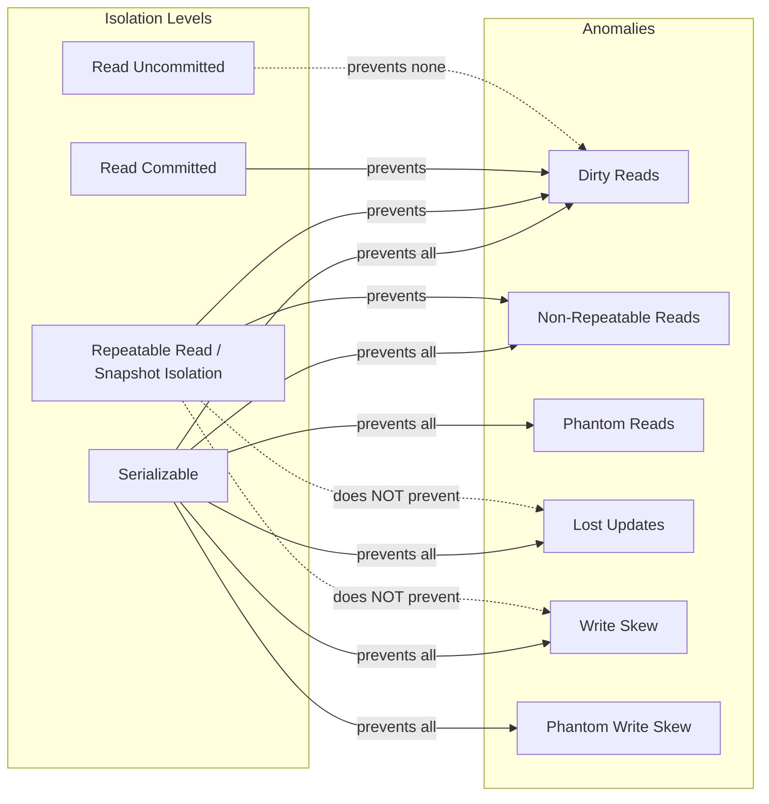

---

## Read Committed (Default in PostgreSQL, Oracle, SQL Server)

**Guarantees**:
- No dirty reads: only read data that has been committed
- No dirty writes: only overwrite data that has been committed

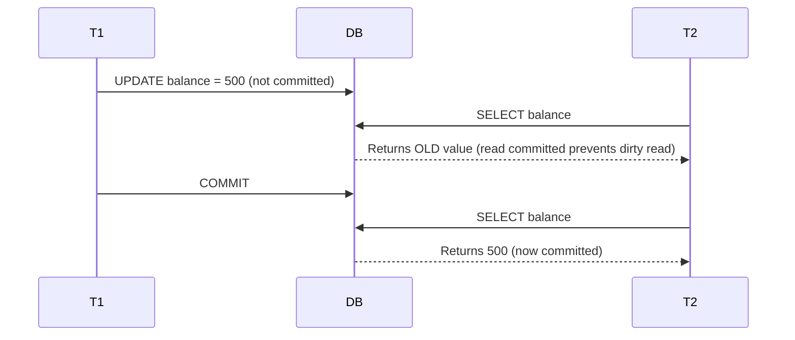

**Implementation**: For each object, DB keeps both the old committed value and the new
uncommitted value. Reads get the old value until commit.

**What Read Committed does NOT prevent**: Non-repeatable reads (value changes between two
reads in same transaction), lost updates, write skew.

---

## Snapshot Isolation (Repeatable Read)

**Key mechanism**: MVCC (Multi-Version Concurrency Control)

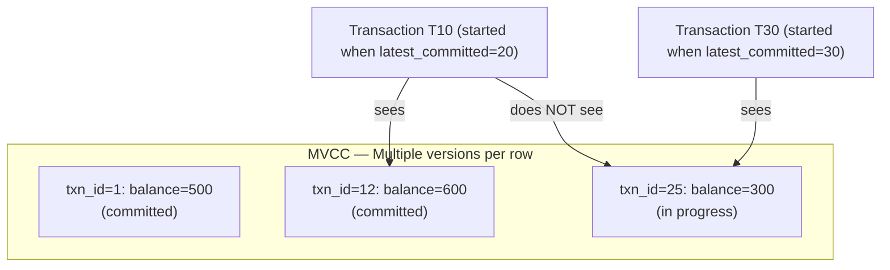

**Visibility rule**: A row version is visible to transaction T if:
1. The writing transaction committed before T started
2. The writing transaction is not T itself

**Benefits**:
- Readers never block writers, writers never block readers
- Long-running analytics queries don't interfere with OLTP
- Consistent database backup without locking

**Naming confusion**: PostgreSQL calls this "Repeatable Read"; Oracle calls it "Serializable"
(misleadingly). True Serializable is stronger than Snapshot Isolation.

---

## Preventing Lost Updates

Lost update = two transactions read-modify-write concurrently; one overwrites the other.

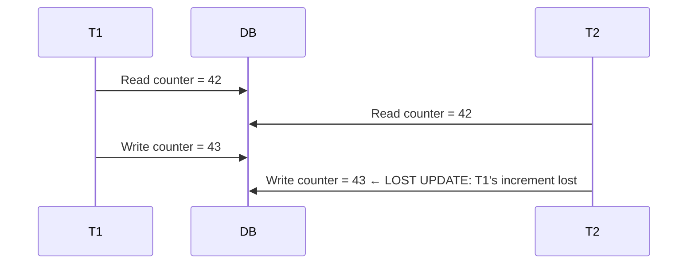

**Solutions**:

| Solution | How | When |
|----------|-----|------|
| Atomic operations | `UPDATE counter SET val = val + 1` | Simple increment/decrement |
| Explicit locking | `SELECT ... FOR UPDATE` | Complex read-modify-write in app code |
| Automatic detection | DB detects and retries (PostgreSQL, MySQL) | General purpose |
| Compare-and-swap | `UPDATE ... WHERE val = old_val` | Optimistic, no DB support needed |

---

## Write Skew and Phantoms

**Write skew**: Two transactions read overlapping data, then each writes based on what they
read — but combined result violates an invariant that each individual write would have honored.

```
Example: On-call doctor scheduling
Rule: At least 1 doctor must be on call at all times
Doctor A: SELECT count(*) FROM oncall → 2. "I can go off call"
Doctor B: SELECT count(*) → 2. "I can go off call"
Both update themselves as off-call → 0 doctors on call → INVARIANT VIOLATED
```

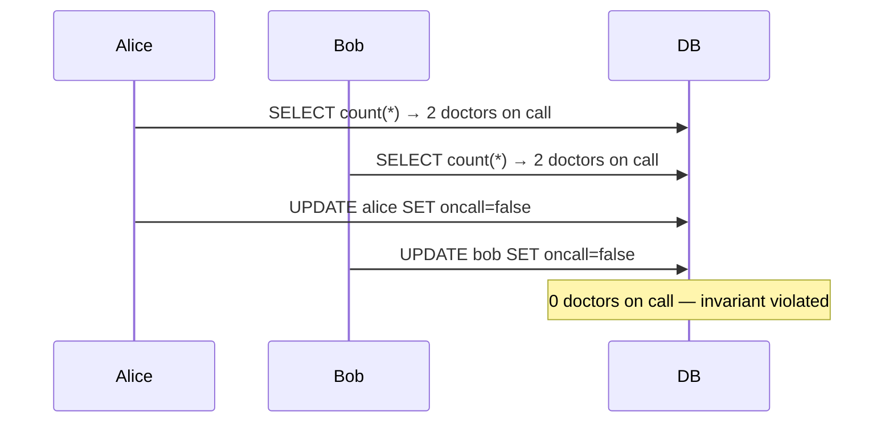

**Write skew requires Serializable isolation to prevent.**

**Phantom**: A write in one transaction changes the result set of a search query in another
transaction. Write skew where the read query doesn't match the row being written.

---

## Serializable Isolation — Implementations

### 1. Serial Execution (VoltDB, Redis, FoundationDB)

Execute transactions one at a time, on a single thread:
- Works when transactions are short and dataset fits in RAM
- Stored procedures (not interactive multi-round-trip transactions)

### 2. Two-Phase Locking (2PL)

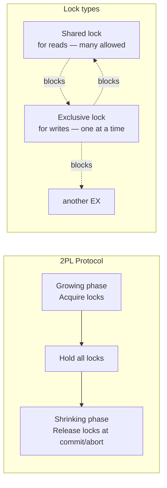

**Predicate locks**: Lock all rows matching a WHERE clause (not just rows that exist yet).
Prevents phantoms. Expensive — often replaced with index-range locks.

**Deadlock**: T1 holds lock A, waits for B; T2 holds B, waits for A.
Database detects and aborts one transaction.

### 3. Serializable Snapshot Isolation (SSI) — PostgreSQL default "Serializable"

Optimistic approach:
1. Execute using snapshot isolation (no blocking)
2. Track reads and writes
3. At commit: detect if any snapshot assumption was violated
4. If violated: abort and retry

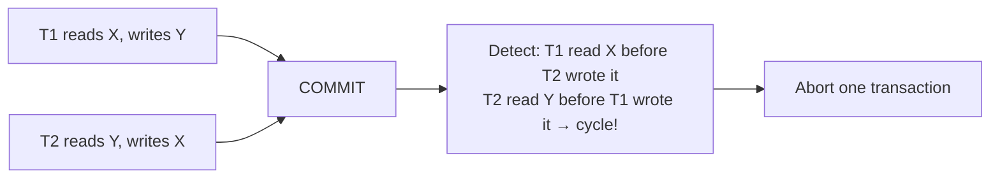

**SSI vs 2PL**:
- SSI: Optimistic, high throughput, retry on conflict
- 2PL: Pessimistic, lower throughput, blocks on conflict

---

## Distributed Transactions and Two-Phase Commit (2PC)

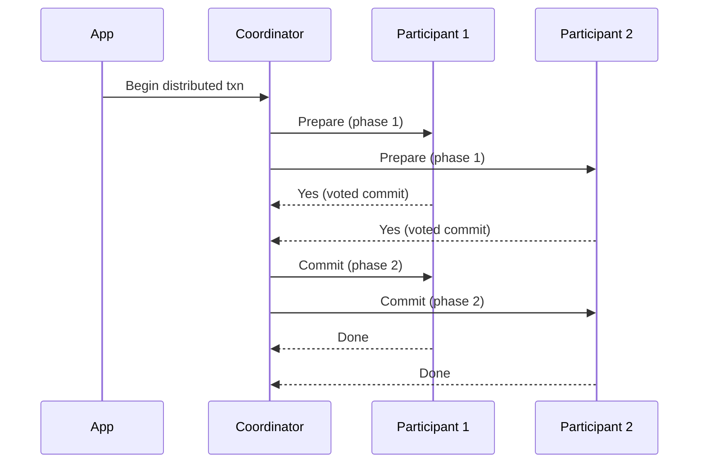

**The problem with 2PC**:
- If coordinator crashes after receiving "Yes" votes but before sending "Commit": participants
  are stuck in "prepared" state — locks held indefinitely ("in-doubt transaction")
- Coordinator is a single point of failure
- Blocking protocol — cannot progress without coordinator

**2PC usage in practice**: XA transactions (Java EE, MSDTC). Performance penalty 10–100× vs
single-node. Most cloud-native architectures avoid 2PC and use sagas or eventual consistency instead.

---

## Saga Pattern (Alternative to 2PC)


- Each step is a local transaction with a compensating transaction for rollback
- No distributed locks — steps are independent
- Eventually consistent — a window where partial state exists
- Complex: must design compensating transactions for every step

---

## What Exactly Is a Transaction?

**DDIA's working definition**: A transaction is a way for an application to group several
reads and writes together into a logical unit. Either the entire transaction succeeds
(commit) or it fails (abort, rollback), and the application can retry safely.

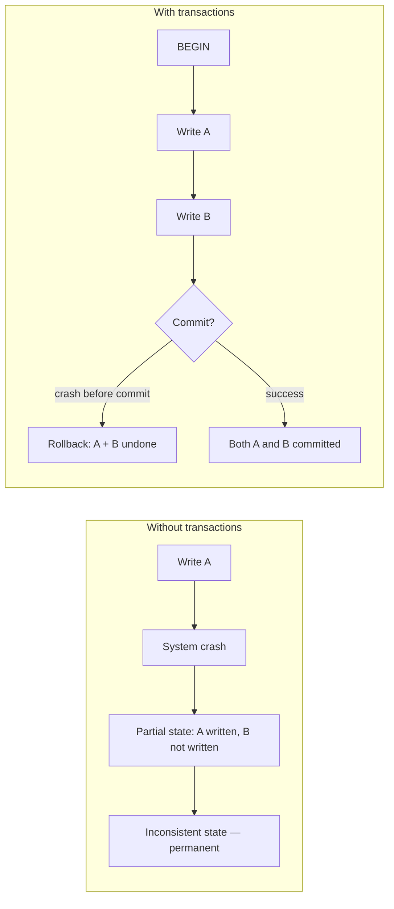

**Not all applications need transactions**: Systems that handle only one operation at a
time on a single object (e.g., simple key-value stores), or systems that tolerate
partial failures and eventual consistency, can avoid transaction overhead.

---

## Materializing Conflicts (Preventing Phantoms with Locks)

Write skew involves a phantom: the transaction's WHERE clause reads rows that don't
yet exist when the lock needs to be taken. Predicate locks prevent phantoms, but
are expensive. Materializing conflicts creates concrete rows to lock.

```mermaid
graph LR
    subgraph "Write Skew: Meeting Room Booking"
        T1[T1: Is room 123 free 2-3pm? → yes]
        T2[T2: Is room 123 free 2-3pm? → yes]
        T1 --> I1[INSERT booking(room=123, 2-3pm)]
        T2 --> I2[INSERT booking(room=123, 2-3pm)]
        I1 & I2 --> DOUBLE[Double booking! — phantom write skew]
    end

    subgraph "Materialized Conflicts Solution"
        PRE[Pre-populate all possible<br/>room × time-slot rows]
        LOCK["SELECT ... FOR UPDATE<br/>on room=123, time=2-3pm row"]
        LOCK --> ONE[Only one transaction wins the lock]
        note1[Now there is a real row to lock<br/>Phantom becomes a regular dirty write conflict]
    end
```

**Materializing conflicts** = creating a row for every possible combination that could
conflict, so that the DB can use row-level locking instead of predicate locking.

**Drawback**: Leaks concurrency-control mechanism into the data model. Only use as a last
resort if SSI or explicit locking isn't available.

---

## Actual Serial Execution

The simplest way to achieve serializability: only one transaction at a time, on a single thread.

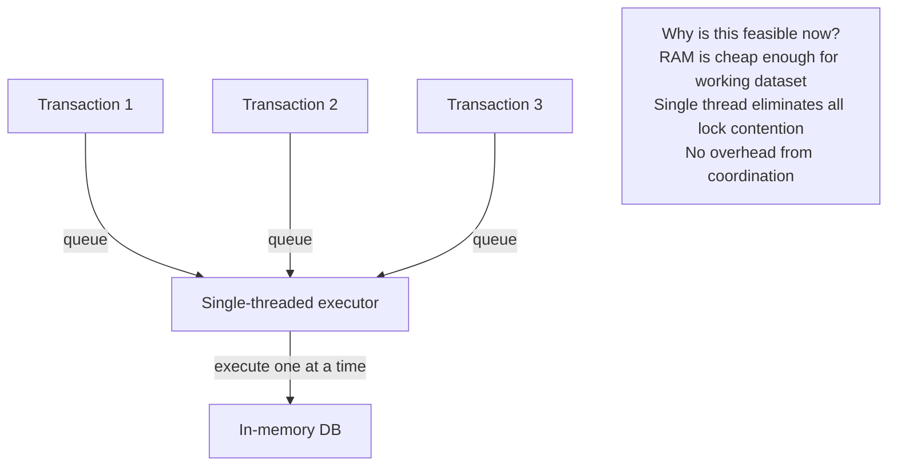

**Requirements for serial execution**:
1. Dataset must fit in RAM (or at least working set)
2. Transactions must be short — no interactive multi-round-trip transactions
3. Use stored procedures: send the entire transaction logic to the DB upfront
4. Cross-partition transactions are expensive — route to one partition when possible

**Examples**: VoltDB, SingleStore, Redis (single-threaded command execution), FoundationDB.

**Throughput**: A single core can process ~100K simple transactions/second. For many
workloads, this is sufficient and eliminates all concurrency bugs.

---

## Three-Phase Commit (3PC) and Its Limits

3PC attempts to fix 2PC's blocking problem by adding a third phase:

```mermaid
sequenceDiagram
    participant Coord as Coordinator
    participant P1 as Participant
    Phase1: CanCommit? → YES/NO
    Phase2: PreCommit (write to stable storage, send ACK)  
    Phase3: DoCommit (actually commit)
    
    note over Coord,P1: If coordinator crashes after PreCommit:<br/>Participants can commit without coordinator<br/>if a new coordinator takes over
```

**Why 3PC is not used in practice**: It requires a perfectly synchronous network with bounded delays. In real networks with arbitrary message delays, 3PC can still block or make incorrect decisions. It's theoretically elegant but practically fragile. The industry uses 2PC despite its flaws, combined with manual intervention for stuck transactions.

---

## Distributed Transactions Across Different Systems (Heterogeneous Transactions)

When a transaction spans different types of systems (e.g., a database AND a message queue), 2PC requires all participants to support the XA protocol:

```mermaid
graph LR
    APP[Application]
    APP -->|XA begin| DB[(PostgreSQL)]
    APP -->|XA begin| MQ[ActiveMQ / RabbitMQ]
    APP -->|XA begin| DB2[(MySQL)]
    
    APP -->|XA prepare| ALL
    ALL -->|all yes| APP
    APP -->|XA commit| ALL
    
    note1[XA = eXtended Architecture (X/Open standard)<br/>Supported by Java EE, MSDTC<br/>10-100× slower than single-system transactions<br/>Coordinator is a SPOF]
```

**Database-internal distributed transactions**: When all participants are nodes of the same database system (e.g., CockroachDB or Spanner), the vendor can use a custom protocol optimized for their system. Far more efficient than XA — same atomicity guarantees without the XA coordination overhead.

**Exactly-Once Message Processing across DB + Queue**:

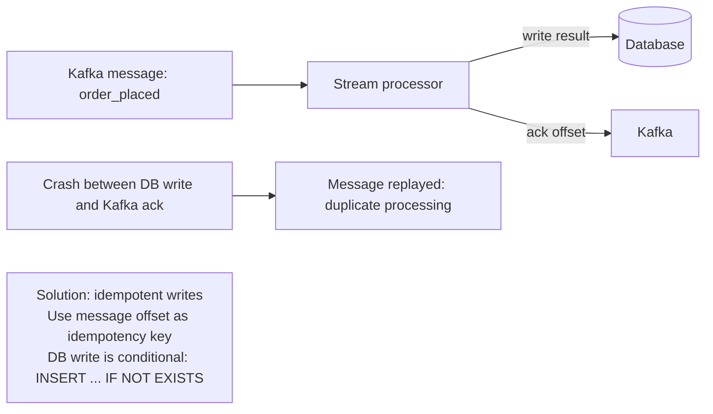

**Kafka Transactions** (EOS): Kafka's transactional API atomically commits both the consumer offset advance AND the producer's output messages. This creates exactly-once semantics entirely within Kafka — no XA needed.

---

## Serializable Snapshot Isolation (SSI) — Deep Dive

SSI (PostgreSQL's "Serializable" level) tracks read/write dependencies to detect conflicts:

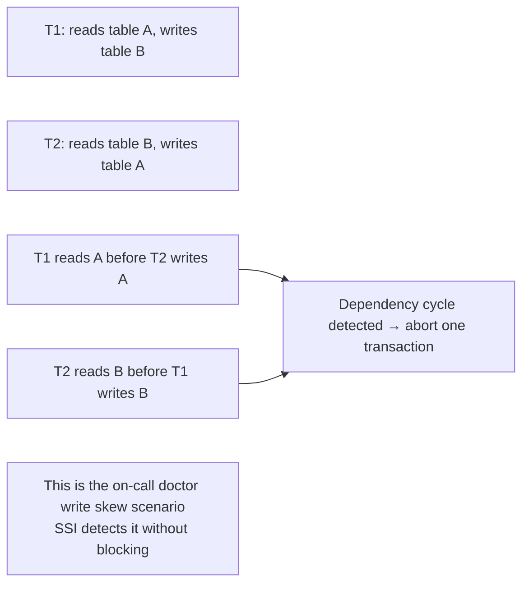

**Detection of stale MVCC reads**: T1 reads a snapshot; later T2 modifies the data T1 read and commits. At T1's commit time, SSI checks: "did anything I read get modified by a committed transaction?" If yes, and there's a dangerous pattern → abort T1.

**SSI vs 2PL trade-off**:
- 2PL: blocking, high contention → good for write-heavy, conflict-heavy workloads
- SSI: optimistic, non-blocking → good for read-heavy workloads with rare conflicts
- Both provide full serializability

**Two-Phase Locking — Predicate and Index-Range Locks**:
- **Predicate lock**: locks all rows matching a WHERE clause, including rows that don't exist yet (prevents phantoms)
- **Index-range lock**: approximate predicate lock on an index range (e.g., lock all rows with `shift_id = 1234` via the index). Less precise but cheaper — locks a superset of matching rows

---

## Isolation Level Quick Reference

| Level | Dirty Read | Non-Repeatable Read | Phantom | Lost Update | Write Skew |
|-------|-----------|--------------------|---------|-----------| ----------|
| Read Uncommitted | ❌ | ❌ | ❌ | ❌ | ❌ |
| Read Committed | ✅ | ❌ | ❌ | ❌ | ❌ |
| Repeatable Read / SI | ✅ | ✅ | ❌ | Partial | ❌ |
| Serializable | ✅ | ✅ | ✅ | ✅ | ✅ |

✅ = prevented, ❌ = NOT prevented
