# Chapter 9: The Trouble with Distributed Systems

## Core Thesis
Distributed systems are fundamentally different from single-node software. The hardware
and network are unreliable in ways you cannot fully control. You must assume things will
fail — in partial, unpredictable ways — and design systems that behave correctly anyway.
This chapter is a catalogue of what can go wrong; Chapter 10 addresses how to cope.

---

## Partial Failures — The Defining Problem

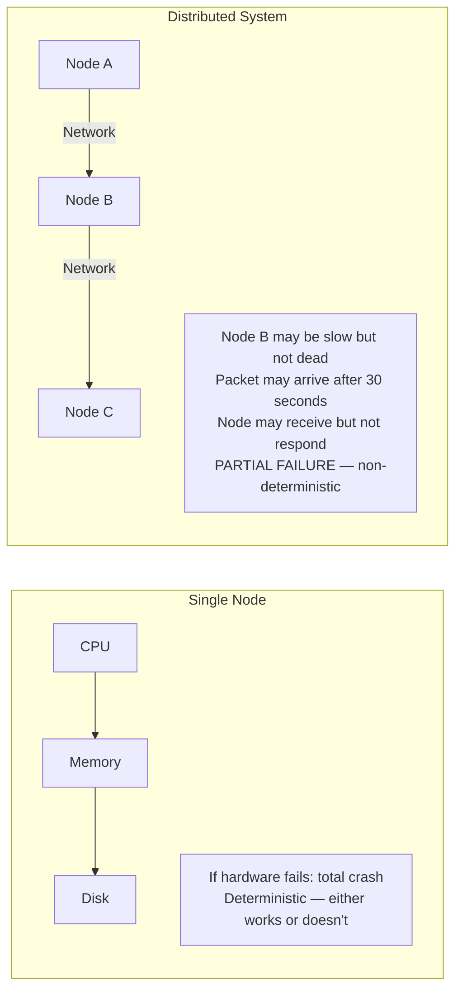

**The fundamental challenge**: You cannot distinguish between "node is dead" and "network
is very slow" from the outside. This ambiguity is the root cause of most distributed
systems complexity.

---

## Unreliable Networks

Everything that can happen to a network message:

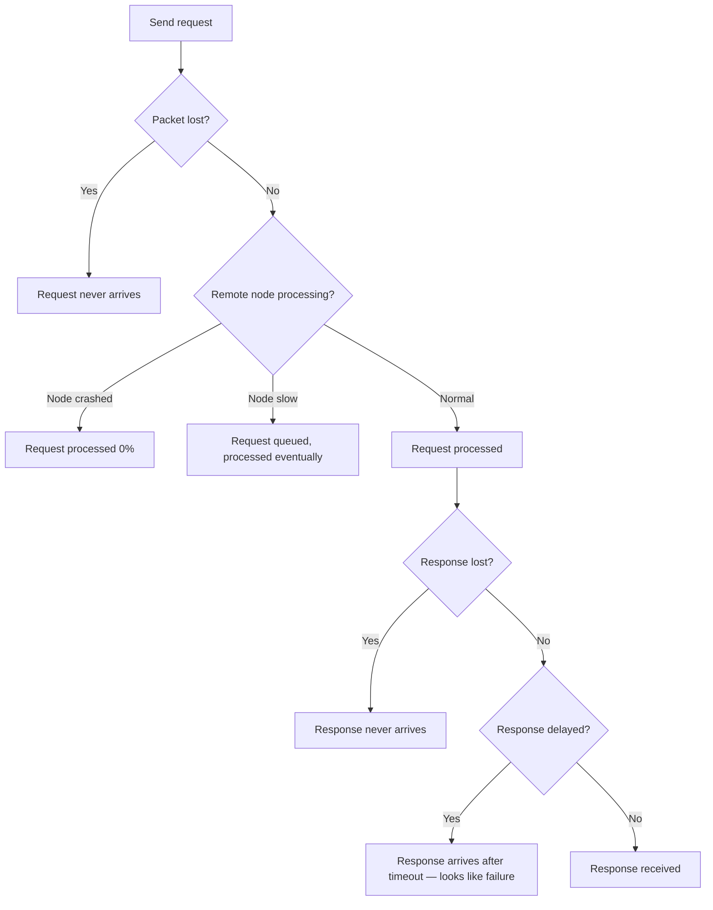

**Key insight**: The sender has no way to know which of these occurred. A timeout can only
tell you "something went wrong" — not what.

### Timeout Selection — No Right Answer

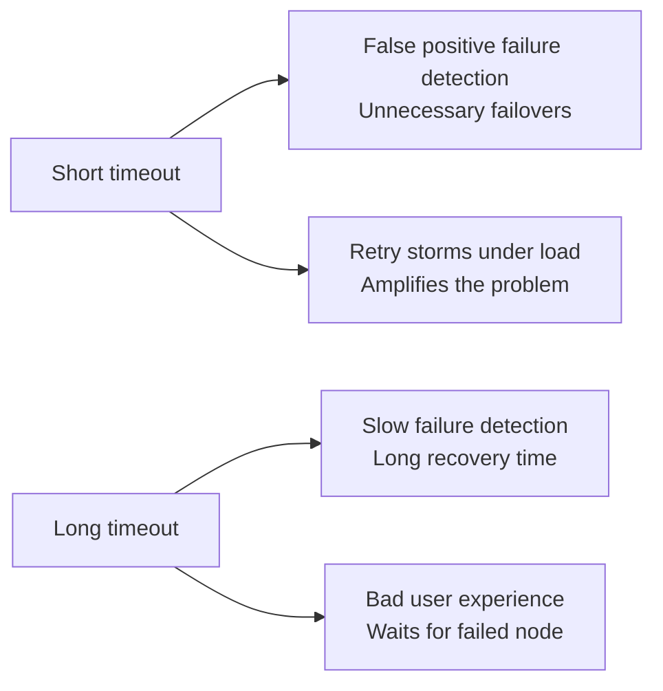

**Best practice**: Start with p99 observed latency as timeout baseline. Use exponential
backoff + jitter. Use circuit breakers to stop sending to known-bad targets.

---

## Network Congestion and Queuing

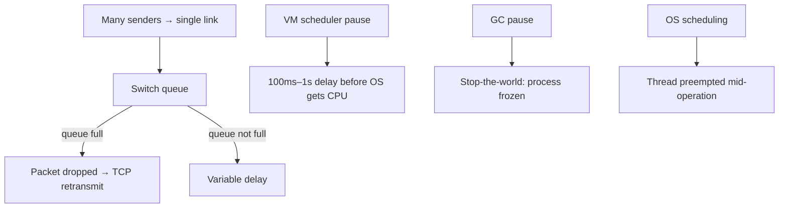

**The implication**: Even on a fast, healthy network, latency is variable and unbounded.
You cannot assume a response will arrive within any fixed time. All timeouts are guesses.

---

## Unreliable Clocks

### Two Types of Clocks

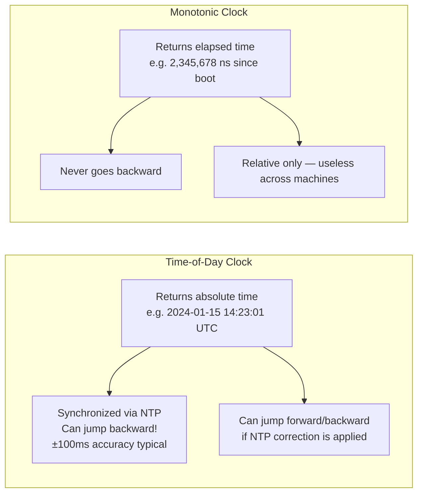

**Use monotonic clocks for**: measuring duration of an operation, timeouts.  
**Use time-of-day clocks for**: event timestamps, scheduling (with caution).

### Why Clocks Are Untrustworthy

| Issue | Detail |
|-------|--------|
| NTP accuracy | Typically ±1–100ms. Google TrueTime uses GPS/atomic: ±1ms |
| NTP leap second | Clocks can go backward or stall |
| VM clock | Hypervisor can freeze a VM while clock still ticks on host; then VM "catches up" |
| Quartz drift | Cheap clocks drift 10–200 ppm (6 seconds/day fast or slow) |

### The Danger of Timestamps for Ordering

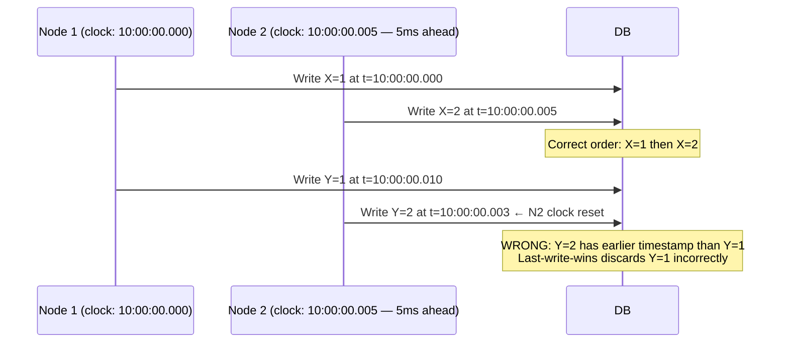

**Google Spanner's TrueTime**: Returns time as an interval `[earliest, latest]` with
bounded uncertainty. When ordering events, wait until the uncertainty window has passed.
Feasible with GPS + atomic clocks; not practical for most deployments.

---

## Process Pauses

A process can be paused for arbitrarily long times:

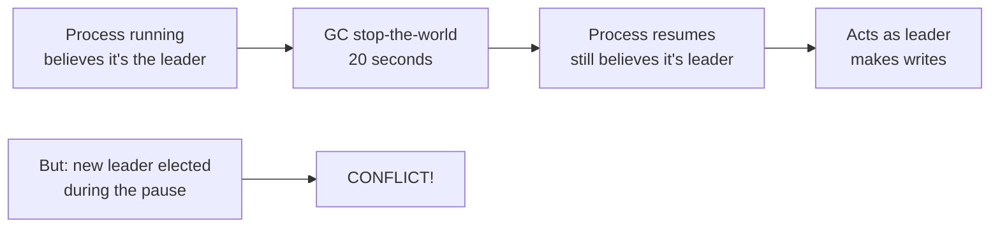

**Causes of process pauses**:
- Garbage collection (JVM G1 pauses can be 100ms–10s)
- Virtual machine live migration (VM paused while moved to another host)
- OS `SIGSTOP` / debugger breakpoint
- Swap/paging — process waiting for disk
- CPU scheduling — hypervisor gives CPU to another VM

**Why this matters**: Any algorithm that assumes "if I didn't hear from node X in time T, it
must be dead" is vulnerable. The node could just be paused.

---

## Fencing Tokens — Preventing Stale Leader Writes

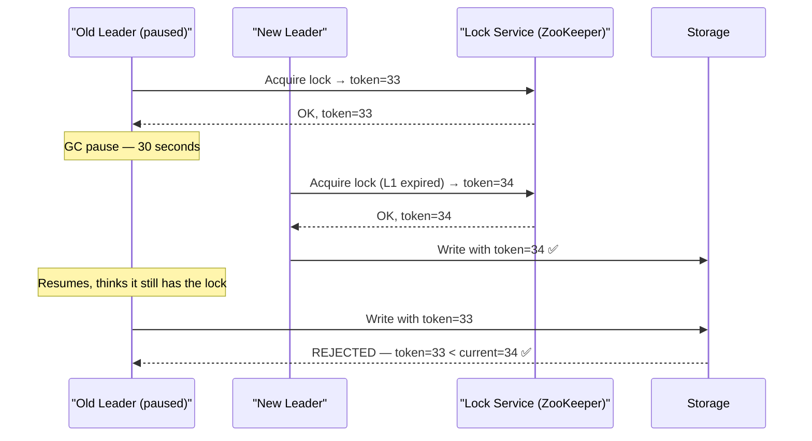

**Fencing token**: A monotonically increasing number from the lock service. Storage layer
rejects writes from tokens lower than the highest seen.

---

## Knowledge, Truth, and Lies

In distributed systems, a node cannot know the truth about the state of the system —
it can only make inferences from the messages it has received. This has profound implications.

**"A node cannot trust its own judgment"**:
- A node believes it's the leader — but the network partition means others have elected a new one
- A node believes its lock is valid — but the lock service timed it out while the node was GC-paused
- A node believes a write succeeded — but the response was lost on the network

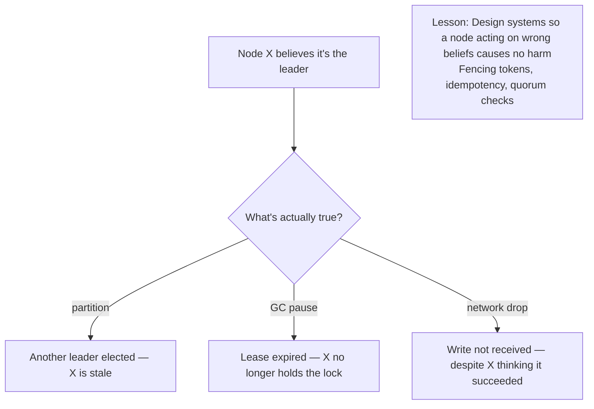

---

## The Majority Rules

For a system to be safe, any decision requires agreement from a majority (quorum) of nodes:

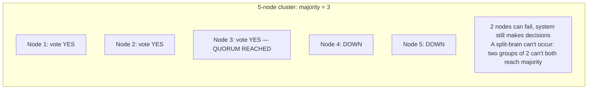

**Why majority (not just any quorum)?** Two disjoint majorities cannot exist in the
same cluster. If Group A has majority, Group B cannot also have majority — no split-brain.

**This is the foundation of**: Raft leader election, Paxos, ZooKeeper, and all
consensus protocols. The quorum condition `w + r > n` in leaderless replication is
the same principle applied to reads and writes.

---

## Distributed Locks and Leases

A distributed lock grants exclusive access to a resource across nodes. Key challenge:
the lock holder might crash or be paused — who decides when to release it?

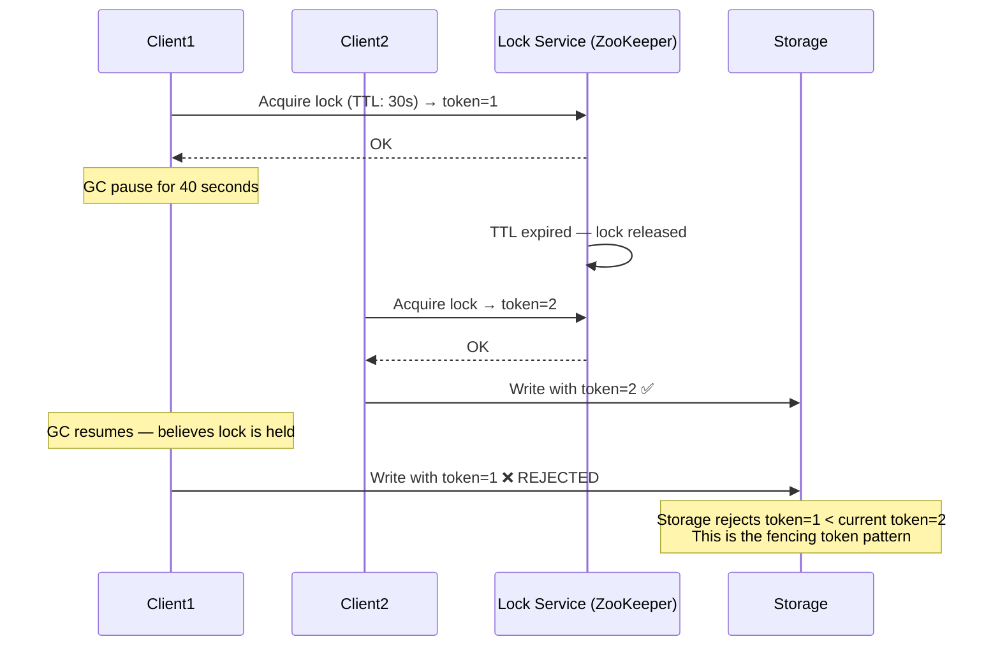

**Lease** = a time-limited lock. The holder can use the resource only until the lease expires.
**Fencing token** = monotonically increasing number from the lock service. Storage layer
must enforce that only the highest-seen token is accepted.

**Safe lock usage checklist**:
1. ✅ Lock service uses consensus (ZooKeeper, etcd) — not just a single node
2. ✅ Fencing token included in every write to storage
3. ✅ Storage layer checks and enforces fencing token
4. ✅ Client handles "lock lost" by aborting its current operation

---

## The Byzantine Generals Problem

A **Byzantine fault** is when a node behaves arbitrarily — sending incorrect or malicious
data, rather than simply being slow or crashed.

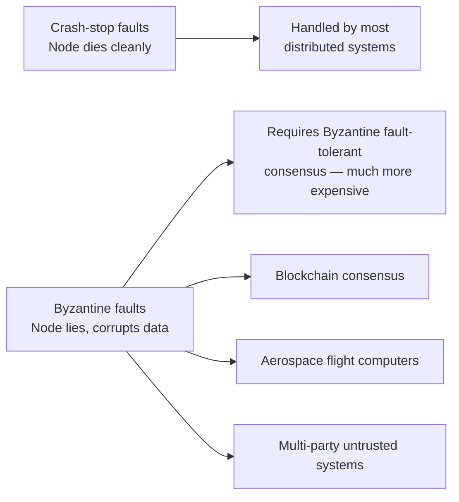

**For most distributed systems**: Assume crash-stop (or crash-recovery) faults only. Byzantine
fault tolerance adds enormous complexity and is rarely needed in controlled datacenter environments.

---

## System Models

Distributed algorithms are designed and proved against formal models:

| Model | Network | Clocks | Processes |
|-------|---------|--------|-----------|
| Synchronous | Bounded delay | Bounded drift | Bounded pause |
| Partially synchronous | Usually bounded | Usually bounded | Usually bounded |
| Asynchronous | Unbounded | No clocks | Unbounded pauses |

**Real systems are partially synchronous**: Usually behave like synchronous systems, with
occasional periods of bad behavior (congestion, GC, load spikes). Algorithms must be
correct in asynchronous model but can be tuned for partially synchronous performance.

---

## Formal Methods and Randomized Testing

Given that distributed systems have almost infinite edge cases, how do you gain confidence they're correct?

### Formal Verification
Specify the system's expected behavior mathematically and prove it holds:
- **TLA+** (Leslie Lamport): Used by Amazon, Microsoft to verify distributed algorithms. AWS found 10 bugs in internal systems using TLA+.
- **Alloy**: Model checker for relational specifications
- **Isabelle/Coq**: Full proof assistants (used to verify Raft formally)

**Practical use**: Formal methods are most valuable for core consensus/replication logic — the small, critical algorithms that everything else depends on. Not practical for entire application code.

### Fault Injection

Deliberately introduce failures in test/staging environments to verify fault-tolerance:

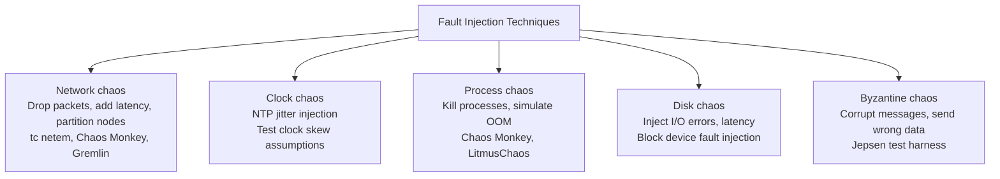

**Jepsen** (Kyle Kingsbury): The gold standard for distributed database testing. Runs concurrent operations while injecting network partitions, then checks whether safety invariants were violated. Has found real bugs in Cassandra, MongoDB, Elasticsearch, Redis, etc.

### The Power of Determinism

Non-determinism in distributed systems makes bugs nearly impossible to reproduce. Strategies to maximize determinism:

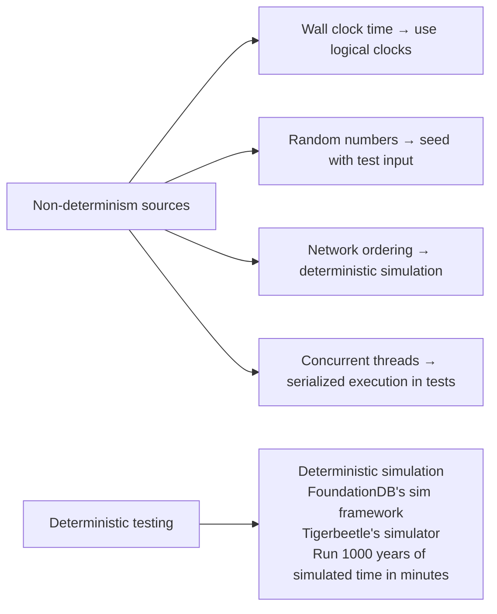

**Deterministic simulation** (FoundationDB approach): Run the entire distributed system in a single-threaded simulator with a fake network, fake clocks, and controlled fault injection. Deterministically reproducible bugs. FoundationDB found and fixed thousands of bugs this way before shipping.

---

## Key Takeaways

```mermaid
graph TD
    T1[Assume network delays are unbounded<br/>— use timeouts, but know they're guesses]
    T2[Assume clocks are unreliable<br/>— don't use timestamps for distributed ordering]
    T3[Assume processes can pause<br/>— use fencing tokens, not just lock expiry]
    T4[Assume partial failures<br/>— design for "request may have succeeded but response lost"]
    T5[You cannot distinguish slow from dead<br/>— design for both outcomes]
```

The only correct response to these truths is to design algorithms that are provably correct
despite them — which is what Chapter 10 addresses.
