# Chapter 10: Consistency and Consensus

## Core Thesis
Chapter 9 established that distributed systems are unreliable. This chapter asks: what
correctness guarantees *can* we achieve, and at what cost? Linearizability, total order
broadcast, and consensus are the strongest guarantees — and understanding their
relationships is the foundation of distributed systems reasoning.

---

## The Consistency Spectrum

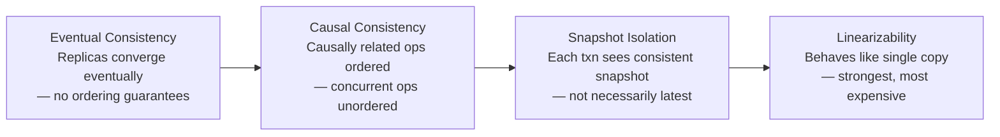

---

## Linearizability

**Definition**: The system appears to have a single copy of the data, and all operations
on it are atomic. Once a write completes, all subsequent reads see that value.

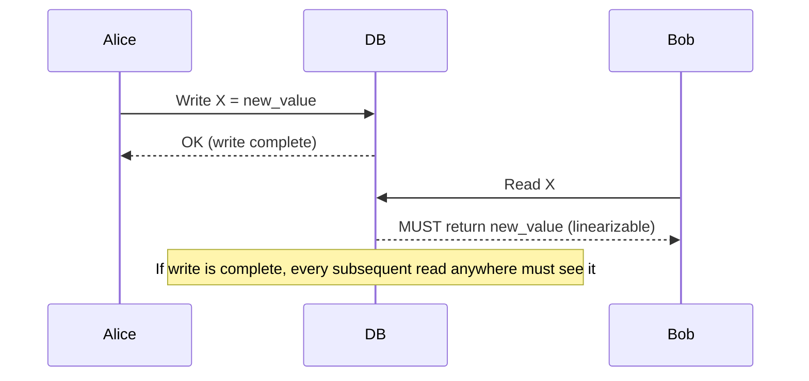

**Non-linearizable example**:
```
Alice: Read X → "old"
Alice: Read X again (same request) → "new"   ← OK, value changed
Bob:  Read X → "old"    ← NOT OK if Alice already saw "new"
```

If Alice saw "new" and Bob sees "old" after that, the system is not linearizable.

### When Linearizability Is Required

| Use Case | Why |
|----------|-----|
| Leader election / distributed locks | Only one node must win |
| Unique constraint enforcement | Usernames, email addresses must be globally unique |
| Cross-channel coordination | Image upload → thumbnail service must see complete image |
| Distributed counters / ID generation | Must not issue duplicate IDs |

### Linearizability vs Serializability

| Concept | About | Applies to |
|---------|-------|-----------|
| Linearizability | Recency of individual reads/writes | Single-object operations |
| Serializability | Isolation between transactions | Multi-object transactions |

A system can be serializable but not linearizable (snapshot isolation).
A system can be linearizable but not serializable.
**Strict serializability** = both: serializable AND linearizable.

---

## The CAP Theorem — and Why It's Unhelpful

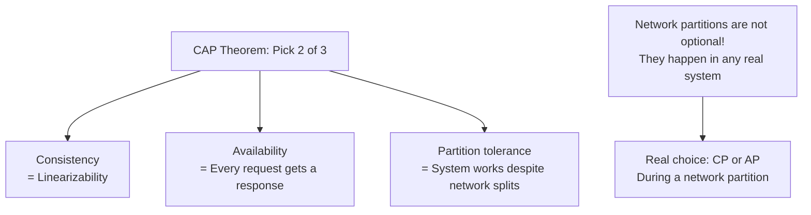

**Why CAP is misleading**:
1. "Availability" in CAP ≠ high availability in practice
2. Network partitions are inevitable — you don't choose to tolerate them
3. CAP only applies during a network partition — ignores latency, the more common issue
4. Many nuances between "consistent" and "available" that CAP doesn't capture

**Kleppmann's framing**: The real trade-off is **consistency vs latency** (PACELC):
- Under normal operation: choose between lower latency or stronger consistency
- Under partition: choose between availability or consistency

---

## Implementing Linearizable Systems

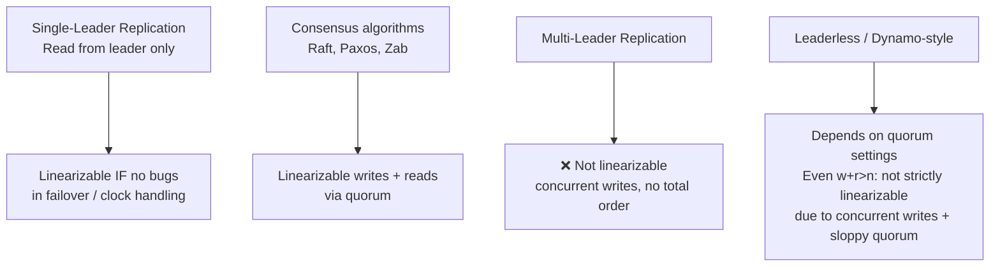

---

## The Cost of Linearizability: CAP in Practice

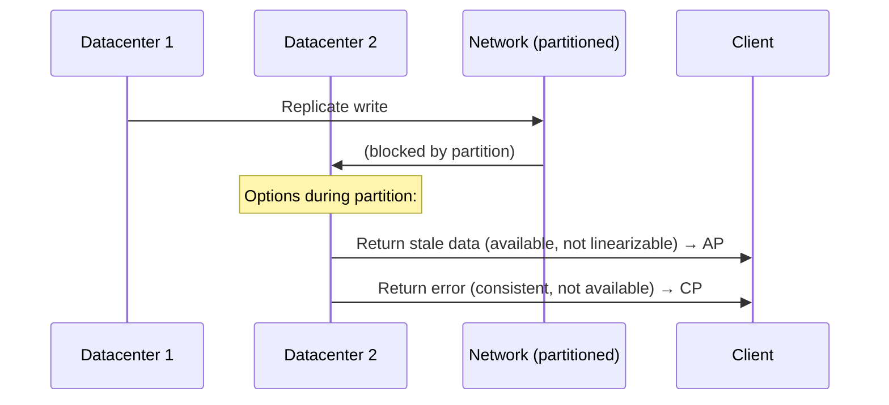

Single-datacenter databases (Raft) choose CP — refuse to serve if can't reach majority.
Multi-region with async replication chooses AP — serve locally, may be stale.

---

## Logical Clocks and Ordering

When linearizability is too expensive, logical clocks provide causal ordering:

### Lamport Timestamps

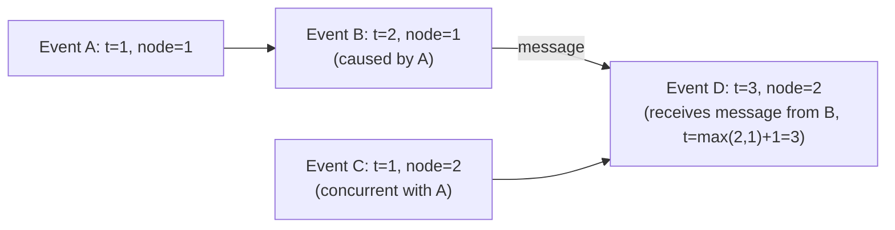

**Lamport timestamp**: `t = max(my_clock, received_clock) + 1`

**Limitation**: Can determine causal ordering, but cannot detect concurrent events. If
`t(A) < t(B)`, either A caused B, or A happened concurrently with B (and got a lower number
by coincidence).

### Vector Clocks

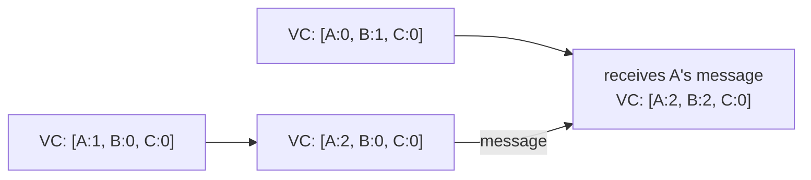

**Vector clocks** detect concurrent events: if neither VC dominates the other, events are concurrent.
Used in: Amazon Dynamo, Riak, CRDTs.

---

## Consensus

**Consensus problem**: Multiple nodes agree on a single value. Required for:
- Leader election
- Atomic commit (2PC is not consensus — see Ch.8)
- Total order broadcast

### Why Consensus Is Hard: FLP Impossibility

In an asynchronous system (Ch.9 definition), there is no algorithm that:
1. Always terminates
2. Always agrees
3. Is valid (agreed value was proposed by some node)

In practice: algorithms can terminate in partially synchronous conditions (network is usually bounded).

### Raft and Paxos

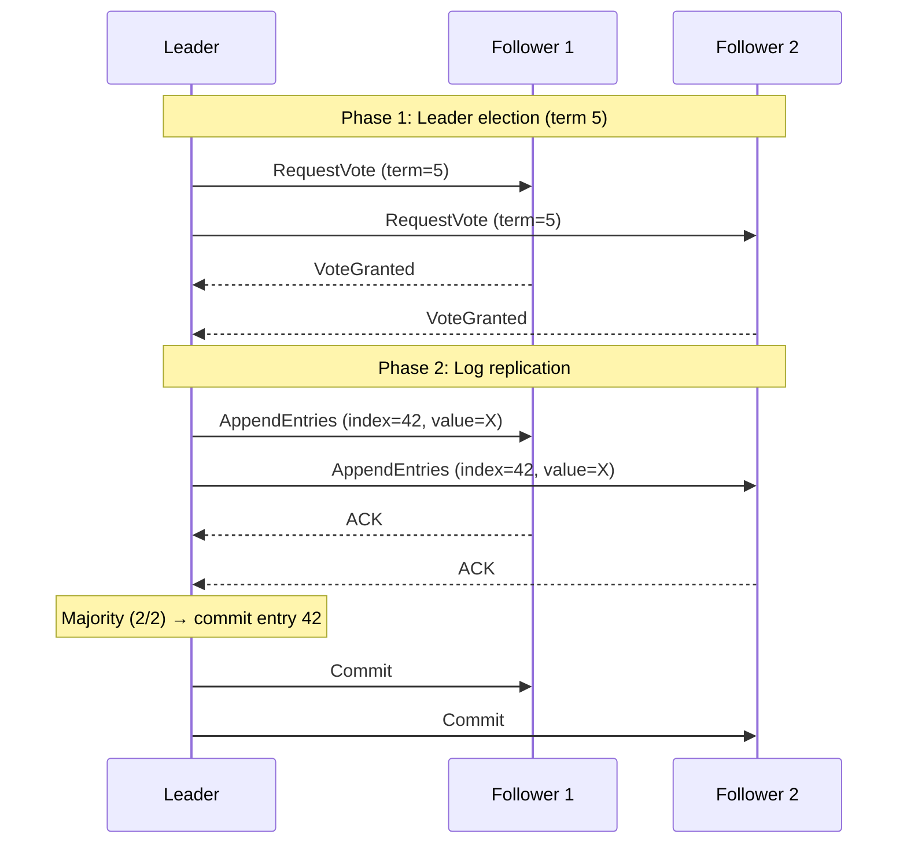

**Raft guarantees**:
- At most one leader per term
- A log entry is committed only when stored on a majority of nodes
- Committed entries are never deleted

**ZooKeeper** uses ZAB (similar to Raft/Paxos) and exposes: linearizable writes, ordered
updates, watches (event notifications). Used for distributed coordination, not for application data.

---

## Total Order Broadcast

**Definition**: All nodes deliver messages in the same order. No message is delivered to
some nodes but not others.

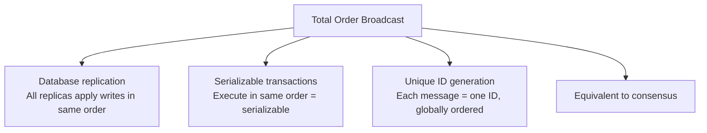

**The connection**: Total order broadcast ↔ consensus ↔ linearizable compare-and-swap.
These three problems are equivalent in power. If you can solve one, you can solve the others.

---

## The Many Faces of Consensus

Consensus appears as the foundation of multiple distributed systems abstractions.
Understanding their equivalence is the key theoretical insight of this chapter.

### Formal Consensus Properties

Any correct consensus algorithm must satisfy:

| Property | Definition |
|----------|-----------|
| **Uniform agreement** | No two nodes decide different values |
| **Integrity** | No node decides twice |
| **Validity** | The decided value was proposed by some node |
| **Termination** | Every non-crashed node eventually decides |

*Termination* is the liveness property — the algorithm must make progress. The other three are safety properties — nothing bad happens.

### Equivalent Abstractions

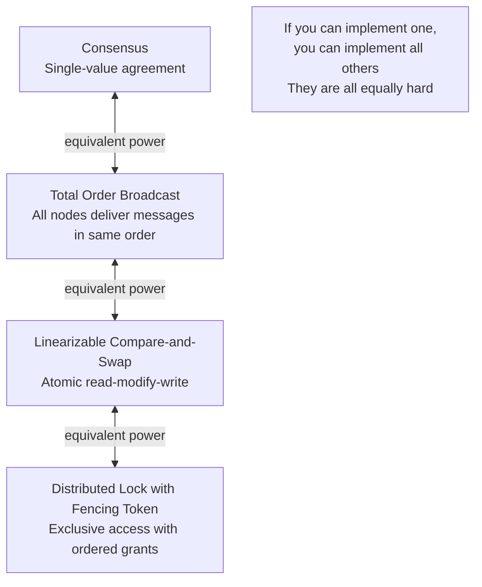

### Consensus in Practice

Real consensus is expensive — every decision requires a full round-trip to a majority of nodes. Practical systems minimize how often they invoke consensus:

```mermaid
graph LR
    ELEC[Leader election<br/>Invoke consensus once<br/>to elect a leader] --> LEAD[Leader period<br/>Leader processes requests<br/>without consensus<br/>— just log replication]
    LEAD --> FAIL[Leader fails] --> ELEC
    note1[Consensus overhead: O(1) per leader election<br/>Not O(1) per request<br/>That's why Raft/ZAB are practical]
```

---

## Coordination Services (ZooKeeper, etcd)

ZooKeeper and etcd are purpose-built consensus-based coordination services. They should
not be used as application databases — they're designed for small amounts of infrequently
changing coordination data.

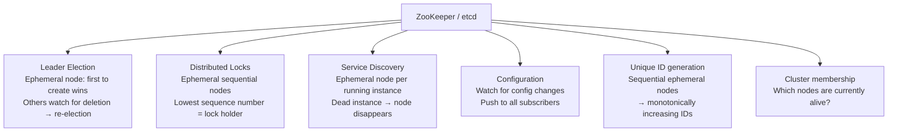

**Ephemeral nodes**: automatically deleted when the creating session ends (heartbeat stops).
This makes them ideal for registering "I am alive" presence.

**Watches**: clients register a callback on a path. ZooKeeper notifies the client when
that path changes. Used to build reactive systems: "when the leader node disappears, elect a new one."

**Operational characteristics**:
- ZooKeeper: ensemble of typically 3 or 5 nodes; linearizable writes, may serve stale reads
- etcd: used by Kubernetes for all cluster state; linearizable reads and writes via Raft
- Both: designed for kilobytes of data, not gigabytes. Not a substitute for a database.

---

## Consistency Versus Availability in Leader Election

During a network partition, a consensus-based leader election must choose:

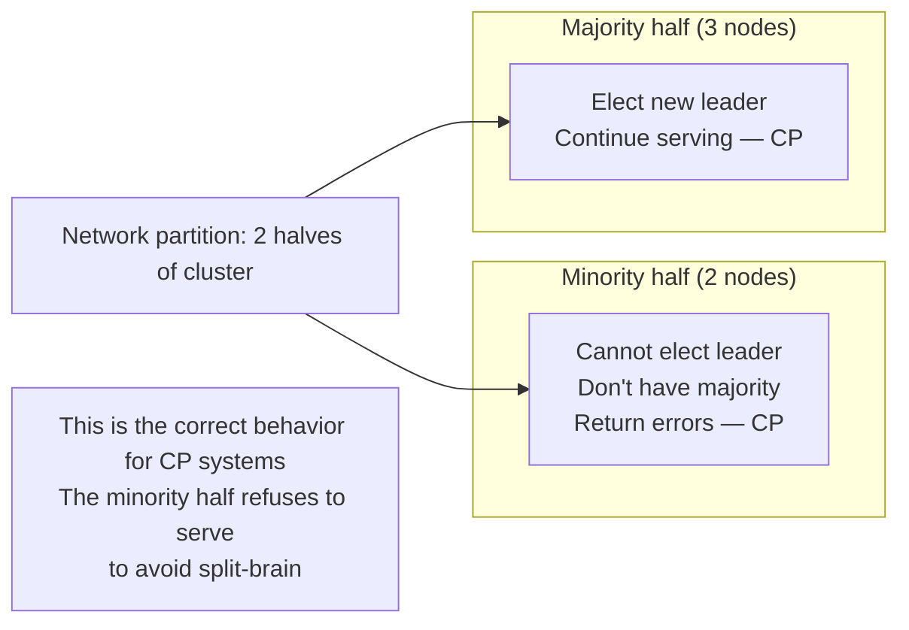

**ZooKeeper/Raft behavior**: If a node cannot reach a quorum, it stops serving requests.
This is deliberate — consistency over availability. The system recovers when the partition heals.

**Why this matters for your system**: Any service that uses ZooKeeper/etcd for leader
election inherits this behavior. Plan for "ZooKeeper quorum lost → your service stops accepting
writes" as a real failure mode.

---

## Compare-and-Set as Consensus

Linearizable compare-and-set (CAS) is equivalent in power to consensus:

```python
# Atomic CAS: only sets new_value if current value == expected_value
if compare_and_set(key, expected=old_value, new=new_value):
    # success — we "won" the competition
else:
    # another writer changed it first — retry
```

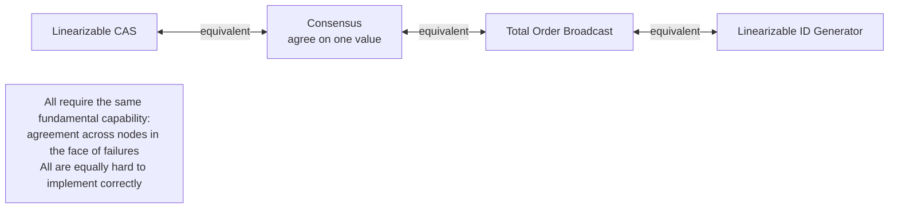

**Fetch-and-add**: Another atomic primitive equivalent to consensus. Used in ticket servers (monotonically increasing IDs), sequence numbers.

**Subtleties of consensus**:
1. **Liveness vs safety**: Raft guarantees safety (never decides wrong value) always. Liveness (eventually decides) only holds if a majority of nodes are alive and can communicate.
2. **Leader epoch**: Each leader has a monotonically increasing epoch (term in Raft). Followers reject messages from old leaders by comparing epoch numbers.
3. **Performance**: Consensus requires a round-trip to a quorum for every decision. Batching writes amortizes this cost — log many entries, commit in one round.

---

## Managing Configuration with Coordination Services

ZooKeeper and etcd are used as the single source of truth for dynamic cluster configuration:

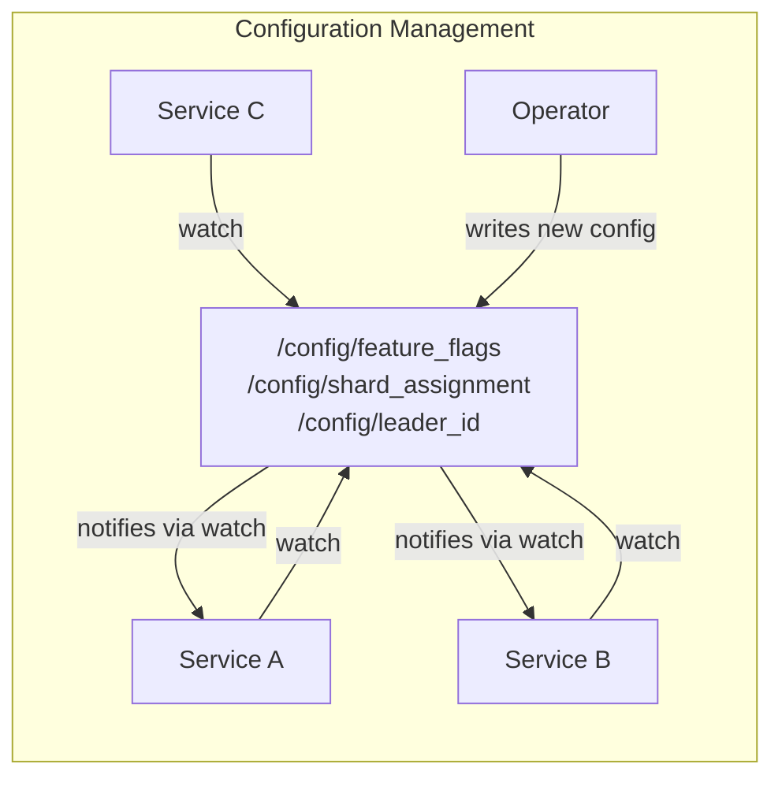

**Using shared logs for state machine replication**: ZooKeeper's ZAB protocol maintains a total order log of all writes. Any system that replicates this log processes the same sequence of operations → identical state on all nodes. This is the foundation of "state machine replication" — the general technique behind Raft, Paxos, and ZAB.

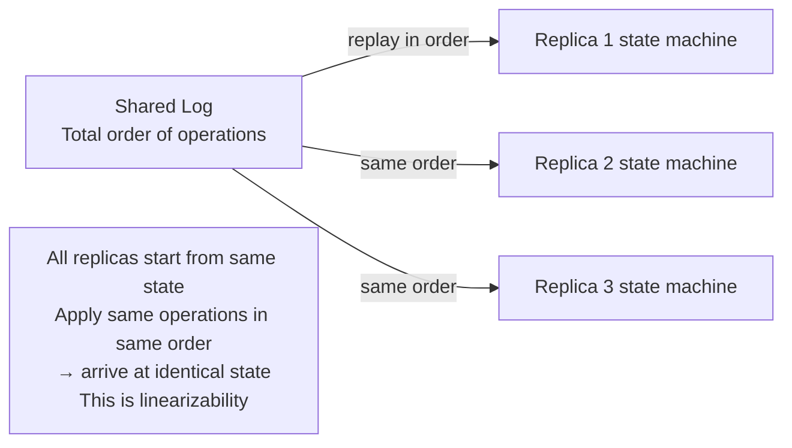

**Shared log use cases**: Leader election, distributed lock management, cluster membership tracking, database redo log shipping, Kafka's internal topic partition assignment.

**etcd vs ZooKeeper**:
- etcd: gRPC API, Raft consensus, used by Kubernetes; simpler ops, newer
- ZooKeeper: Java, ZAB consensus, mature ecosystem, used by HBase/Kafka/Hadoop

---

## ZooKeeper in Practice

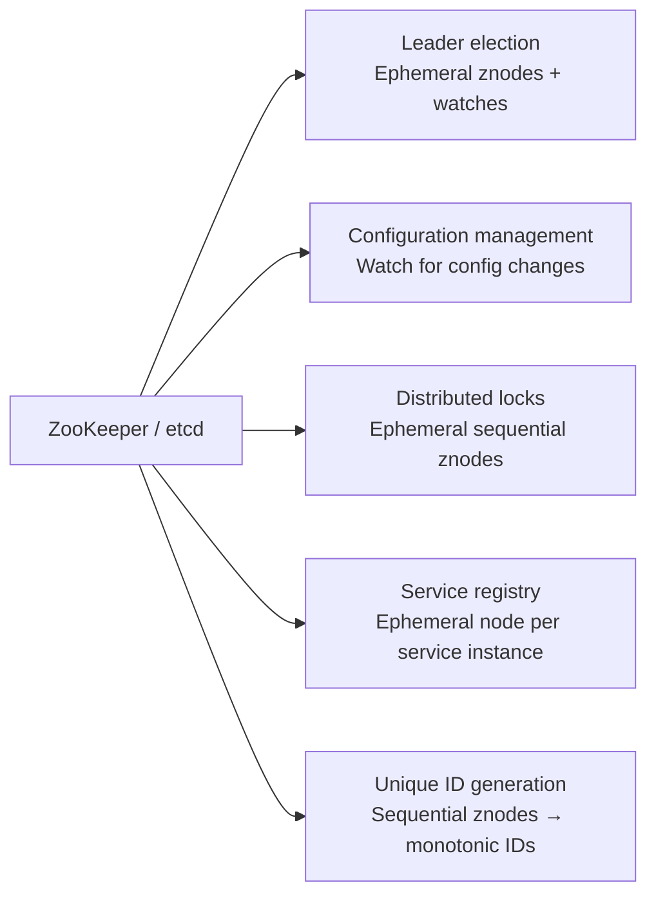

**Ephemeral node**: Automatically deleted when the creating session ends (node crashes).
Used for leader registration — if leader crashes, its znode disappears, triggering re-election.
