# Chapter 11: Batch Processing

## Core Thesis
Batch processing transforms large datasets by running computation over a bounded input and
producing output. It is the most reliable, scalable, and debuggable form of data processing.
Understanding its internals — especially how distributed joins and shuffles work — is essential
for building analytics pipelines and data platforms.

---

## Three Paradigms of Data Processing

```mermaid
graph TD
    DP[Data Processing Paradigms]
    DP --> OL[Online (OLTP)<br/>Request → immediate response<br/>Low latency, high availability]
    DP --> BA[Batch<br/>Large bounded input → output<br/>High throughput, no latency SLA]
    DP --> ST[Stream<br/>Continuous unbounded input<br/>Low latency, continuous output]

    BA --> USE1[ETL pipelines]
    BA --> USE2[ML training]
    BA --> USE3[Search index building]
    BA --> USE4[Data warehouse loads]
```

---

## The Unix Philosophy Applied to Data

Unix tools model the right abstractions for batch processing:

```bash
# Count most popular log URLs — Unix pipeline
cat access.log |
  awk '{print $7}' |     # extract URL
  sort |                 # sort for grouping
  uniq -c |              # count duplicates
  sort -rn |             # sort by count descending
  head -10               # top 10
```

**Unix principles carried to distributed batch**:
1. Each program does one thing well
2. Programs communicate via uniform interfaces (stdin/stdout, files)
3. Programs are composable — chain them together

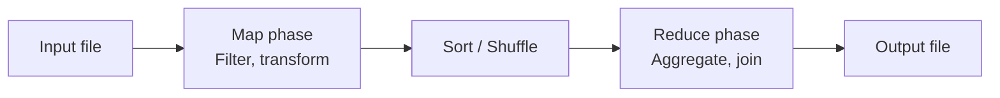

This is exactly MapReduce.

---

## Distributed Filesystems (HDFS)

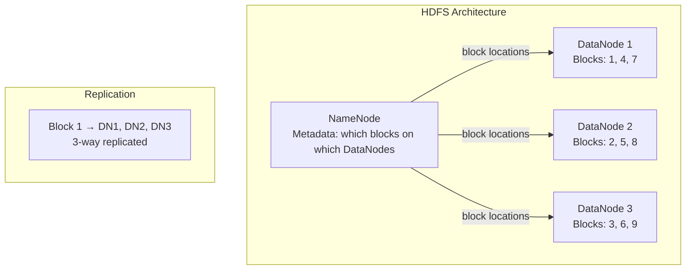

**Move computation to data** (not data to computation):
- HDFS knows which node holds each block
- MapReduce scheduler assigns map tasks to nodes that hold the input data
- Reduces network I/O dramatically for large datasets

**Object Storage vs HDFS**:
- HDFS: compute and storage collocated → low latency reads, complex cluster management
- S3/GCS/Azure Blob: storage separate from compute → flexible, scalable, cheap, higher latency
- Modern trend: move to object storage + columnar formats (Parquet, ORC) + query engines (Spark, Trino)

---

## MapReduce

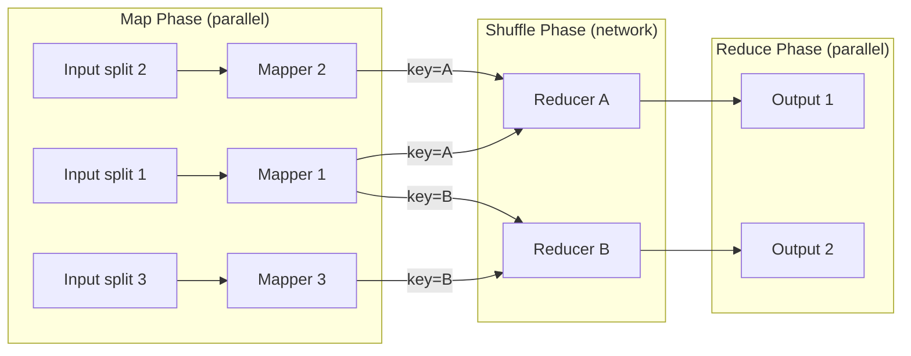

**Key properties**:
- Mapper: called once per input record, emits (key, value) pairs
- Shuffle: framework sorts and groups all values by key, sends to reducers
- Reducer: processes all values for a given key, emits final output
- No shared state between mappers or reducers — pure functional model
- On failure: just re-run the failed task (output is deterministic)

### MapReduce Word Count (Python)

```python
# Mapper
import sys
for line in sys.stdin:
    for word in line.strip().split():
        print(f"{word}\t1")

# Reducer
import sys
from itertools import groupby

for key, group in groupby(sys.stdin, key=lambda l: l.split('\t')[0]):
    count = sum(int(v.split('\t')[1]) for v in group)
    print(f"{key}\t{count}")
```

---

## Joins in Batch Processing

### Sort-Merge Join (Reduce-Side Join)

```mermaid
graph LR
    subgraph "Input datasets"
        ORDERS[Orders: user_id, product, amount]
        USERS[Users: user_id, name, country]
    end

    subgraph "Map phase"
        ORDERS -->|emit (user_id, order_data)| SORT
        USERS -->|emit (user_id, user_data)| SORT
    end

    subgraph "Reduce phase"
        SORT[Sort + group by user_id] --> RED[Reducer receives all data for user_id<br/>Joins user record with all their orders]
        RED --> OUT[Enriched order records]
    end
```

**Properties**: Works for any join size. Requires sorting/shuffling entire datasets. O(N log N).

### Broadcast Hash Join (Map-Side Join)

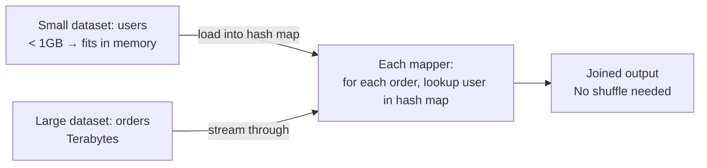

**When to use**: One dataset is small enough to fit in memory of each mapper. No network
shuffle needed — extremely fast. Used by Spark broadcast join (`broadcast` hint).

### Partitioned Hash Join

```mermaid
graph LR
    ORDERS2[Orders partitioned by hash(user_id)] --> M1
    USERS2[Users partitioned by hash(user_id)] --> M1
    note1[Same user_id always in same partition<br/>→ mapper only needs its partition of users in memory]
    M1[Mapper: hash join within partition] --> OUT2[Joined output]
```

---

## Dataflow Engines (Spark, Flink, Tez)

MapReduce's key limitation: every step writes intermediate results to HDFS (fault tolerance
via materialization). For multi-step pipelines, this is extremely slow.

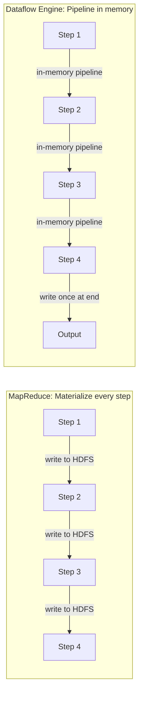

**Spark vs MapReduce**:
- Spark keeps intermediate results in memory (RDD/DataFrame)
- 10–100× faster for iterative algorithms (ML training: run 100 iterations → huge win)
- Fault tolerance via lineage: re-compute lost partitions from source rather than checkpointing

---

## DataFrames: The Dominant API

Modern batch processing is done almost exclusively via DataFrames (Spark, Pandas, Dask,
Polars) rather than raw MapReduce APIs. A DataFrame is a distributed, lazily-evaluated
collection of records with a schema.

```python
# Spark DataFrame example — this is the modern way
from pyspark.sql import SparkSession
from pyspark.sql.functions import col, sum

spark = SparkSession.builder.getOrCreate()

# Read from S3 in Parquet format
df = spark.read.parquet("s3://bucket/events/")

# Transformations are lazy — build execution plan
result = (df
    .filter(col("event_type") == "purchase")
    .groupBy("user_id", "product_category")
    .agg(sum("amount").alias("total_spend"))
    .orderBy(col("total_spend").desc())
)

# Action triggers actual computation
result.write.parquet("s3://bucket/output/user_spend/")
```

**Lazy evaluation**: Transformations build a DAG of operations. The query optimizer
can reorder, push predicates down, and choose join strategies before any data moves.
This is equivalent to SQL's query optimizer, but for code.

**Spark vs Pandas**:
- Pandas: in-memory, single-node, `O(data_size)` RAM required
- Spark: distributed, lazy, handles datasets larger than single-machine RAM

---

## Batch Use Cases (2nd Edition Expansion)

### Extract-Transform-Load (ETL)

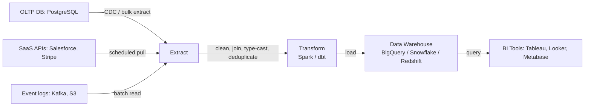

### Analytics and Pre-Aggregation

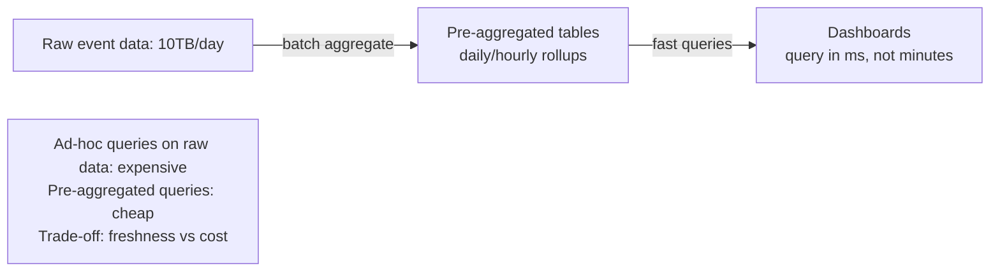

**dbt (data build tool)**: SQL-based transformation layer that runs inside the data warehouse.
Defines data models as SELECT statements; manages dependencies, testing, and documentation.

### Machine Learning Batch Pipelines

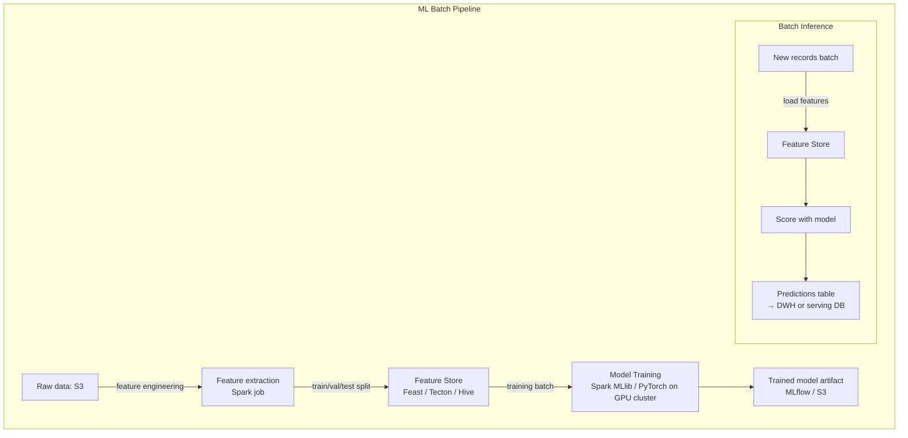

**Feature engineering**: Transforming raw data into ML model inputs. Critical: the same
feature logic must run at training time AND at inference time — or you get training-serving skew.

**Feature Store** (Feast, Tecton): Stores pre-computed features with point-in-time correctness.
Prevents data leakage (accidentally using future data to train a model).

**Batch inference vs online inference**:
- Batch: score millions of records overnight, store results → serve from DB. Low latency, stale.
- Online: score in real-time at request time → fresh, but adds latency to each request.

### Serving Derived Data

Batch jobs don't just produce analytical outputs — they feed operational systems:

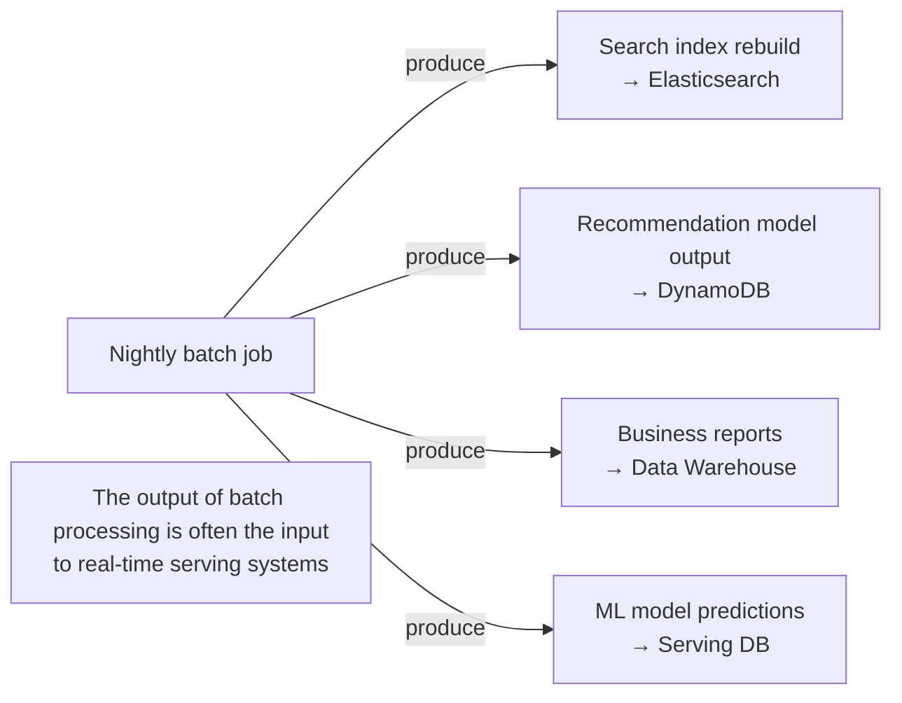

---

## Batch Processing and Cloud Data Warehouses Converge

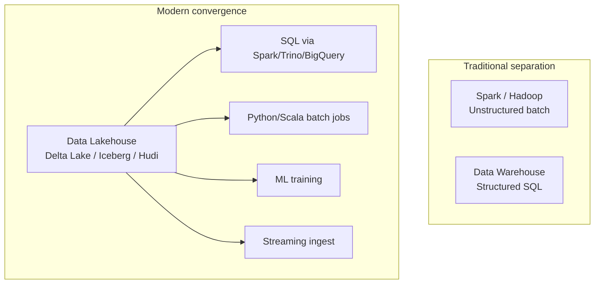

**Parquet** as the universal format: columnar, compressed, splittable, supported by
Spark, BigQuery, Athena, DuckDB, Pandas. The de facto interchange format for analytical data.

---

## Workflow Orchestration

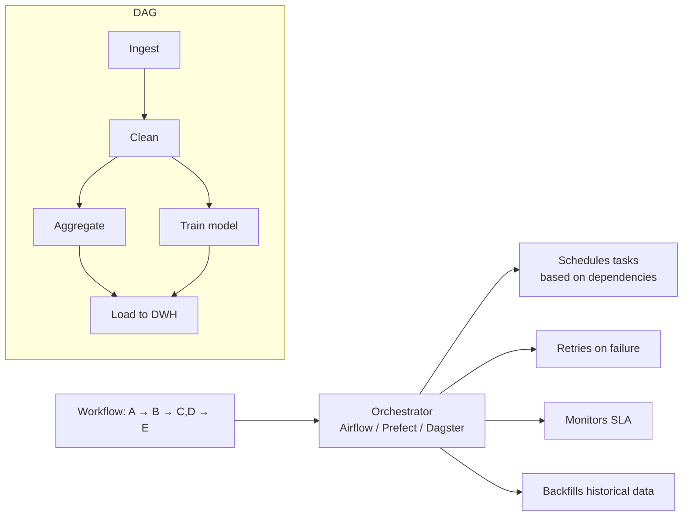

**Key principle**: Job outputs are immutable files. Each job reads its inputs and writes
new outputs. Never modify the input. This makes workflows debuggable, replayable, and
safe to re-run on failure.
