# Chapter 12: Stream Processing

## Core Thesis
Stream processing is batch processing on an unbounded, continuously arriving dataset.
The core challenges that distinguish it from batch: handling late data, windowing time,
maintaining state across events, and providing exactly-once guarantees across stateful
operations. Kafka is the reference architecture — understand it deeply.

---

## Event Streams vs Polling

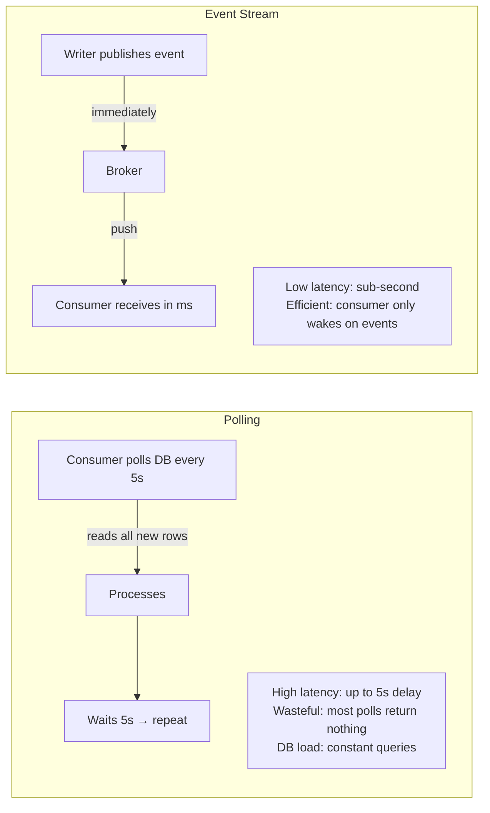

---

## Messaging Systems — Design Dimensions

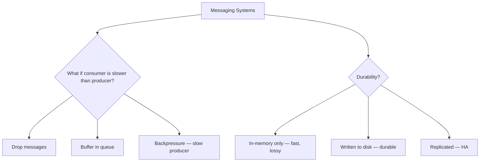

### Traditional Message Brokers (RabbitMQ, ActiveMQ, SQS)

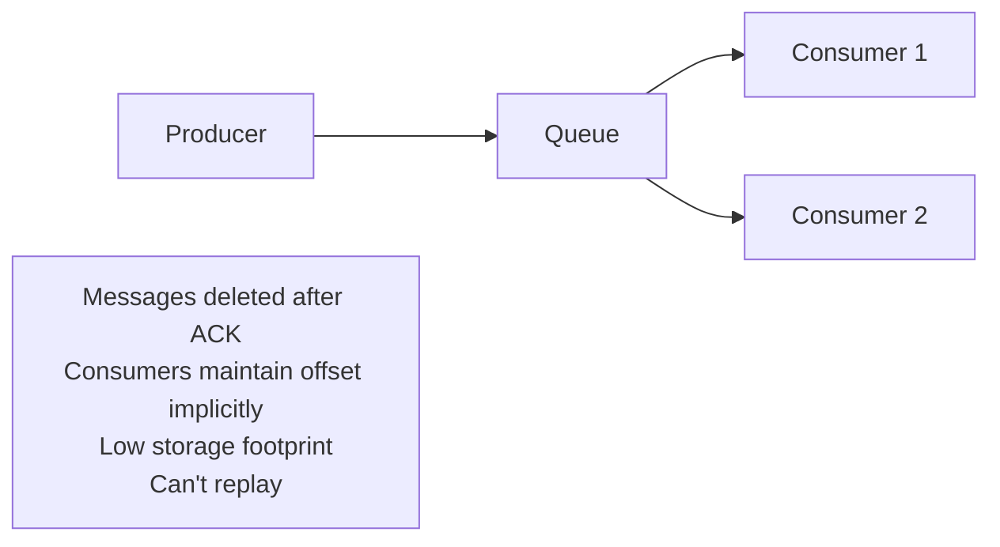

**Patterns**:
- **Load balancing**: Message delivered to one consumer (work queue)
- **Fan-out**: Message delivered to all consumers (pub/sub)

### Log-Based Message Brokers (Kafka, Kinesis, Pulsar)

```mermaid
graph TD
    subgraph "Kafka Topic: orders (3 partitions)"
        P0[Partition 0: offset 0,1,2,3...]
        P1[Partition 1: offset 0,1,2,3...]
        P2[Partition 2: offset 0,1,2,3...]
    end

    PROD[Producer] -->|hash(key) → partition| P0
    PROD --> P1
    PROD --> P2

    CG1[Consumer Group A<br/>Analytics] --> P0
    CG1 --> P1
    CG1 --> P2

    CG2[Consumer Group B<br/>Notifications] --> P0
    CG2 --> P1
    CG2 --> P2

    note1[Each consumer group tracks its own offset<br/>Messages NOT deleted after read<br/>Multiple consumer groups read independently<br/>Can replay from any offset]
```

| Dimension | Traditional Broker | Log-Based (Kafka) |
|-----------|-------------------|-------------------|
| Message retention | Deleted on ACK | Kept for configured period |
| Replay | ❌ No | ✅ Any offset, any time |
| Consumer groups | Complex | Native — each group has its own offset |
| Throughput | Moderate | Very high (sequential disk writes) |
| Ordering | Within queue | Within partition |
| Fan-out | Yes | Yes (multiple consumer groups) |

---

## Kafka Internals

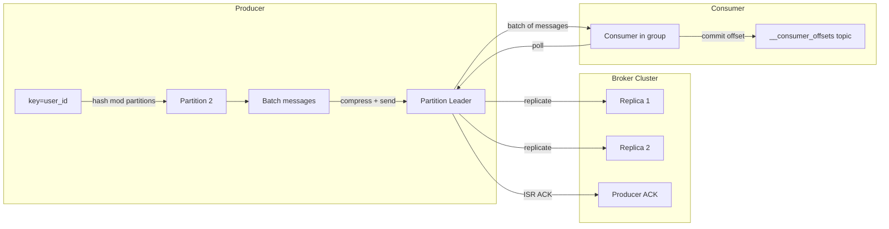

**Key design choice**: Log-structured storage (sequential appends) → very high write
throughput. Consumer reads sequentially → OS page cache is highly effective.

**ISR (In-Sync Replicas)**: Leader only ACKs when all ISR replicas have written.
`acks=all` (producer setting) + `min.insync.replicas=2` = strong durability.

---

## Change Data Capture (CDC)

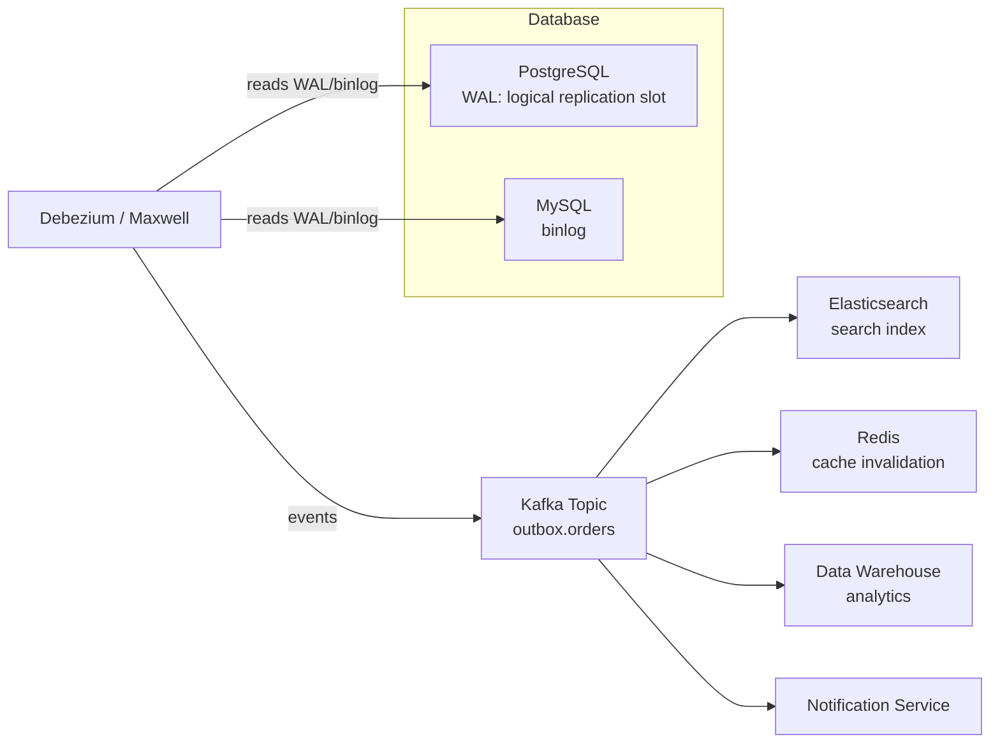

**CDC vs dual-write**:
- **Dual write**: App writes to DB and Kafka simultaneously → race condition, partial failure risk
- **CDC**: DB write is the single source of truth; Kafka event is derived from WAL
  → guaranteed consistency between DB and downstream systems

**The outbox pattern** (safer than CDC for transactional guarantee):
```sql
BEGIN;
INSERT INTO orders VALUES (...);
INSERT INTO outbox (event_type, payload) VALUES ('order_created', '...');
COMMIT;
-- CDC publishes outbox rows to Kafka, then deletes them
```

---

## Event Sourcing

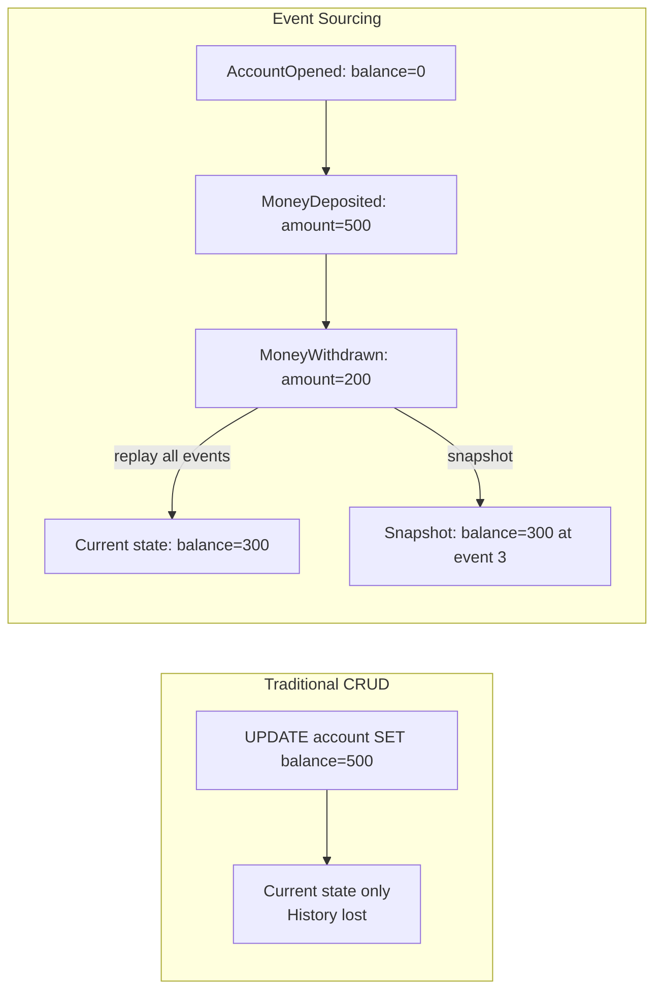

**Event sourcing benefits**:
- Complete audit trail
- Temporal queries ("what was the state at time T?")
- Replay to rebuild projections (search index, caches, new views)
- Debugging — exactly reproduce the sequence of events that led to a bug

**Event sourcing costs**:
- Storage grows forever (mitigated by snapshots + log compaction)
- Eventual consistency — projections lag behind the event log
- Schema evolution is hard (old events must still be readable)

---

## Uses of Stream Processing

### 1. Complex Event Processing (CEP)

Detect patterns across sequences of events in real time:

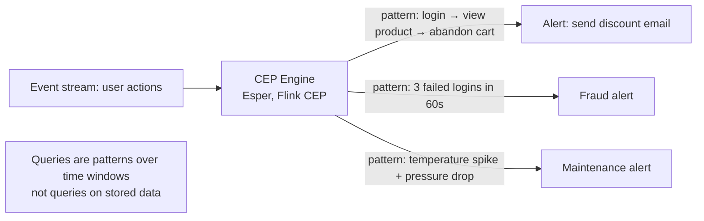

CEP inverts the typical query model: instead of storing data and running queries, you store queries (patterns) and run data through them.

### 2. Stream Analytics

Aggregate metrics continuously over time windows:

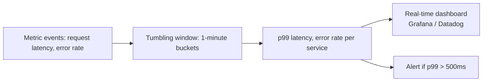

**Examples**: Kafka Streams, Apache Flink, Spark Structured Streaming.
Used for: operational dashboards, fraud detection, A/B test metrics, IoT monitoring.

### 3. Incremental View Maintenance

Maintain a continuously updated materialized view as new events arrive:

```mermaid
graph LR
    EVENTS2[Event stream: order placed / cancelled] --> IVM[Incremental View Maintenance]
    IVM -->|update| VIEW[orders_summary view:<br/>total_orders, total_revenue by product]
    
    note1[Instead of recomputing the view from scratch<br/>apply each event as a delta update<br/>O(event) not O(entire dataset)]
```

**Why it's hard**: Retractions (cancellations, updates) must undo the effect of previous events.
If an order is cancelled, the running sum must decrease. This requires keeping state.

**Examples**: Materialize (full SQL incrementally maintained), Flink SQL, ksqlDB.

---

## Reasoning About Time — Window Types

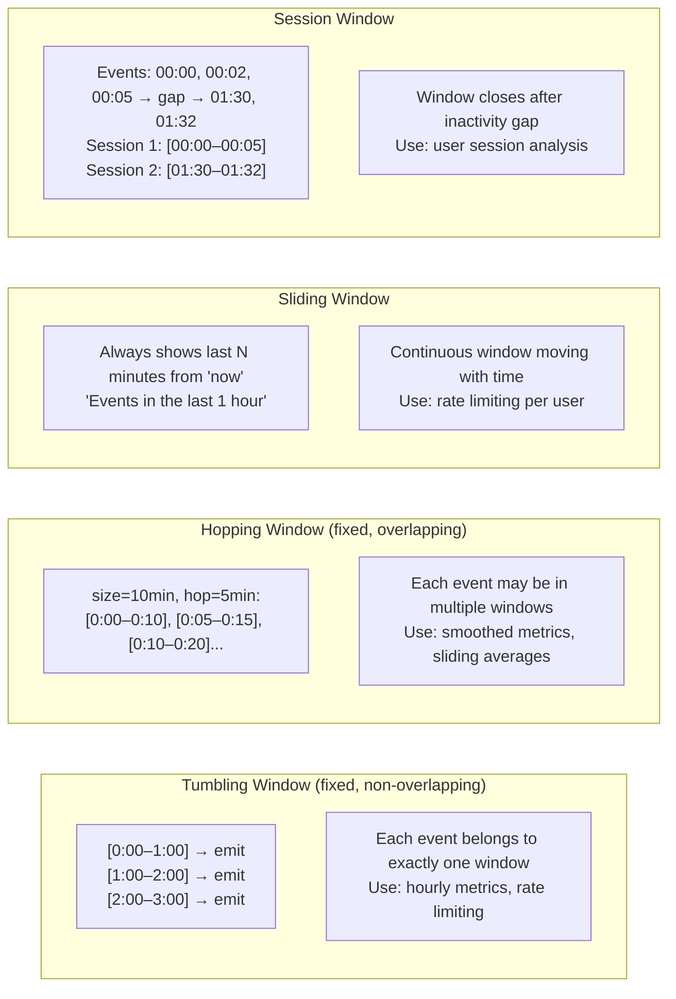

### Event Time vs Processing Time — The Core Time Problem

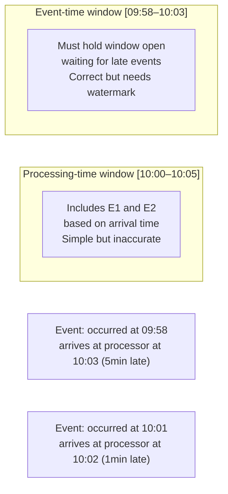

**Watermark**: The system's estimate of "we've received all events up to time T."
When watermark reaches T, the window [T-duration, T] can be closed and emitted.

**Late data strategies**:
1. Drop late events (fire-and-forget, simple)
2. Re-trigger window with late arrivals (output corrections)
3. Route to side output for separate handling (audit trail of late data)

---

## Event-Driven Architectures vs RPC

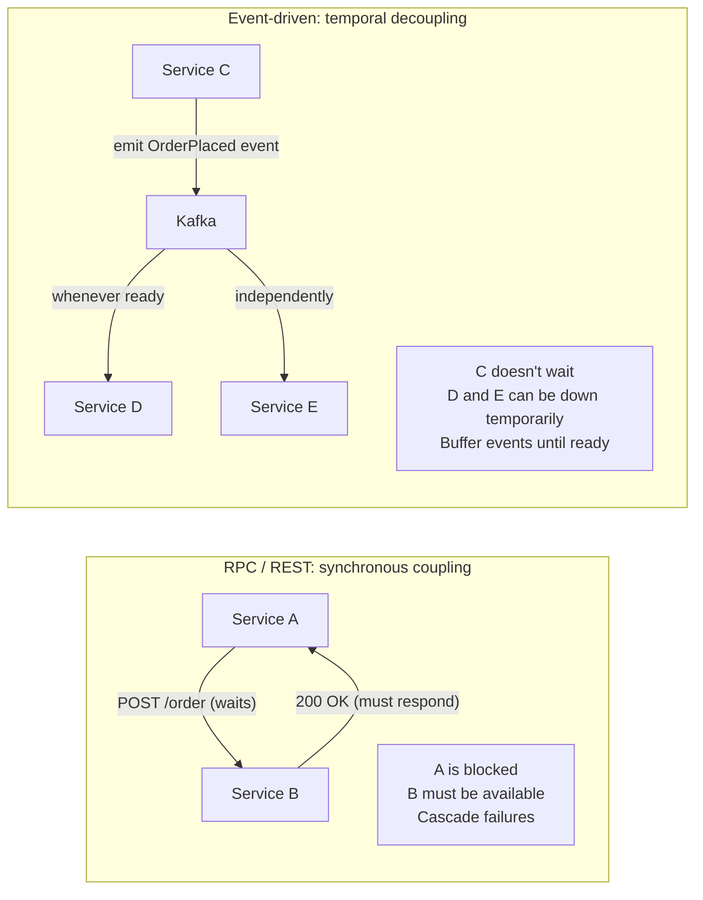

**When event-driven wins**: Multiple consumers for the same event, variable processing
rates, need for replay, adding new consumers without changing producers.

**When RPC wins**: Synchronous response needed (read data), simpler debugging, strong
ordering guarantees required, or the latency of an async roundtrip is unacceptable.

---

## Stream Processing

### Window Types

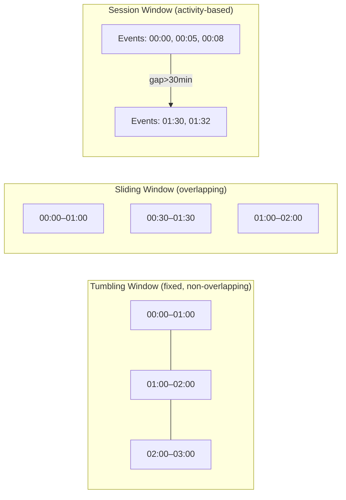

### Time Semantics

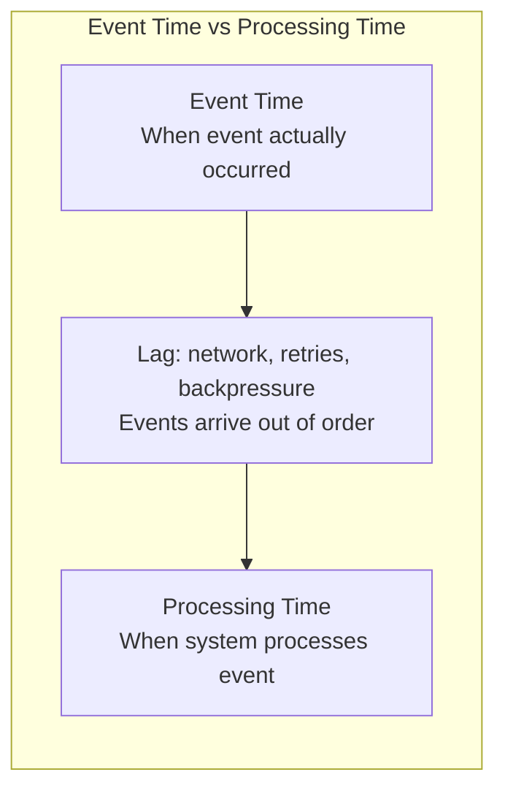

**Watermarks**: A heuristic estimate of "we've seen all events up to time T".
When watermark reaches T, window [T-window, T] is closed and emitted.

```mermaid
graph LR
    EVENTS[Events arrive with timestamps: 10, 8, 12, 9, 15, 7]
    WMARK[Watermark at t=12: max_event_time - max_lateness<br/>= 15 - 5 = 10]
    CLOSE[Close window [0,10]: event at t=7 arrives late]
    LATE[Late event: drop, or emit to side output]
```

---

## Stream Joins

### Stream-Stream Join (Windowed)

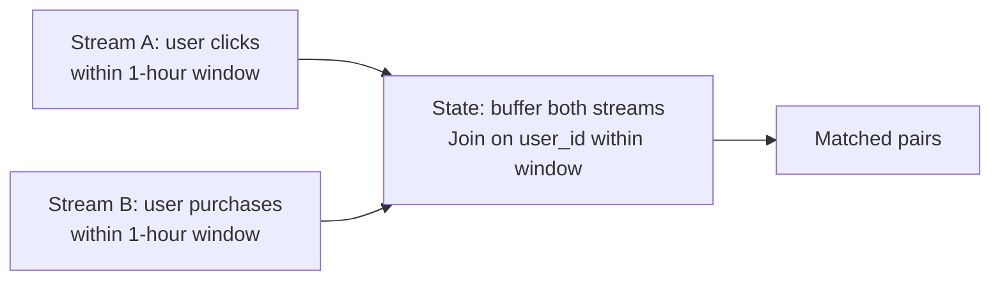

### Stream-Table Join (Enrichment)

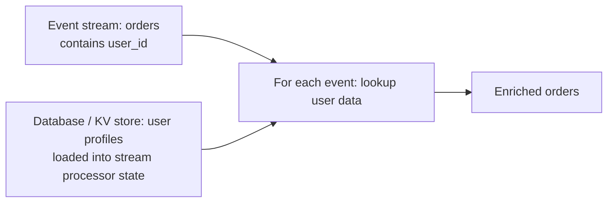

### Table-Table Join (Materialized View Maintenance)

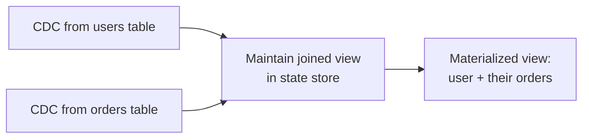

---

## Limitations of Immutability

Event logs and immutable data have real practical constraints:

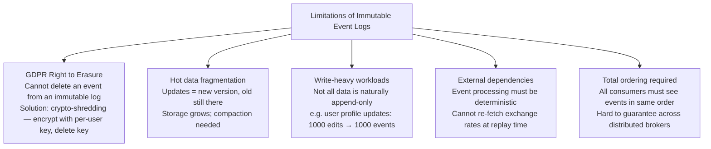

**Compaction**: Kafka log compaction keeps only the latest value per key, removing all older versions. This allows indefinite retention of the "current state" snapshot without unbounded storage growth. Important for CDC use cases where Kafka is the system of record.

**Crypto-shredding** (for GDPR compliance): Encrypt each user's event data with a unique per-user encryption key. Store keys separately. When a user requests erasure, delete their key — all their events become undecipherable without changing the event log structure.

---

## Stream Processing Fault Tolerance

Unlike batch processing (rerun the whole job on failure), stream processing must handle failures while maintaining low latency:

```mermaid
graph LR
    subgraph "Checkpoint-Based Recovery (Flink)"
        SP[Stream Processor<br/>stateful operators]
        STATE[State: running aggregates]
        CKPT[Periodic checkpoint<br/>to durable storage]
        
        FAIL[Processor crashes]
        RESTORE[Restore from checkpoint<br/>Replay events since checkpoint]
        
        SP --> STATE
        STATE --> CKPT
        FAIL --> RESTORE
        RESTORE --> SP
    end
```

**Flink's checkpointing**: Periodically snapshot all operator state to durable storage (HDFS/S3). On failure, restore from checkpoint and replay input events from the saved offset. Recovery time = time since last checkpoint.

**Micro-batching** (Spark Structured Streaming): Process small batches (100ms) instead of truly continuous. Simpler fault tolerance (batch semantics), slightly higher latency.

**Exactly-once in stream processing**:
1. Store state and output offset atomically (same transaction)
2. Use idempotent sinks (deduplicate output at destination)
3. Kafka transactions: atomically commit both offset and output

**State backend options** (Flink):
- In-memory: fastest, bounded by heap size, lost on crash without checkpoint
- RocksDB: spills to disk, can handle TB of state, slightly slower
- Remote KV store: Redis, DynamoDB — higher latency, highly available

---

## Exactly-Once Semantics

```mermaid
graph TD
    AT_MOST[At-most-once<br/>May lose messages<br/>Easy to implement] 
    AT_LEAST[At-least-once<br/>May duplicate messages<br/>Standard default]
    EXACTLY[Exactly-once<br/>No loss, no duplicates<br/>Hard to implement]

    AT_LEAST -->|with idempotent consumers| EFFECTIVELY[Effectively-once<br/>Idempotent deduplication]
    AT_LEAST -->|with distributed transactions| EXACTLY
```

**Kafka exactly-once (EOS)**:
1. **Idempotent producer**: Each message has a sequence number. Broker deduplicates.
2. **Transactional API**: Read-process-write wrapped in Kafka transaction.
   Either all happen or none (atomically).
3. Limitation: Only works within Kafka. Writes to external systems (DB, API) require
   idempotent writes at the destination.
