# Chapter 13: A Philosophy of Streaming Systems

## Core Thesis
Chapters 11 and 12 described batch and stream processing mechanics. This chapter asks:
what is the *right* way to architect a system around data flows? The answer is to treat
derived data — caches, indexes, ML models, search, analytics — as the output of continuous
transformations applied to a single stream of events. This "unbundled database" philosophy
leads to more evolvable, reliable, and maintainable systems.

---

## The Problem: Multiple Specialized Systems

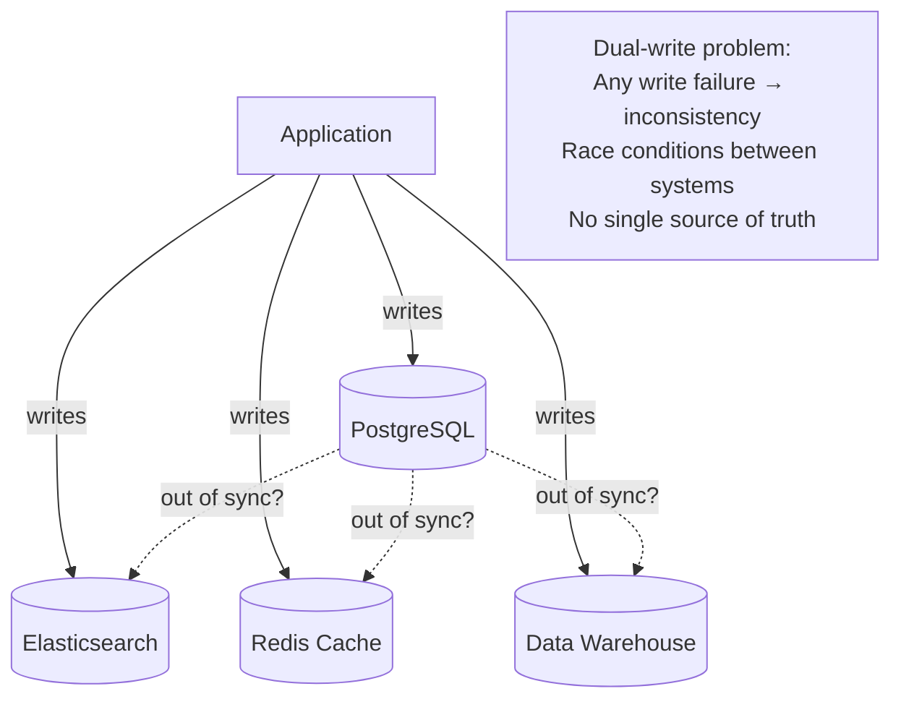

**The unbundled approach** — one event stream, many derived views:

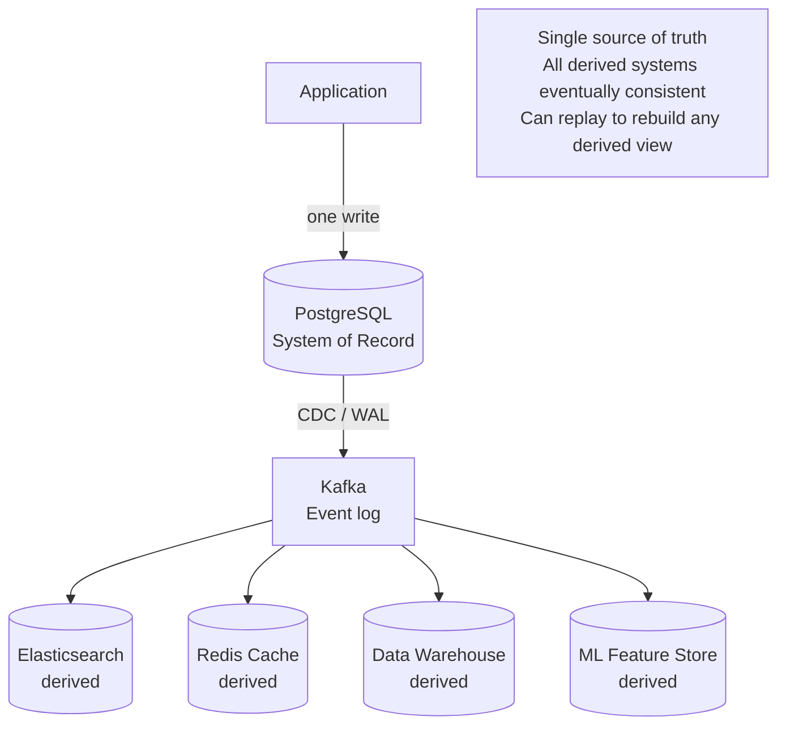

---

## Derived Data and Total Ordering

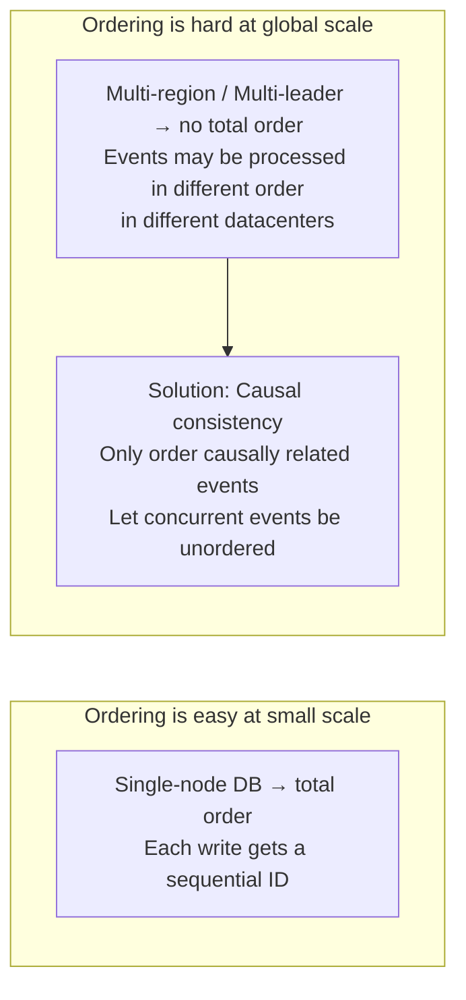

**Practical implication**: For most systems, causal consistency is sufficient. Total ordering
requires coordination (consensus) which is expensive. Only pay that cost when you need it.

---

## Lambda Architecture (Batch + Speed Layer)

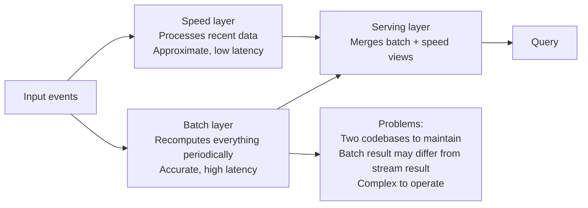

**Kappa Architecture** (Nathan Marz's simplification):

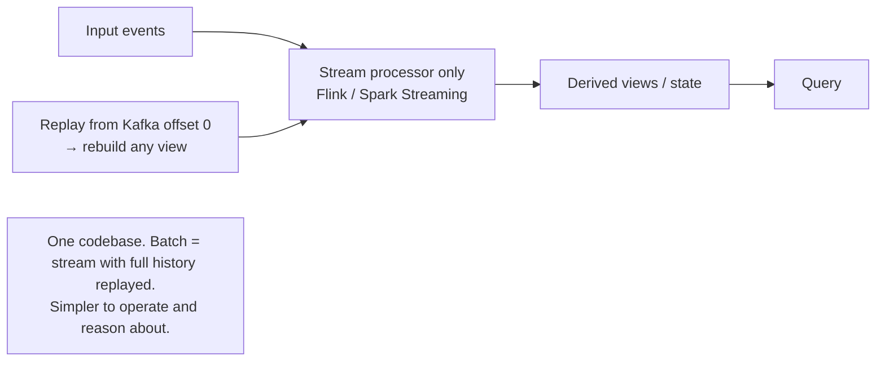

---

## Unbundling Databases

The hypothesis: a distributed system can be built from composable primitives that
correspond to the internals of a monolithic database.

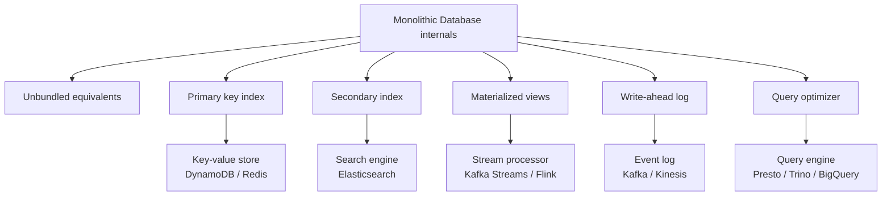

**Trade-off**:
- Integrated DB: Consistency, ACID, single tool, but limited scale per component
- Unbundled: Scale each component independently, but eventual consistency between components

---

## Designing Applications Around Dataflow

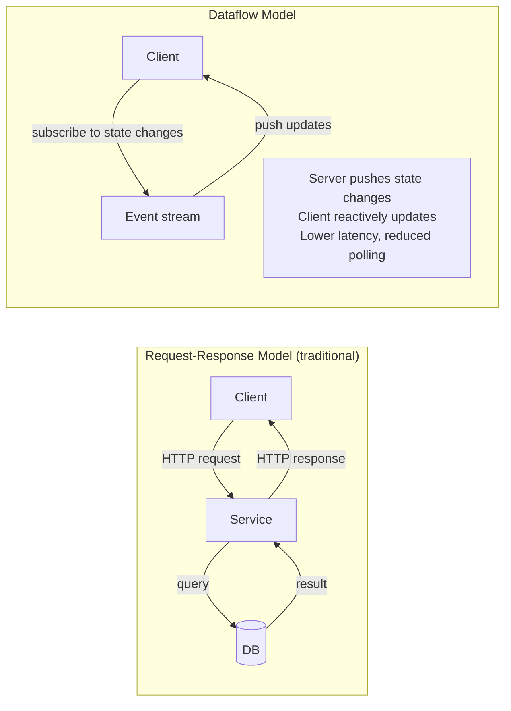

### Application Code as Derivation

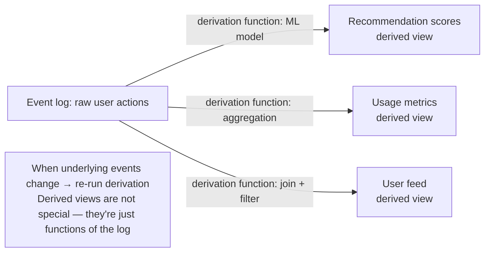

**CQRS (Command Query Responsibility Segregation)**:

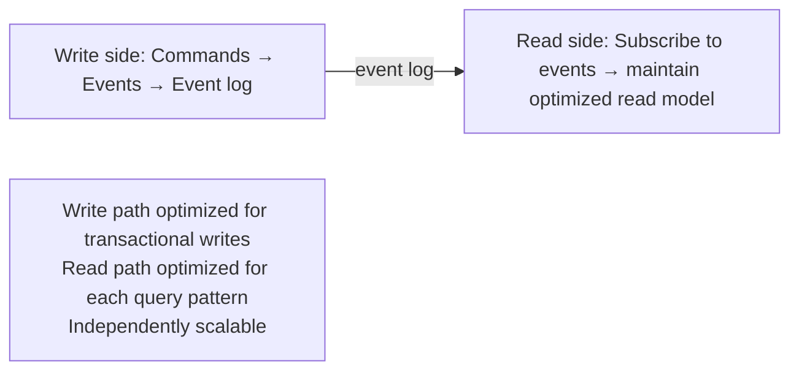

---

## End-to-End Correctness

The hardest problems occur at system boundaries — not within a single component.

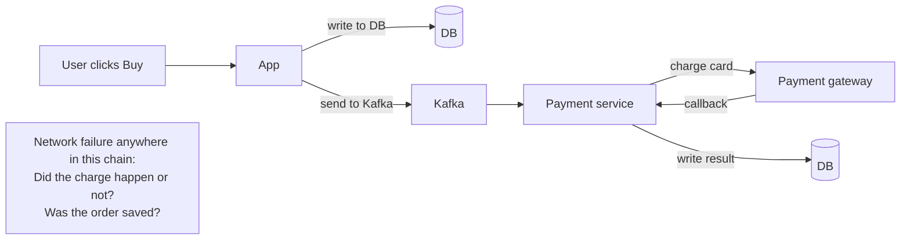

**Idempotency as the solution**:
- Every operation must be safe to retry
- Each step must be identified by a unique operation ID
- Upstream systems track which IDs they've processed

```python
# Idempotent payment processing
def process_payment(order_id: str, amount: Decimal) -> None:
    if already_processed(order_id):  # check idempotency key
        return  # safe to call multiple times
    
    charge_card(amount)
    mark_processed(order_id)  # atomic with the charge via outbox pattern
```

---

## Aiming for Correctness

Even with perfectly designed individual components, bugs occur at the boundaries.
The end-to-end correctness question: is the system correct, not just each component?

### The End-to-End Argument

A principle from network systems: reliability functions implemented at a lower layer
can only be fully guaranteed if also implemented at the higher (application) layer.

```mermaid
graph LR
    subgraph "Example: Payment Processing"
        CLIENT[Client] -->|POST /charge| APP[App Server]
        APP -->|INSERT payment| DB[(DB)]
        APP -->|charge_card()| GATEWAY[Payment Gateway]
        
        FAIL1[Network drop between APP and CLIENT<br/>Client retries → second charge!]
        FAIL2[App crashes after DB insert but before gateway call<br/>DB has payment, gateway doesn't]
    end

    subgraph "End-to-End Solution"
        IDEM[Idempotency key in every request<br/>App generates UUID per operation<br/>Gateway deduplicates by key]
    end
```

**The lesson**: The transport layer (TCP) guarantees at-most-once delivery between hops.
But end-to-end, across service boundaries, restarts, and retries — the application must
enforce exactly-once semantics itself via idempotency keys.

### Duplicate Suppression

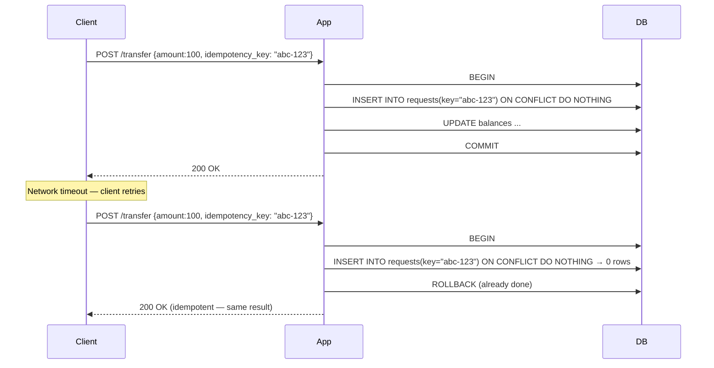

**Implementation**: The `requests` table has a unique constraint on `idempotency_key`.
The INSERT + operation happen in one atomic transaction. Second attempt sees the key
already exists → knows it's a duplicate → returns the original result.

---

## Timeliness vs Integrity

Two distinct correctness properties that are often conflated:

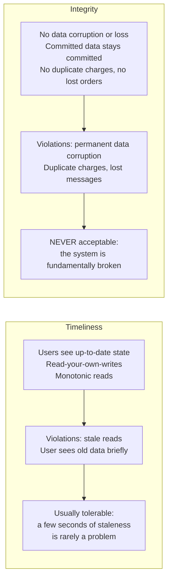

**The key insight**: Systems can sacrifice timeliness (eventual consistency) without
compromising integrity, if they use idempotency and end-to-end exactly-once semantics.

**Ordering**: Integrity is a stronger requirement than timeliness. Systems that sacrifice
integrity to gain availability are dangerous. Systems that sacrifice timeliness are just
eventually consistent.

---

## Enforcing Constraints in an Unbundled System

Without distributed transactions, how do you enforce unique constraints (e.g., unique usernames)?

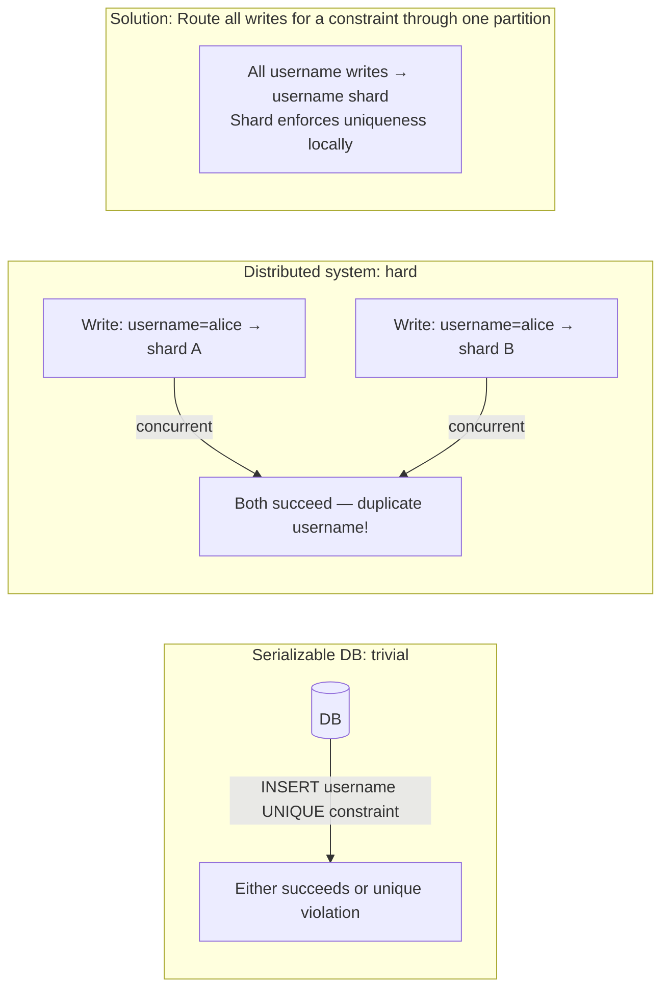

**Two-phase approach for complex constraints**:
1. Write tentatively with a request ID
2. Asynchronous validation: check the constraint
3. If violated: mark tentative write as rejected, notify client

This trades timeliness (constraint enforcement may be slightly delayed) for integrity
(eventually, no violations survive).

---

## Trust, but Verify

Even correct-looking systems can have silent data corruption bugs. The solution: don't just assume correctness — actively verify it.

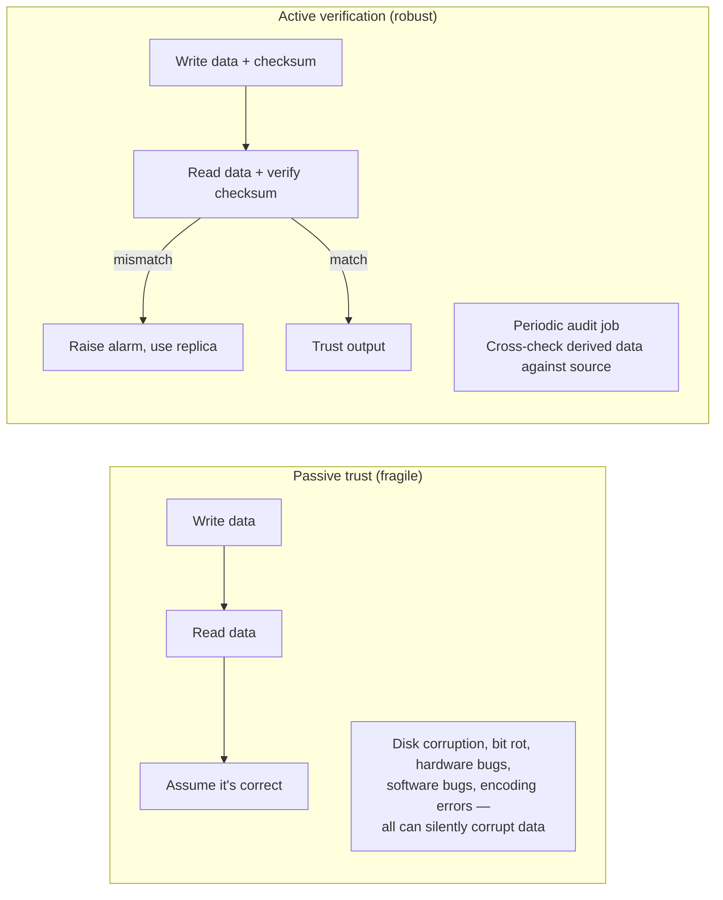

**Techniques**:
- **Checksums**: Store a hash with every record. Verify on read. Detects bit rot and disk corruption.
- **Audit logs**: Periodically recompute derived data from source and compare. Detects bugs in derivation logic.
- **End-to-end checksums**: Include a checksum computed at the data source all the way through the pipeline to the final consumer. Detects corruption at any intermediate step.
- **Write-audit-read**: After writing, read back and verify. Detects write failures that were not properly reported.

**The Parable of Financial Reconciliation**: Banks routinely run reconciliation jobs that cross-check ledger balances against transaction histories, interbank settlement records, and account statements. This is "trust but verify" at industrial scale — not because individual transactions are untrustworthy, but because the cumulative effect of silent errors is catastrophic.

**Why this matters for data pipelines**: ETL pipelines move data through many systems. Errors compound. A 0.001% error rate is invisible in daily monitoring but produces significant corruption over months of data.

**Practical checklist**:
```python
# After every significant pipeline step
assert output_record_count == expected_count
assert output_sum == source_sum  # financial reconciliation
assert sample_records_match_source()  # spot-check
assert no_nulls_in_required_fields()
assert referential_integrity_holds()
```

---

## The Dataflow Philosophy: Summary

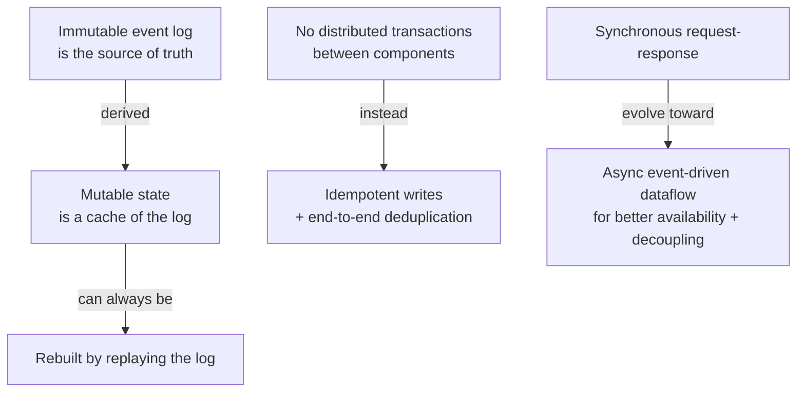

**When to apply this philosophy**:
- Systems with multiple specialized data stores that must stay in sync
- High-write systems where keeping all stores consistent synchronously is a bottleneck
- Systems that need auditability, replay, or temporal queries
- Analytics alongside OLTP without interference

**When NOT to use**:
- Simple CRUD applications with a single DB — complexity not justified
- Systems with hard real-time consistency requirements between all components (use 2PC or saga)
