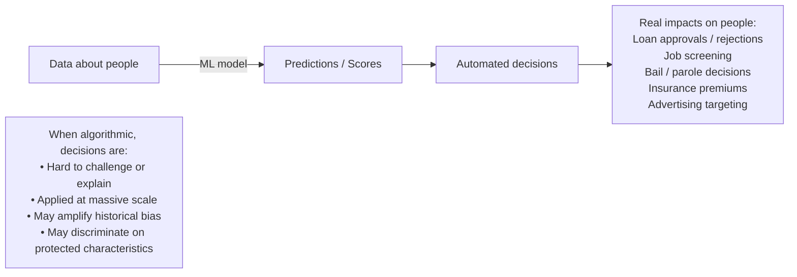
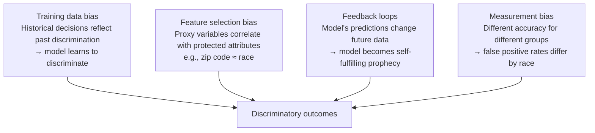
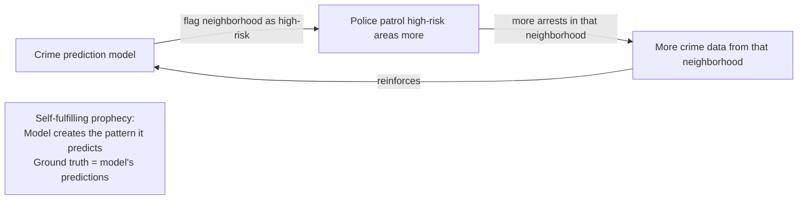
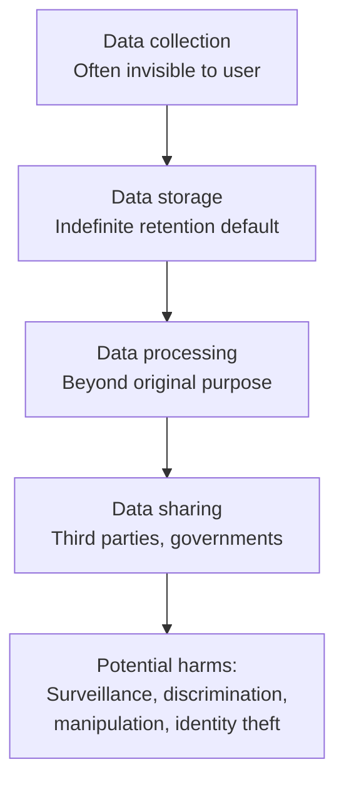
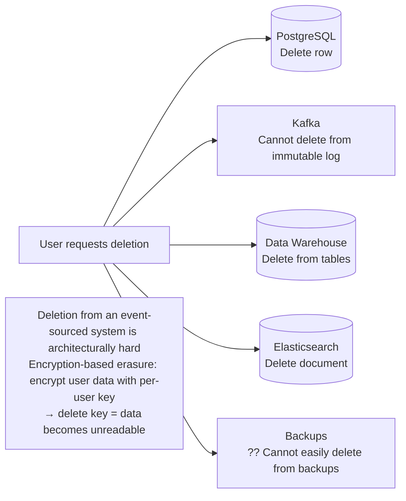
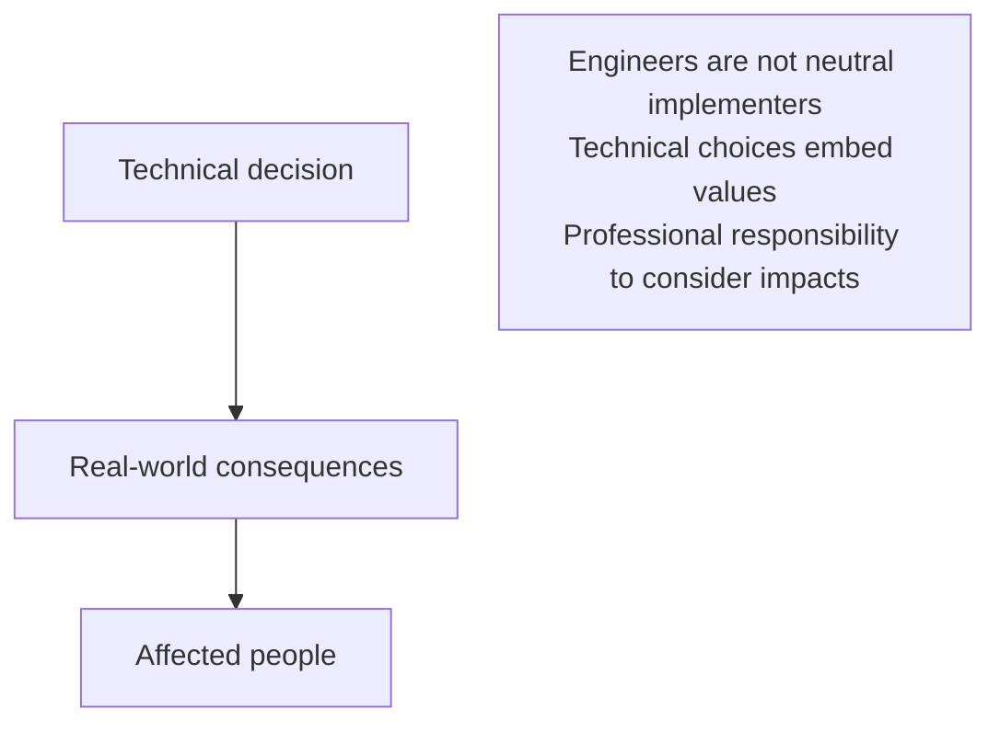
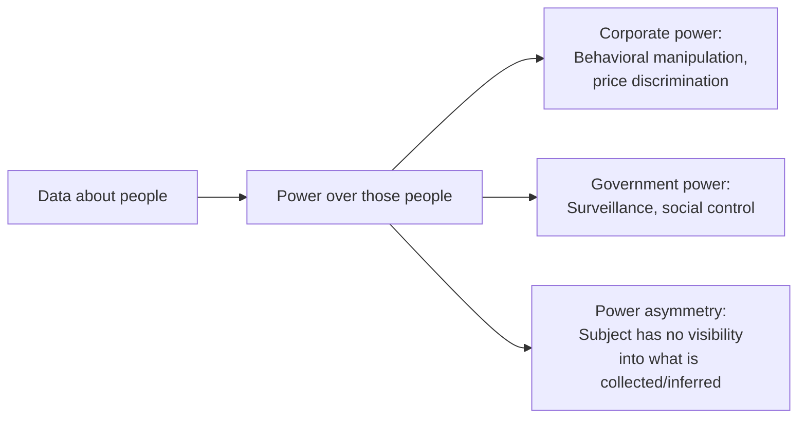
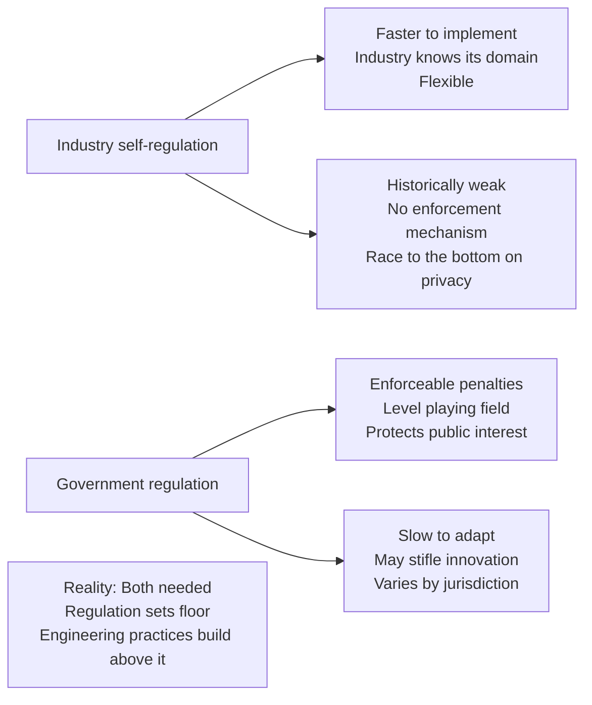
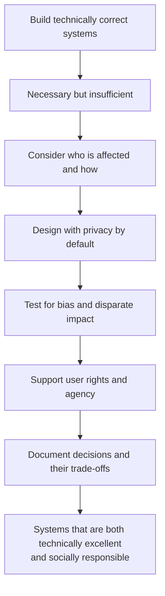

# Chapter 14: Doing the Right Thing

## Core Thesis
Data systems are not neutral tools. They embed values, create power asymmetries, and have
real-world consequences for the people whose data they process. Engineers who build these
systems have ethical and professional responsibilities that go beyond technical correctness.

---

## Predictive Analytics and Algorithmic Decision-Making



---

## Bias and Discrimination

### Sources of Bias



### The Feedback Loop Problem



This applies equally to: search ranking, social media feeds, credit scoring, hiring tools.

---

## Privacy



### Surveillance vs. Privacy

| Surveillance State View | Privacy-Respecting View |
|------------------------|------------------------|
| More data = better product | Minimum necessary data collection |
| Data is an asset to maximize | Data is a liability to minimize |
| Users consent via Terms of Service | Meaningful informed consent |
| Aggregate data is anonymous | Aggregates can be re-identified |
| Data helps us serve you better | User controls their own data |

**Re-identification risk**: "Anonymous" datasets frequently can be de-anonymized by
combining with external data. AOL search query release (2006), Netflix prize dataset
re-identification — both supposedly anonymous datasets were linked to individuals.

---

## GDPR and Data Governance Principles

```mermaid
graph TD
    GDPR[GDPR / Privacy by Design Principles]
    GDPR --> PP[Purpose limitation<br/>Collect only for stated purpose<br/>Cannot use for incompatible purposes]
    GDPR --> DM[Data minimization<br/>Collect minimum necessary data]
    GDPR --> SR[Storage limitation<br/>Delete when no longer needed]
    GDPR --> RT[Rights:<br/>Access, rectification, erasure (right to be forgotten),<br/>portability, objection to profiling]
    GDPR --> AC[Accountability<br/>Document processing activities<br/>DPIAs for high-risk processing]
```

**Right to be forgotten — technical challenge**:



**Cryptographic erasure**: Encrypt user data with a per-user key stored separately.
To "delete" the user, delete their encryption key. Data remains in logs but is unreadable.

---

## Responsibility and Accountability

### The Engineer's Responsibility



**Questions to ask when building data systems**:
1. Whose data is this, and did they meaningfully consent to this use?
2. What decisions will be made from this data, and who is harmed if wrong?
3. Does this system create or amplify existing power imbalances?
4. What are the failure modes, and who bears the cost?
5. Could this system be used for surveillance or control?
6. Have we tested for disparate impact across demographic groups?

---

## Data as Power



**The historical parallel**: The industrial revolution created concentrated economic power
that required regulation (labor laws, antitrust, environmental regulations) to protect
individuals. The data economy may require similar structural responses.

---

## Legislation and Self-Regulation

### Major Regulatory Frameworks

```mermaid
graph TD
    REG[Data Regulation Landscape]
    REG --> GDPR2[GDPR — EU 2018<br/>Strongest global standard<br/>Up to 4% global revenue fines<br/>Rights: access, erasure, portability, objection]
    REG --> CCPA[CCPA/CPRA — California<br/>Right to know, delete, opt-out of sale<br/>Model for US state privacy laws]
    REG --> HIPAA[HIPAA — US Healthcare<br/>Protected health information (PHI)<br/>Breach notification required]
    REG --> PCI[PCI-DSS — Payment Card Industry<br/>Card data handling standards<br/>Required for any merchant accepting cards]
    REG --> AI_REG[EU AI Act 2024<br/>Risk-based regulation of AI systems<br/>High-risk AI: hiring, credit, healthcare<br/>Prohibited: social scoring, real-time biometrics]
```

### Technical Implications of Regulation

| Regulation | Engineering implication |
|-----------|------------------------|
| GDPR right to erasure | Deletion from all stores including event logs (cryptographic erasure) |
| GDPR data minimization | Don't collect fields you don't need — architectural discipline |
| GDPR data residency | Multi-region deployment; no cross-border data transfer without safeguards |
| PCI-DSS | Tokenization of card numbers; audit logs; encryption at rest and in transit |
| HIPAA | Audit trails for all PHI access; business associate agreements with vendors |
| EU AI Act | Explainability requirements for high-risk decisions; human oversight mechanisms |

### Self-Regulation vs Government Regulation



**DDIA's position**: Data-intensive applications have real-world consequences for real people.
Engineers bear responsibility for the systems they build. Waiting for regulation is not an
ethical stance — technical decisions embed values whether you intend them to or not.

---

## Practical Engineering Checklist

For any data system that processes personal data:

| Concern | Questions |
|---------|-----------|
| Data collection | Is this data necessary? Have users consented? |
| Data retention | How long is it kept? Is there an automatic deletion policy? |
| Access control | Who can access this data? Is access logged? |
| Sharing | Is data shared with third parties? Do users know? |
| Algorithmic decisions | Are automated decisions explainable? Is there a human override? |
| Bias testing | Have outputs been tested for disparate impact? |
| Security | Is data encrypted at rest and in transit? What's the breach response plan? |
| Deletion | Can individual data be deleted if requested? From all systems including logs? |

---

## Summary: The Ethical Engineer



The technical and ethical dimensions of data systems are not separable. Every architectural
decision about data collection, retention, sharing, and use has ethical implications. The
engineer who understands both is more valuable — and more responsible — than one who
understands only the technical side.
